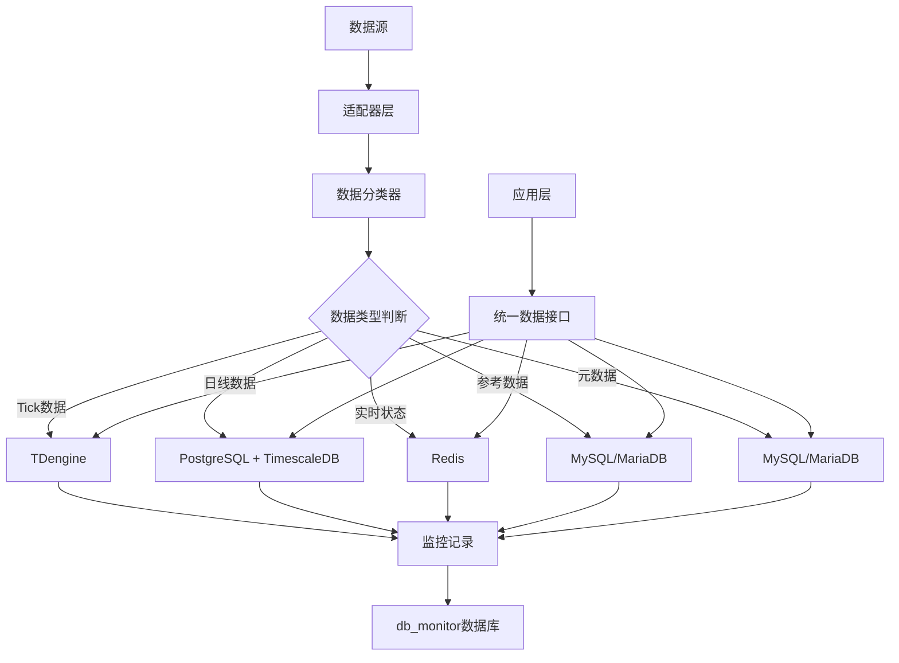
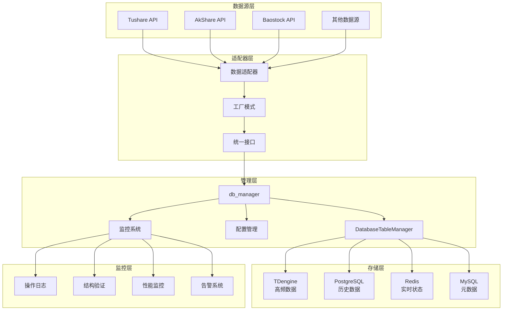

# MyStocks 数据库架构设计与自动化管理方案

## 项目概述

本项目基于NAS环境部署的多数据库架构（TDengine、PostgreSQL、Redis、MariaDB、MySQL），通过适配器模式（Adapter Pattern）结合工厂模式（Factory Pattern）构建统一的数据管理层，实现数据源的自动化管理和高效存储。

**核心目标**：通过 `db_manager` 模块实现数据库的自动化管理，避免人工手工管理各个数据库和表，提供统一的数据接口和监控体系。

## 系统架构概览

```
┌─────────────────────────────────────────────────────────────┐
│                    MyStocks 数据架构                         │
├─────────────────────────────────────────────────────────────┤
│  数据源层    │ Tushare │ AkShare │ Baostock │ 其他API        │
├─────────────────────────────────────────────────────────────┤
│  适配器层    │ 统一数据接口 (Adapter + Factory Pattern)       │
├─────────────────────────────────────────────────────────────┤
│  管理层      │ db_manager 自动化管理模块                      │
├─────────────────────────────────────────────────────────────┤
│  存储层      │ TDengine │ PostgreSQL │ Redis │ MySQL        │
├─────────────────────────────────────────────────────────────┤
│  监控层      │ 自动化监控、日志记录、结构验证                  │
└─────────────────────────────────────────────────────────────┘
```
## 一、数据分类与存储策略

### 1.1 数据分类体系

根据数据的特性、访问模式和使用目的，将量化数据分为五大类：

#### 第1类：市场数据（Market Data）
- **内容**：时间序列价格数据 [time, open, high, low, close, volume, ...]
- **子分类**：
  - **Tick数据**：逐笔成交记录，频率最高，数据量巨大
  - **K线数据**：按时间聚合（秒、分钟、小时、日、周、月）的OHLCV数据
  - **深度数据（L2/L3）**：订单簿快照和盘口信息
- **存储数据库**：**TDengine**（高频数据）+ **PostgreSQL + TimescaleDB**（历史数据）
- **选择理由**：
  - TDengine：专为时间序列数据设计，写入性能极佳，压缩比高
  - TimescaleDB：自动按时间分区，强大的时间序列查询功能

#### 第2类：参考数据（Reference Data）
- **内容**：相对静态的描述性数据
  - 标的列表：股票代码、名称、所属交易所、行业、上市状态
  - 股指期货合约信息：合约乘数、到期日、交割方式
  - 成分股信息：指数成分股及其权重变化历史
  - 交易日历：各交易所的休市、开市日期
- **存储数据库**：**MariaDB / MySQL**
- **选择理由**：高度结构化的关系型数据，需要频繁的JOIN操作和严格的约束

#### 第3类：衍生数据（Derived Data）
- **内容**：通过原始数据计算得出的指标和信号
  - 技术指标：SMA, EMA, RSI, MACD, Bollinger Bands等
  - 量化因子：价值因子、动量因子、质量因子等
  - 模型输出：机器学习模型预测的价格、波动率或交易信号
  - 自定义信号：根据策略逻辑计算出的买卖信号
- **存储数据库**：**PostgreSQL + TimescaleDB**
- **选择理由**：与原始市场数据关联分析，便于时间序列查询

#### 第4类：交易数据（Transaction Data）
- **内容**：策略执行和账户活动的记录
  - 订单记录：委托订单详情（时间、标的、方向、价格、数量、状态）
  - 成交记录：已成交详情
  - 持仓记录：当前和历史持仓情况
  - 账户资金：保证金、可用资金、净值曲线历史
- **存储策略**：
  - **实时状态（热数据）**：**Redis** - 毫秒级访问最新持仓、账户余额
  - **历史记录（冷数据）**：**PostgreSQL + TimescaleDB** - 用于性能分析和审计

#### 第5类：元数据（Meta Data）
- **内容**：关于数据的数据和系统配置
  - 数据源状态：最后成功获取时间、数据质量评分
  - 任务调度信息：数据下载任务的成功/失败日志
  - 策略参数：不同策略的配置参数
  - 系统配置：API密钥、数据库连接字符串（加密存储）
- **存储数据库**：**MariaDB / MySQL**
- **选择理由**：结构化关系数据，适合传统RDBMS管理

### 1.2 数据库分工与存储方案

#### 1.2.1 TDengine - 高频行情数据专用库
- **角色**：存储Tick级和分钟级高频数据
- **存储内容**：
  - `tick_data`：所有标的的Tick级数据
  - `kline_1m`, `kline_5m`：分钟级K线数据
- **优势**：
  - 写入性能：每秒数十万数据点写入能力
  - 存储效率：极高压缩比（10:1甚至20:1）
  - 查询性能：时间范围查询优化

#### 1.2.2 PostgreSQL + TimescaleDB - 历史数据仓库
- **角色**：存储日线、基本面及因子数据
- **存储内容**：
  - `kline_daily`：所有标的的日线数据
  - `derived_factors`：计算好的技术指标和基本面因子
  - `financial_data`：财务数据
- **优势**：
  - 自动时间分区管理
  - 强大的时间序列查询功能
  - 复杂关联查询支持

#### 1.2.3 Redis - 实时状态中心
- **角色**：存储极热数据，提供毫秒级访问
- **存储内容**：
  - 最新行情：`quote:{symbol}`
  - 实时买卖盘口：`orderbook:{symbol}`
  - 交易状态：`position:{symbol}`, `account:cash`
  - 涨跌停列表：Set类型存储
- **优势**：
  - 极致性能：内存级访问速度
  - 数据结构丰富：Hash、Set、Sorted Set等

#### 1.2.4 MySQL/MariaDB - 元数据与参考数据仓库
- **角色**：存储静态和慢变数据
- **存储内容**：
  - `symbols`：股票代码表
  - `industry_classification`：行业分类表
  - `trade_calendar`：交易日历表
  - `data_sources` & `etl_jobs`：ETL元数据表
- **优势**：
  - 数据一致性保障
  - 强大的关联查询能力
  - 成熟的备份恢复机制

## 二、db_manager 自动化管理模块

### 2.1 核心设计理念

`db_manager` 模块是整个数据库架构的自动化管理核心，实现：

- **统一管理**：通过配置文件统一管理所有数据库的表结构
- **自动化操作**：自动创建、修改、删除表结构
- **监控记录**：完整记录所有数据库操作和结构变更
- **结构验证**：自动验证表结构是否符合预期
- **安全连接**：所有连接参数从环境变量读取，避免硬编码

### 2.2 核心组件

#### 2.2.1 DatabaseTableManager 类
```python
# 主要功能
- create_table()      # 创建表
- alter_table()       # 修改表结构
- drop_table()        # 删除表
- validate_table_structure()  # 验证表结构
- batch_create_tables()       # 批量创建表
```

#### 2.2.2 监控数据库 (db_monitor)
- **table_creation_log**：表创建日志
- **column_definition_log**：列定义日志
- **table_operation_log**：表操作日志
- **table_validation_log**：表结构验证日志

#### 2.2.3 配置文件管理 (table_config.yaml)
```yaml
tables:
  - database_type: "TDengine"
    database_name: "market_data"
    table_name: "ticks"
    is_super_table: true
    columns: [...]
```

### 2.3 自动化管理流程

#### 2.3.1 表结构管理流程
```
1. 配置文件定义 → 2. 自动生成DDL → 3. 执行创建/修改 → 4. 记录日志 → 5. 验证结构
```

#### 2.3.2 数据流管理
```
数据源 → 适配器层 → 数据分类 → 自动路由 → 目标数据库 → 监控记录
```

## 三、实施指南与操作步骤

### 3.1 环境准备

#### 3.1.1 数据库部署
```bash
# NAS Docker 环境部署
docker-compose up -d tdengine postgresql redis mysql mariadb
```

#### 3.1.2 环境变量配置 (.env)
```bash
# MySQL/MariaDB 配置
MYSQL_HOST=your_nas_ip
MYSQL_USER=your_username
MYSQL_PASSWORD=your_password
MYSQL_PORT=3306

# PostgreSQL 配置
POSTGRESQL_HOST=your_nas_ip
POSTGRESQL_USER=your_username
POSTGRESQL_PASSWORD=your_password
POSTGRESQL_PORT=5432

# TDengine 配置
TDENGINE_HOST=your_nas_ip
TDENGINE_USER=root
TDENGINE_PASSWORD=taosdata
TDENGINE_PORT=6041

# Redis 配置
REDIS_HOST=your_nas_ip
REDIS_PORT=6379
REDIS_PASSWORD=your_password
REDIS_DB=0
```

### 3.2 初始化监控数据库

#### 3.2.1 运行初始化脚本
```bash
# 进入 db_manager 目录
cd db_manager

# 初始化监控数据库
python init_db_monitor.py

# 强制重建（可选）
python init_db_monitor.py --drop-existing
```

#### 3.2.2 验证初始化结果
```python
# 在 Python 中验证
from database_manager import DatabaseTableManager

manager = DatabaseTableManager()
# 检查监控数据库是否正常创建
```

### 3.3 表结构配置与管理

#### 3.3.1 配置文件示例 (table_config.yaml)
```yaml
tables:
  # TDengine 超级表 - Tick数据
  - database_type: "TDengine"
    database_name: "market_data"
    table_name: "ticks"
    is_super_table: true
    columns:
      - name: "ts"
        type: "TIMESTAMP"
        nullable: false
      - name: "price"
        type: "FLOAT"
      - name: "volume"
        type: "BIGINT"
      - name: "symbol"
        type: "VARCHAR"
        length: 20
        is_tag: true
      - name: "exchange"
        type: "VARCHAR"
        length: 10
        is_tag: true

  # PostgreSQL 日线数据表
  - database_type: "PostgreSQL"
    database_name: "quant_research"
    table_name: "daily_bars"
    is_timescale_hypertable: true
    time_column: "trade_date"
    columns:
      - name: "symbol_id"
        type: "INTEGER"
        nullable: false
      - name: "trade_date"
        type: "DATE"
        nullable: false
      - name: "open"
        type: "NUMERIC"
        precision: 10
        scale: 4
      - name: "high"
        type: "NUMERIC"
        precision: 10
        scale: 4
      - name: "low"
        type: "NUMERIC"
        precision: 10
        scale: 4
      - name: "close"
        type: "NUMERIC"
        precision: 10
        scale: 4
      - name: "volume"
        type: "BIGINT"
      - name: "adj_factor"
        type: "NUMERIC"
        precision: 10
        scale: 6
        comment: "复权因子"

  # MySQL 股票代码表
  - database_type: "MySQL"
    database_name: "quant_research"
    table_name: "symbols"
    columns:
      - name: "symbol_id"
        type: "INT"
        primary_key: true
        nullable: false
        comment: "股票ID"
      - name: "symbol"
        type: "VARCHAR"
        length: 20
        nullable: false
        comment: "股票代码"
      - name: "name"
        type: "VARCHAR"
        length: 100
        nullable: false
        comment: "股票名称"
      - name: "exchange"
        type: "VARCHAR"
        length: 10
        nullable: false
        comment: "交易所"
      - name: "sector"
        type: "VARCHAR"
        length: 50
        comment: "行业"
      - name: "is_active"
        type: "BOOLEAN"
        default: true
        comment: "是否有效"
      - name: "created_at"
        type: "TIMESTAMP"
        default: "CURRENT_TIMESTAMP"
        comment: "创建时间"
      - name: "updated_at"
        type: "TIMESTAMP"
        default: "CURRENT_TIMESTAMP ON UPDATE CURRENT_TIMESTAMP"
        comment: "更新时间"
```

#### 3.3.2 批量创建表
```python
from database_manager import DatabaseTableManager

# 创建管理器实例
manager = DatabaseTableManager()

# 批量创建表
results = manager.batch_create_tables("table_config.yaml")
print("创建结果:", results)

# 验证表结构
for table_name, success in results.items():
    if success:
        print(f"✓ {table_name} 创建成功")
    else:
        print(f"✗ {table_name} 创建失败")
```

### 3.4 数据流管理

#### 3.4.1 实时数据流
```python
# 实时行情数据流示例
def process_realtime_data(tick_data):
    """
    处理实时Tick数据
    """
    # 1. 立即更新Redis
    redis_client.hset(f"quote:{tick_data['symbol']}", mapping={
        'last': tick_data['price'],
        'volume': tick_data['volume'],
        'ts': tick_data['timestamp']
    })
    
    # 2. 批量写入TDengine
    tdengine_client.insert_tick_data(tick_data)
    
    # 3. 记录操作日志
    manager._log_operation(
        table_name="ticks",
        db_type=DatabaseType.TDENGINE,
        db_name="market_data",
        operation_type="INSERT",
        operation_details={"data_count": 1}
    )
```

#### 3.4.2 历史数据流
```python
# 历史数据更新流程
def update_historical_data(symbol, start_date, end_date):
    """
    更新历史数据
    """
    # 1. 从数据源获取数据
    data = data_adapter.get_historical_bars(symbol, start_date, end_date)
    
    # 2. 数据清洗和验证
    cleaned_data = clean_and_validate_data(data)
    
    # 3. 批量写入PostgreSQL
    postgres_client.batch_insert("daily_bars", cleaned_data)
    
    # 4. 记录ETL日志
    log_etl_job("daily_bars_update", len(cleaned_data), "success")
```

## 四、监控管理与最佳实践

### 4.1 自动化监控体系

#### 4.1.1 监控数据库结构
```sql
-- 监控数据库 (db_monitor) 包含以下核心表：

-- 1. 表创建日志表
CREATE TABLE table_creation_log (
    id INT AUTO_INCREMENT PRIMARY KEY,
    table_name VARCHAR(255) NOT NULL,
    database_type ENUM('TDengine', 'PostgreSQL', 'Redis', 'MySQL', 'MariaDB'),
    database_name VARCHAR(255) NOT NULL,
    creation_time TIMESTAMP DEFAULT CURRENT_TIMESTAMP,
    modification_time TIMESTAMP DEFAULT CURRENT_TIMESTAMP ON UPDATE CURRENT_TIMESTAMP,
    status ENUM('success', 'failed'),
    table_parameters JSON,
    ddl_command TEXT,
    error_message TEXT
);

-- 2. 列定义日志表
CREATE TABLE column_definition_log (
    id INT AUTO_INCREMENT PRIMARY KEY,
    table_log_id INT,
    column_name VARCHAR(255) NOT NULL,
    data_type VARCHAR(100) NOT NULL,
    col_length INT,
    col_precision INT,
    col_scale INT,
    is_nullable BOOLEAN DEFAULT TRUE,
    is_primary_key BOOLEAN DEFAULT FALSE,
    default_value VARCHAR(255),
    comment TEXT,
    FOREIGN KEY (table_log_id) REFERENCES table_creation_log(id)
);

-- 3. 表操作日志表
CREATE TABLE table_operation_log (
    id INT AUTO_INCREMENT PRIMARY KEY,
    table_name VARCHAR(255) NOT NULL,
    database_type ENUM('TDengine', 'PostgreSQL', 'Redis', 'MySQL', 'MariaDB'),
    database_name VARCHAR(255) NOT NULL,
    operation_type ENUM('CREATE', 'ALTER', 'DROP', 'VALIDATE'),
    operation_time TIMESTAMP DEFAULT CURRENT_TIMESTAMP,
    operation_status ENUM('success', 'failed', 'processing'),
    operation_details JSON,
    ddl_command TEXT,
    error_message TEXT
);

-- 4. 表结构验证日志表
CREATE TABLE table_validation_log (
    id INT AUTO_INCREMENT PRIMARY KEY,
    table_name VARCHAR(255) NOT NULL,
    database_type ENUM('TDengine', 'PostgreSQL', 'Redis', 'MySQL', 'MariaDB'),
    database_name VARCHAR(255) NOT NULL,
    validation_time TIMESTAMP DEFAULT CURRENT_TIMESTAMP,
    validation_status ENUM('pass', 'fail'),
    validation_details JSON,
    issues_found TEXT
);
```

#### 4.1.2 监控查询示例
```python
# 查询表创建历史
def get_table_creation_history():
    """获取表创建历史记录"""
    query = """
    SELECT table_name, database_type, database_name, 
           creation_time, status, error_message
    FROM table_creation_log 
    ORDER BY creation_time DESC
    """
    return execute_query(query)

# 查询操作统计
def get_operation_statistics():
    """获取操作统计信息"""
    query = """
    SELECT database_type, operation_type, 
           COUNT(*) as count,
           SUM(CASE WHEN operation_status = 'success' THEN 1 ELSE 0 END) as success_count
    FROM table_operation_log 
    WHERE operation_time >= DATE_SUB(NOW(), INTERVAL 7 DAY)
    GROUP BY database_type, operation_type
    """
    return execute_query(query)

# 查询验证失败的表
def get_validation_failures():
    """获取验证失败的表"""
    query = """
    SELECT table_name, database_type, database_name, 
           validation_time, issues_found
    FROM table_validation_log 
    WHERE validation_status = 'fail'
    ORDER BY validation_time DESC
    """
    return execute_query(query)
```

### 4.2 数据质量监控

#### 4.2.1 数据完整性检查
```python
def check_data_integrity():
    """数据完整性检查"""
    checks = {
        'missing_data': check_missing_data(),
        'duplicate_data': check_duplicate_data(),
        'data_freshness': check_data_freshness(),
        'price_anomalies': check_price_anomalies()
    }
    return checks

def check_missing_data():
    """检查缺失数据"""
    # 检查最近交易日是否有数据
    query = """
    SELECT symbol, COUNT(*) as missing_days
    FROM symbols s
    LEFT JOIN daily_bars db ON s.symbol = db.symbol 
        AND db.trade_date >= DATE_SUB(CURDATE(), INTERVAL 5 DAY)
    WHERE s.is_active = 1 AND db.symbol IS NULL
    GROUP BY symbol
    """
    return execute_query(query)

def check_data_freshness():
    """检查数据新鲜度"""
    query = """
    SELECT table_name, MAX(updated_at) as last_update,
           TIMESTAMPDIFF(HOUR, MAX(updated_at), NOW()) as hours_old
    FROM (
        SELECT 'daily_bars' as table_name, MAX(trade_date) as updated_at FROM daily_bars
        UNION ALL
        SELECT 'symbols' as table_name, MAX(updated_at) as updated_at FROM symbols
    ) t
    WHERE hours_old > 24
    """
    return execute_query(query)
```

#### 4.2.2 性能监控
```python
def monitor_database_performance():
    """数据库性能监控"""
    metrics = {
        'connection_pool': check_connection_pool(),
        'slow_queries': get_slow_queries(),
        'table_sizes': get_table_sizes(),
        'index_usage': get_index_usage()
    }
    return metrics

def get_slow_queries():
    """获取慢查询"""
    # MySQL慢查询日志分析
    query = """
    SELECT query_time, lock_time, rows_sent, rows_examined, sql_text
    FROM mysql.slow_log 
    WHERE start_time >= DATE_SUB(NOW(), INTERVAL 1 DAY)
    ORDER BY query_time DESC
    LIMIT 10
    """
    return execute_query(query)
```

### 4.3 自动化运维

#### 4.3.1 定期维护任务
```python
def daily_maintenance():
    """每日维护任务"""
    tasks = [
        ('数据备份', backup_databases),
        ('表结构验证', validate_all_tables),
        ('数据质量检查', check_data_integrity),
        ('性能监控', monitor_database_performance),
        ('日志清理', cleanup_old_logs)
    ]
    
    results = {}
    for task_name, task_func in tasks:
        try:
            results[task_name] = task_func()
            log_maintenance_task(task_name, 'success', results[task_name])
        except Exception as e:
            results[task_name] = str(e)
            log_maintenance_task(task_name, 'failed', str(e))
    
    return results

def backup_databases():
    """数据库备份"""
    backup_configs = [
        {'type': 'MySQL', 'database': 'quant_research', 'backup_file': 'quant_research_backup.sql'},
        {'type': 'PostgreSQL', 'database': 'quant_research', 'backup_file': 'quant_research_backup.dump'},
        {'type': 'TDengine', 'database': 'market_data', 'backup_file': 'market_data_backup.tar.gz'}
    ]
    
    backup_results = []
    for config in backup_configs:
        result = perform_backup(config)
        backup_results.append(result)
    
    return backup_results
```

#### 4.3.2 告警机制
```python
def setup_alerts():
    """设置告警机制"""
    alerts = {
        'data_freshness': {
            'threshold': 24,  # 小时
            'action': 'send_email_alert'
        },
        'table_creation_failure': {
            'threshold': 1,   # 次
            'action': 'send_slack_notification'
        },
        'slow_query': {
            'threshold': 5,   # 秒
            'action': 'log_and_notify'
        },
        'disk_usage': {
            'threshold': 80,  # 百分比
            'action': 'send_disk_alert'
        }
    }
    return alerts

def check_alerts():
    """检查告警条件"""
    alerts = setup_alerts()
    triggered_alerts = []
    
    # 检查数据新鲜度
    freshness_data = check_data_freshness()
    for row in freshness_data:
        if row['hours_old'] > alerts['data_freshness']['threshold']:
            triggered_alerts.append({
                'type': 'data_freshness',
                'message': f"数据过期: {row['table_name']} 已 {row['hours_old']} 小时未更新",
                'severity': 'warning'
            })
    
    return triggered_alerts
```

## 五、数据流程图与架构图

### 5.1 数据流程图



### 5.2 系统架构图



## 六、最佳实践与总结

### 6.1 核心设计原则

#### 6.1.1 自动化优先
- **配置驱动**：所有表结构通过YAML配置文件管理
- **一键部署**：通过脚本自动创建所有数据库和表
- **自动监控**：实时监控数据库状态和性能
- **自动告警**：异常情况自动通知

#### 6.1.2 安全第一
- **环境变量**：所有敏感信息通过环境变量管理
- **连接池**：使用连接池避免连接泄露
- **权限控制**：最小权限原则
- **数据加密**：敏感数据加密存储

#### 6.1.3 可扩展性
- **模块化设计**：各组件独立，易于扩展
- **标准化接口**：统一的API接口
- **插件架构**：支持新的数据源和数据库类型
- **水平扩展**：支持集群部署

### 6.2 实施步骤

#### 6.2.1 第一阶段：基础建设
1. **环境准备**
   - 部署数据库服务（TDengine、PostgreSQL、Redis、MySQL）
   - 配置环境变量
   - 初始化监控数据库

2. **核心表创建**
   - 创建基础信息表（symbols、exchanges等）
   - 创建市场数据表（daily_bars、ticks等）
   - 创建元数据表（data_sources、etl_jobs等）

#### 6.2.2 第二阶段：数据接入
1. **适配器开发**
   - 实现各数据源的适配器
   - 统一数据格式
   - 错误处理和重试机制

2. **数据流建立**
   - 实时数据流（Tick → Redis + TDengine）
   - 历史数据流（API → PostgreSQL）
   - 元数据流（配置 → MySQL）

#### 6.2.3 第三阶段：监控优化
1. **监控体系**
   - 数据质量监控
   - 性能监控
   - 告警机制

2. **自动化运维**
   - 定期备份
   - 数据清理
   - 性能优化

### 6.3 关键成功因素

#### 6.3.1 技术因素
- **选择合适的数据库**：根据数据特性选择最适合的存储方案
- **合理的表设计**：考虑查询模式和数据增长
- **有效的索引策略**：优化查询性能
- **数据分区**：提高大数据量处理能力

#### 6.3.2 管理因素
- **完善的文档**：详细的操作手册和架构文档
- **标准化流程**：统一的开发和部署流程
- **团队培训**：确保团队理解架构和工具
- **持续改进**：根据使用情况不断优化

### 6.4 预期收益

#### 6.4.1 效率提升
- **开发效率**：统一接口减少重复开发
- **运维效率**：自动化管理减少人工操作
- **查询效率**：专业数据库提供最佳性能
- **扩展效率**：标准化架构便于快速扩展

#### 6.4.2 质量保障
- **数据质量**：自动化验证确保数据完整性
- **系统稳定性**：监控告警及时发现和处理问题
- **可维护性**：清晰的架构便于维护和升级
- **可追溯性**：完整的操作日志便于问题排查

## 七、总结

本方案通过 `db_manager` 模块实现了数据库的自动化管理，避免了人工手工管理各个数据库和表的繁琐工作。核心特点包括：

1. **统一管理**：通过配置文件统一管理所有数据库表结构
2. **自动化操作**：自动创建、修改、删除表结构，无需手工操作
3. **完整监控**：记录所有操作，验证表结构，监控数据质量
4. **安全可靠**：环境变量管理敏感信息，连接池管理数据库连接
5. **易于扩展**：模块化设计，支持新的数据库类型和数据源

通过这套架构，您可以专注于业务逻辑开发，而将数据库管理的复杂性交给自动化系统处理，大大提高开发效率和系统可靠性。

---

## 附录：快速开始指南

### A.1 环境检查清单
- [ ] NAS Docker环境已部署所有数据库服务
- [ ] 环境变量文件(.env)已正确配置
- [ ] Python依赖包已安装
- [ ] 网络连接正常

### A.2 快速启动命令
```bash
# 1. 初始化监控数据库
cd db_manager
python init_db_monitor.py

# 2. 批量创建表结构
python -c "
from database_manager import DatabaseTableManager
manager = DatabaseTableManager()
results = manager.batch_create_tables('table_config.yaml')
print('创建结果:', results)
"

# 3. 验证系统状态
python -c "
from database_manager import DatabaseTableManager
manager = DatabaseTableManager()
# 检查连接状态
print('系统初始化完成！')
"
```

### A.3 常用操作命令
```bash
# 查看表创建历史
mysql -u root -p db_monitor -e "SELECT * FROM table_creation_log ORDER BY creation_time DESC LIMIT 10;"

# 查看操作统计
mysql -u root -p db_monitor -e "SELECT database_type, operation_type, COUNT(*) FROM table_operation_log GROUP BY database_type, operation_type;"

# 强制重建监控数据库
python init_db_monitor.py --drop-existing
```

### A.4 故障排除
1. **连接失败**：检查环境变量配置和网络连接
2. **表创建失败**：查看错误日志，检查权限和数据库状态
3. **性能问题**：检查索引和查询优化
4. **数据不一致**：运行数据完整性检查

---

**文档版本**：v2.0  
**最后更新**：2024年  
**维护者**：MyStocks项目组