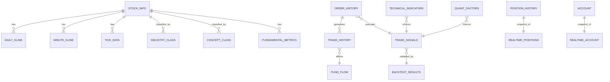

# Data Model Design: MyStocks量化交易数据管理系统

**创建人**: Claude (自动生成)
**版本**: 1.0.0
**创建日期**: 2025-10-11
**关联规格**: [spec.md](spec.md)
**关联研究**: [research.md](research.md)

## 模型设计概述

本文档定义MyStocks系统中23个数据分类对应的数据模型schema,覆盖从策略研发→回测验证→实盘交易→系统监控的全流程数据需求。所有模型遵循以下设计原则:

### 通用设计原则

1. **时序数据**: 所有时序表包含 `symbol` (股票代码) 和 `timestamp`/`date` (时间戳) 字段
2. **审计字段**: 所有表包含 `created_at` 和 `updated_at` 审计字段
3. **主键策略**: 时序表使用复合主键 `(symbol, timestamp)`,配置表使用自增主键
4. **索引优化**: 时序查询使用联合索引 `(symbol, timestamp DESC)`
5. **分区策略**: 时序表按月/季度分区,配置表不分区
6. **数据类型**: 价格使用DOUBLE,数量使用BIGINT,时间使用TIMESTAMP WITH TIME ZONE
7. **空值策略**: 核心字段NOT NULL,扩展字段允许NULL

---

## 1. Market Data Models (市场数据,6个实体)

### 1.1 Tick Data (Tick数据)

**数据分类**: `TICK_DATA`
**目标数据库**: TDengine
**表结构类型**: Super Table (超级表)
**数据频率**: 超高频 (毫秒级)
**压缩策略**: ZSTD高压缩级别,目标20:1压缩比

#### Schema定义

```sql
-- TDengine超级表
CREATE STABLE tick_data (
    ts TIMESTAMP NOT NULL,              -- 时间戳 (毫秒精度)
    price DOUBLE NOT NULL,              -- 成交价格
    volume BIGINT NOT NULL,             -- 成交量
    amount DOUBLE NOT NULL,             -- 成交额
    direction TINYINT,                  -- 买卖方向 (1=主动买, -1=主动卖, 0=未知)
    buy_count INT,                      -- 买盘笔数
    sell_count INT,                     -- 卖盘笔数
    bid_price DOUBLE,                   -- 买一价
    ask_price DOUBLE,                   -- 卖一价
    created_at TIMESTAMP DEFAULT NOW()  -- 记录创建时间
) TAGS (
    symbol BINARY(16) NOT NULL,         -- 股票代码
    exchange BINARY(16) NOT NULL,       -- 交易所 (SSE/SZSE)
    security_type BINARY(16) NOT NULL   -- 证券类型 (STOCK/INDEX/BOND)
)
ENCODE 'delta-d,delta-i,simple8b'       -- 编码策略
COMPRESS 'zstd'
LEVEL 'high'
KEEP 730;                               -- 保留730天 (2年)
```

#### 字段说明

| 字段名 | 类型 | 约束 | 说明 |
|-------|------|------|------|
| ts | TIMESTAMP | NOT NULL, PRIMARY KEY | 成交时间戳,毫秒精度 |
| price | DOUBLE | NOT NULL | 成交价格,保留3位小数 |
| volume | BIGINT | NOT NULL | 成交量,单位:股 |
| amount | DOUBLE | NOT NULL | 成交额,单位:元 |
| direction | TINYINT | NULLABLE | 买卖方向 (1=主动买, -1=主动卖, 0=未知) |
| buy_count | INT | NULLABLE | 买盘笔数 |
| sell_count | INT | NULLABLE | 卖盘笔数 |
| bid_price | DOUBLE | NULLABLE | 买一价 |
| ask_price | DOUBLE | NULLABLE | 卖一价 |
| **Tags** | | | |
| symbol | BINARY(16) | NOT NULL | 股票代码 (如 600000.SH) |
| exchange | BINARY(16) | NOT NULL | 交易所代码 |
| security_type | BINARY(16) | NOT NULL | 证券类型 |

#### 使用示例

```python
# 保存Tick数据
tick_df = pd.DataFrame({
    'ts': [datetime.now()],
    'symbol': ['600000.SH'],
    'exchange': ['SSE'],
    'security_type': ['STOCK'],
    'price': [10.55],
    'volume': [10000],
    'amount': [105500.0],
    'direction': [1]
})

mgr.save_data_by_classification(tick_df, DataClassification.TICK_DATA)
```

---

### 1.2 Minute Kline (分钟K线数据)

**数据分类**: `MINUTE_KLINE`
**目标数据库**: TDengine
**表结构类型**: Super Table
**数据频率**: 高频 (分钟级)
**压缩策略**: ZSTD高压缩级别

#### Schema定义

```sql
CREATE STABLE minute_kline (
    ts TIMESTAMP NOT NULL,              -- K线时间戳 (分钟精度)
    open DOUBLE NOT NULL,               -- 开盘价
    high DOUBLE NOT NULL,               -- 最高价
    low DOUBLE NOT NULL,                -- 最低价
    close DOUBLE NOT NULL,              -- 收盘价
    volume BIGINT NOT NULL,             -- 成交量
    amount DOUBLE NOT NULL,             -- 成交额
    num_trades INT,                     -- 成交笔数
    vwap DOUBLE,                        -- 成交均价 (Volume Weighted Average Price)
    created_at TIMESTAMP DEFAULT NOW()
) TAGS (
    symbol BINARY(16) NOT NULL,
    exchange BINARY(16) NOT NULL,
    interval_type BINARY(8) NOT NULL    -- K线周期 (1min/5min/15min/30min/60min)
)
ENCODE 'delta-d,delta-i,simple8b'
COMPRESS 'zstd'
LEVEL 'high'
KEEP 730;
```

#### 字段说明

| 字段名 | 类型 | 约束 | 说明 |
|-------|------|------|------|
| ts | TIMESTAMP | NOT NULL, PRIMARY KEY | K线时间戳 (分钟精度) |
| open | DOUBLE | NOT NULL | 开盘价 |
| high | DOUBLE | NOT NULL | 最高价 |
| low | DOUBLE | NOT NULL | 最低价 |
| close | DOUBLE | NOT NULL | 收盘价 |
| volume | BIGINT | NOT NULL | 成交量 |
| amount | DOUBLE | NOT NULL | 成交额 |
| num_trades | INT | NULLABLE | 成交笔数 |
| vwap | DOUBLE | NULLABLE | 成交均价 |
| **Tags** | | | |
| interval_type | BINARY(8) | NOT NULL | K线周期 (1min/5min/15min/30min/60min) |

---

### 1.3 Daily Kline (日线/周线/月线数据)

**数据分类**: `DAILY_KLINE`
**目标数据库**: PostgreSQL + TimescaleDB
**表结构类型**: Hypertable
**数据频率**: 中低频 (日/周/月)
**压缩策略**: 30天后自动压缩

#### Schema定义

```sql
CREATE TABLE daily_kline (
    id BIGSERIAL NOT NULL,
    symbol VARCHAR(16) NOT NULL,
    trade_date TIMESTAMPTZ NOT NULL,    -- 交易日期
    interval_type VARCHAR(8) NOT NULL,  -- D=日线, W=周线, M=月线
    open DOUBLE PRECISION NOT NULL,
    high DOUBLE PRECISION NOT NULL,
    low DOUBLE PRECISION NOT NULL,
    close DOUBLE PRECISION NOT NULL,
    volume BIGINT NOT NULL,
    amount DOUBLE PRECISION,
    turnover_rate DOUBLE PRECISION,     -- 换手率 (%)
    pe_ratio DOUBLE PRECISION,          -- 市盈率
    pb_ratio DOUBLE PRECISION,          -- 市净率
    adj_factor DOUBLE PRECISION,        -- 复权因子
    created_at TIMESTAMPTZ DEFAULT NOW(),
    updated_at TIMESTAMPTZ DEFAULT NOW(),
    PRIMARY KEY (id, trade_date)
) PARTITION BY RANGE (trade_date);

-- 转换为Hypertable
SELECT create_hypertable(
    'daily_kline',
    'trade_date',
    chunk_time_interval => INTERVAL '1 day',
    if_not_exists => TRUE
);

-- 索引
CREATE INDEX idx_daily_kline_symbol_date ON daily_kline (symbol, trade_date DESC);
CREATE INDEX idx_daily_kline_interval ON daily_kline (interval_type, trade_date DESC);

-- 压缩策略
ALTER TABLE daily_kline SET (
    timescaledb.compress,
    timescaledb.compress_segmentby = 'symbol, interval_type',
    timescaledb.compress_orderby = 'trade_date DESC'
);

SELECT add_compression_policy('daily_kline', INTERVAL '30 days');

-- 保留策略: 10年
SELECT add_retention_policy('daily_kline', INTERVAL '10 years');
```

#### 字段说明

| 字段名 | 类型 | 约束 | 说明 |
|-------|------|------|------|
| id | BIGSERIAL | NOT NULL, PRIMARY KEY | 自增主键 |
| symbol | VARCHAR(16) | NOT NULL | 股票代码 |
| trade_date | TIMESTAMPTZ | NOT NULL, PRIMARY KEY | 交易日期 |
| interval_type | VARCHAR(8) | NOT NULL | D=日线, W=周线, M=月线 |
| open | DOUBLE PRECISION | NOT NULL | 开盘价 |
| high | DOUBLE PRECISION | NOT NULL | 最高价 |
| low | DOUBLE PRECISION | NOT NULL | 最低价 |
| close | DOUBLE PRECISION | NOT NULL | 收盘价 |
| volume | BIGINT | NOT NULL | 成交量 |
| amount | DOUBLE PRECISION | NULLABLE | 成交额 |
| turnover_rate | DOUBLE PRECISION | NULLABLE | 换手率 (%) |
| pe_ratio | DOUBLE PRECISION | NULLABLE | 市盈率 |
| pb_ratio | DOUBLE PRECISION | NULLABLE | 市净率 |
| adj_factor | DOUBLE PRECISION | NULLABLE | 复权因子 (用于计算前/后复权价格) |

---

### 1.4 Order Book Depth (订单簿深度数据)

**数据分类**: `ORDER_BOOK_DEPTH`
**目标数据库**: TDengine
**表结构类型**: Super Table
**数据频率**: 高频 (秒级/3秒快照)

#### Schema定义

```sql
CREATE STABLE order_book_depth (
    ts TIMESTAMP NOT NULL,
    bid_prices BINARY(512),             -- JSON格式: 买盘10档价格 [price1, price2, ...]
    bid_volumes BINARY(512),            -- JSON格式: 买盘10档数量 [vol1, vol2, ...]
    ask_prices BINARY(512),             -- JSON格式: 卖盘10档价格
    ask_volumes BINARY(512),            -- JSON格式: 卖盘10档数量
    total_bid_volume BIGINT,            -- 买盘总量
    total_ask_volume BIGINT,            -- 卖盘总量
    spread DOUBLE,                      -- 价差 (ask_price_1 - bid_price_1)
    mid_price DOUBLE,                   -- 中间价 ((bid_price_1 + ask_price_1) / 2)
    created_at TIMESTAMP DEFAULT NOW()
) TAGS (
    symbol BINARY(16) NOT NULL,
    exchange BINARY(16) NOT NULL
)
COMPRESS 'zstd'
LEVEL 'medium'                          -- JSON字段压缩率较低
KEEP 365;                               -- 保留1年
```

#### 字段说明

| 字段名 | 类型 | 约束 | 说明 |
|-------|------|------|------|
| ts | TIMESTAMP | NOT NULL, PRIMARY KEY | 快照时间戳 |
| bid_prices | BINARY(512) | NULLABLE | 买盘10档价格 (JSON数组) |
| bid_volumes | BINARY(512) | NULLABLE | 买盘10档数量 (JSON数组) |
| ask_prices | BINARY(512) | NULLABLE | 卖盘10档价格 (JSON数组) |
| ask_volumes | BINARY(512) | NULLABLE | 卖盘10档数量 (JSON数组) |
| total_bid_volume | BIGINT | NULLABLE | 买盘总量 |
| total_ask_volume | BIGINT | NULLABLE | 卖盘总量 |
| spread | DOUBLE | NULLABLE | 价差 |
| mid_price | DOUBLE | NULLABLE | 中间价 |

---

### 1.5 Level-2 Snapshot (Level-2盘口快照)

**数据分类**: `LEVEL2_SNAPSHOT`
**目标数据库**: TDengine
**表结构类型**: Super Table
**数据频率**: 高频 (3秒/次)

#### Schema定义

```sql
CREATE STABLE level2_snapshot (
    ts TIMESTAMP NOT NULL,
    current_price DOUBLE NOT NULL,      -- 当前价
    pre_close DOUBLE NOT NULL,          -- 昨收价
    bid1_price DOUBLE, bid1_volume BIGINT,
    bid2_price DOUBLE, bid2_volume BIGINT,
    bid3_price DOUBLE, bid3_volume BIGINT,
    bid4_price DOUBLE, bid4_volume BIGINT,
    bid5_price DOUBLE, bid5_volume BIGINT,
    ask1_price DOUBLE, ask1_volume BIGINT,
    ask2_price DOUBLE, ask2_volume BIGINT,
    ask3_price DOUBLE, ask3_volume BIGINT,
    ask4_price DOUBLE, ask4_volume BIGINT,
    ask5_price DOUBLE, ask5_volume BIGINT,
    total_volume BIGINT,                -- 总成交量
    total_amount DOUBLE,                -- 总成交额
    weighted_buy_price DOUBLE,          -- 加权买价
    weighted_sell_price DOUBLE,         -- 加权卖价
    created_at TIMESTAMP DEFAULT NOW()
) TAGS (
    symbol BINARY(16) NOT NULL,
    exchange BINARY(16) NOT NULL
)
COMPRESS 'zstd'
LEVEL 'high'
KEEP 365;
```

---

### 1.6 Index Quotes (指数行情)

**数据分类**: `INDEX_QUOTES`
**目标数据库**: TDengine (分时) + PostgreSQL (日线)
**数据频率**: 分时高频 + 日线中频

#### Schema定义 (TDengine分时)

```sql
CREATE STABLE index_intraday_quotes (
    ts TIMESTAMP NOT NULL,
    index_value DOUBLE NOT NULL,        -- 指数点位
    change DOUBLE,                      -- 涨跌点数
    change_pct DOUBLE,                  -- 涨跌幅 (%)
    volume BIGINT,                      -- 成交量
    amount DOUBLE,                      -- 成交额
    created_at TIMESTAMP DEFAULT NOW()
) TAGS (
    index_code BINARY(16) NOT NULL,     -- 指数代码 (000001.SH=上证指数)
    index_name BINARY(64),              -- 指数名称
    market BINARY(16) NOT NULL          -- 市场 (SSE/SZSE/CSI)
)
COMPRESS 'zstd'
LEVEL 'high'
KEEP 180;                               -- 保留6个月
```

#### Schema定义 (PostgreSQL日线)

```sql
CREATE TABLE index_daily_quotes (
    id BIGSERIAL NOT NULL,
    index_code VARCHAR(16) NOT NULL,
    trade_date TIMESTAMPTZ NOT NULL,
    open DOUBLE PRECISION NOT NULL,
    high DOUBLE PRECISION NOT NULL,
    low DOUBLE PRECISION NOT NULL,
    close DOUBLE PRECISION NOT NULL,
    volume BIGINT,
    amount DOUBLE PRECISION,
    change_pct DOUBLE PRECISION,
    created_at TIMESTAMPTZ DEFAULT NOW(),
    PRIMARY KEY (id, trade_date)
) PARTITION BY RANGE (trade_date);

SELECT create_hypertable('index_daily_quotes', 'trade_date', chunk_time_interval => INTERVAL '1 day');

CREATE INDEX idx_index_daily_code_date ON index_daily_quotes (index_code, trade_date DESC);

SELECT add_compression_policy('index_daily_quotes', INTERVAL '30 days');
```

---

## 2. Reference Data Models (参考数据,9个实体)

### 2.1 Symbols Info (股票基础信息)

**数据分类**: `SYMBOLS_INFO`
**目标数据库**: MySQL/MariaDB
**表结构类型**: 普通表
**数据频率**: 静态/半静态 (日度更新)

#### Schema定义

```sql
CREATE TABLE stock_info (
    id BIGINT UNSIGNED AUTO_INCREMENT PRIMARY KEY,
    symbol VARCHAR(16) NOT NULL UNIQUE,     -- 股票代码 (600000.SH)
    name VARCHAR(64) NOT NULL,              -- 股票名称
    exchange VARCHAR(16) NOT NULL,          -- 交易所 (SSE/SZSE)
    security_type VARCHAR(16) NOT NULL,     -- 证券类型 (STOCK/INDEX/BOND/FUND)
    list_date DATE,                         -- 上市日期
    delist_date DATE,                       -- 退市日期
    status VARCHAR(16) NOT NULL DEFAULT 'ACTIVE', -- 状态 (ACTIVE/SUSPENDED/DELISTED)
    listing_board VARCHAR(16),              -- 上市板块 (MAIN/GEM/STAR/BJ)
    market_cap DOUBLE,                      -- 总市值 (元)
    circulating_market_cap DOUBLE,          -- 流通市值 (元)
    total_shares BIGINT,                    -- 总股本
    circulating_shares BIGINT,              -- 流通股本
    created_at TIMESTAMP DEFAULT CURRENT_TIMESTAMP,
    updated_at TIMESTAMP DEFAULT CURRENT_TIMESTAMP ON UPDATE CURRENT_TIMESTAMP,
    INDEX idx_symbol (symbol),
    INDEX idx_exchange_status (exchange, status),
    INDEX idx_security_type (security_type)
) ENGINE=InnoDB DEFAULT CHARSET=utf8mb4 COLLATE=utf8mb4_unicode_ci;
```

#### 字段说明

| 字段名 | 类型 | 约束 | 说明 |
|-------|------|------|------|
| id | BIGINT UNSIGNED | AUTO_INCREMENT, PRIMARY KEY | 自增主键 |
| symbol | VARCHAR(16) | NOT NULL, UNIQUE | 股票代码 (统一格式: 600000.SH) |
| name | VARCHAR(64) | NOT NULL | 股票名称 (如"浦发银行") |
| exchange | VARCHAR(16) | NOT NULL | 交易所 (SSE=上交所, SZSE=深交所) |
| security_type | VARCHAR(16) | NOT NULL | 证券类型 |
| list_date | DATE | NULLABLE | 上市日期 |
| delist_date | DATE | NULLABLE | 退市日期 (NULL表示未退市) |
| status | VARCHAR(16) | NOT NULL, DEFAULT 'ACTIVE' | 状态 |
| listing_board | VARCHAR(16) | NULLABLE | 上市板块 (MAIN=主板, GEM=创业板, STAR=科创板, BJ=北交所) |
| market_cap | DOUBLE | NULLABLE | 总市值 (元,动态更新) |
| circulating_market_cap | DOUBLE | NULLABLE | 流通市值 (元,动态更新) |
| total_shares | BIGINT | NULLABLE | 总股本 (股) |
| circulating_shares | BIGINT | NULLABLE | 流通股本 (股) |

---

### 2.2 Industry Classification (行业分类)

**数据分类**: `INDUSTRY_CLASS`
**目标数据库**: MySQL/MariaDB

#### Schema定义

```sql
CREATE TABLE industry_classification (
    id BIGINT UNSIGNED AUTO_INCREMENT PRIMARY KEY,
    symbol VARCHAR(16) NOT NULL,
    industry_standard VARCHAR(32) NOT NULL,     -- 分类标准 (SW=申万, CSRC=证监会, THS=同花顺)
    industry_level VARCHAR(8) NOT NULL,         -- 行业层级 (L1=一级, L2=二级, L3=三级)
    industry_code VARCHAR(16) NOT NULL,         -- 行业代码
    industry_name VARCHAR(64) NOT NULL,         -- 行业名称
    parent_industry_code VARCHAR(16),           -- 父行业代码
    valid_from DATE NOT NULL,                   -- 生效日期
    valid_to DATE,                              -- 失效日期 (NULL表示当前有效)
    created_at TIMESTAMP DEFAULT CURRENT_TIMESTAMP,
    updated_at TIMESTAMP DEFAULT CURRENT_TIMESTAMP ON UPDATE CURRENT_TIMESTAMP,
    INDEX idx_symbol_standard (symbol, industry_standard),
    INDEX idx_industry_code (industry_code),
    INDEX idx_valid_period (valid_from, valid_to),
    UNIQUE KEY uk_symbol_standard_level (symbol, industry_standard, industry_level, valid_from)
) ENGINE=InnoDB DEFAULT CHARSET=utf8mb4 COLLATE=utf8mb4_unicode_ci;
```

---

### 2.3 Concept Classification (概念分类)

**数据分类**: `CONCEPT_CLASS`
**目标数据库**: MySQL/MariaDB

#### Schema定义

```sql
CREATE TABLE concept_classification (
    id BIGINT UNSIGNED AUTO_INCREMENT PRIMARY KEY,
    symbol VARCHAR(16) NOT NULL,
    concept_name VARCHAR(64) NOT NULL,          -- 概念名称 (AI、新能源、国企改革)
    concept_category VARCHAR(32),               -- 概念类别 (TECH/NEW_ENERGY/POLICY)
    concept_source VARCHAR(32) NOT NULL,        -- 概念来源 (THS/EASTMONEY/WIND)
    join_date DATE NOT NULL,                    -- 加入概念日期
    exit_date DATE,                             -- 退出概念日期 (NULL表示仍在概念内)
    weight DOUBLE,                              -- 权重 (如果概念有权重)
    created_at TIMESTAMP DEFAULT CURRENT_TIMESTAMP,
    updated_at TIMESTAMP DEFAULT CURRENT_TIMESTAMP ON UPDATE CURRENT_TIMESTAMP,
    INDEX idx_symbol (symbol),
    INDEX idx_concept_name (concept_name),
    INDEX idx_concept_category (concept_category),
    INDEX idx_join_date (join_date DESC)
) ENGINE=InnoDB DEFAULT CHARSET=utf8mb4 COLLATE=utf8mb4_unicode_ci;
```

---

### 2.4 Index Constituents (指数成分股)

**数据分类**: `INDEX_CONSTITUENTS`
**目标数据库**: MySQL/MariaDB

#### Schema定义

```sql
CREATE TABLE index_constituents (
    id BIGINT UNSIGNED AUTO_INCREMENT PRIMARY KEY,
    index_code VARCHAR(16) NOT NULL,            -- 指数代码 (000300.SH=沪深300)
    index_name VARCHAR(64) NOT NULL,            -- 指数名称
    symbol VARCHAR(16) NOT NULL,                -- 成分股代码
    weight DOUBLE,                              -- 权重 (%)
    in_date DATE NOT NULL,                      -- 纳入日期
    out_date DATE,                              -- 调出日期 (NULL表示当前在成分内)
    adjustment_reason VARCHAR(128),             -- 调整原因
    created_at TIMESTAMP DEFAULT CURRENT_TIMESTAMP,
    updated_at TIMESTAMP DEFAULT CURRENT_TIMESTAMP ON UPDATE CURRENT_TIMESTAMP,
    INDEX idx_index_code (index_code, in_date DESC),
    INDEX idx_symbol (symbol),
    INDEX idx_in_date (in_date DESC),
    UNIQUE KEY uk_index_symbol_in_date (index_code, symbol, in_date)
) ENGINE=InnoDB DEFAULT CHARSET=utf8mb4 COLLATE=utf8mb4_unicode_ci;
```

---

### 2.5 Trade Calendar (交易日历)

**数据分类**: `TRADE_CALENDAR`
**目标数据库**: MySQL/MariaDB

#### Schema定义

```sql
CREATE TABLE trade_calendar (
    id BIGINT UNSIGNED AUTO_INCREMENT PRIMARY KEY,
    trade_date DATE NOT NULL UNIQUE,            -- 交易日期
    is_open BOOLEAN NOT NULL,                   -- 是否开市
    exchange VARCHAR(16) NOT NULL,              -- 交易所 (SSE/SZSE/ALL)
    day_type VARCHAR(16) NOT NULL,              -- 日期类型 (TRADING/WEEKEND/HOLIDAY)
    holiday_name VARCHAR(64),                   -- 节假日名称 (如"国庆节")
    prev_trade_date DATE,                       -- 上一交易日
    next_trade_date DATE,                       -- 下一交易日
    created_at TIMESTAMP DEFAULT CURRENT_TIMESTAMP,
    updated_at TIMESTAMP DEFAULT CURRENT_TIMESTAMP ON UPDATE CURRENT_TIMESTAMP,
    INDEX idx_trade_date (trade_date DESC),
    INDEX idx_is_open_exchange (is_open, exchange),
    INDEX idx_day_type (day_type)
) ENGINE=InnoDB DEFAULT CHARSET=utf8mb4 COLLATE=utf8mb4_unicode_ci;
```

---

### 2.6 Fundamental Metrics (财务指标)

**数据分类**: `FUNDAMENTAL_METRICS`
**目标数据库**: MySQL/MariaDB

#### Schema定义

```sql
CREATE TABLE fundamental_metrics (
    id BIGINT UNSIGNED AUTO_INCREMENT PRIMARY KEY,
    symbol VARCHAR(16) NOT NULL,
    report_period DATE NOT NULL,                -- 报告期 (YYYY-MM-DD)
    report_type VARCHAR(16) NOT NULL,           -- 报告类型 (Q1/Q2/Q3/ANNUAL)
    revenue DOUBLE,                             -- 营业收入 (元)
    net_profit DOUBLE,                          -- 净利润 (元)
    eps DOUBLE,                                 -- 每股收益
    roe DOUBLE,                                 -- 净资产收益率 (%)
    roa DOUBLE,                                 -- 总资产收益率 (%)
    gross_margin DOUBLE,                        -- 毛利率 (%)
    net_margin DOUBLE,                          -- 净利率 (%)
    debt_ratio DOUBLE,                          -- 资产负债率 (%)
    current_ratio DOUBLE,                       -- 流动比率
    quick_ratio DOUBLE,                         -- 速动比率
    total_assets DOUBLE,                        -- 总资产 (元)
    total_liabilities DOUBLE,                   -- 总负债 (元)
    shareholders_equity DOUBLE,                 -- 股东权益 (元)
    operating_cash_flow DOUBLE,                 -- 经营活动现金流 (元)
    created_at TIMESTAMP DEFAULT CURRENT_TIMESTAMP,
    updated_at TIMESTAMP DEFAULT CURRENT_TIMESTAMP ON UPDATE CURRENT_TIMESTAMP,
    INDEX idx_symbol_period (symbol, report_period DESC),
    INDEX idx_report_period (report_period DESC),
    UNIQUE KEY uk_symbol_period_type (symbol, report_period, report_type)
) ENGINE=InnoDB DEFAULT CHARSET=utf8mb4 COLLATE=utf8mb4_unicode_ci;
```

---

### 2.7 Dividend Data (分红送配)

**数据分类**: `DIVIDEND_DATA`
**目标数据库**: MySQL/MariaDB

#### Schema定义

```sql
CREATE TABLE dividend_data (
    id BIGINT UNSIGNED AUTO_INCREMENT PRIMARY KEY,
    symbol VARCHAR(16) NOT NULL,
    announcement_date DATE NOT NULL,            -- 公告日期
    ex_dividend_date DATE NOT NULL,             -- 除权除息日
    record_date DATE,                           -- 股权登记日
    payment_date DATE,                          -- 派息日
    dividend_ratio DOUBLE,                      -- 每股派息 (元)
    bonus_share_ratio DOUBLE,                   -- 每股送股 (股)
    transfer_ratio DOUBLE,                      -- 每股转增 (股)
    total_dividend_amount DOUBLE,               -- 总派息金额 (元)
    payout_ratio DOUBLE,                        -- 分红比例 (%)
    dividend_yield DOUBLE,                      -- 股息率 (%)
    created_at TIMESTAMP DEFAULT CURRENT_TIMESTAMP,
    updated_at TIMESTAMP DEFAULT CURRENT_TIMESTAMP ON UPDATE CURRENT_TIMESTAMP,
    INDEX idx_symbol_ex_date (symbol, ex_dividend_date DESC),
    INDEX idx_ex_dividend_date (ex_dividend_date DESC),
    UNIQUE KEY uk_symbol_ex_date (symbol, ex_dividend_date)
) ENGINE=InnoDB DEFAULT CHARSET=utf8mb4 COLLATE=utf8mb4_unicode_ci;
```

---

### 2.8 Shareholder Data (股东数据)

**数据分类**: `SHAREHOLDER_DATA`
**目标数据库**: MySQL/MariaDB

#### Schema定义

```sql
CREATE TABLE shareholder_data (
    id BIGINT UNSIGNED AUTO_INCREMENT PRIMARY KEY,
    symbol VARCHAR(16) NOT NULL,
    report_period DATE NOT NULL,                -- 报告期
    holder_name VARCHAR(128) NOT NULL,          -- 股东名称
    holder_type VARCHAR(32) NOT NULL,           -- 股东类型 (FUND/QFII/INSURANCE/CORP/INDIVIDUAL)
    holder_rank INT,                            -- 股东排名
    shareholding BIGINT,                        -- 持股数量 (股)
    shareholding_pct DOUBLE,                    -- 持股比例 (%)
    change_shares BIGINT,                       -- 增减持数量 (股)
    change_pct DOUBLE,                          -- 增减持比例 (%)
    created_at TIMESTAMP DEFAULT CURRENT_TIMESTAMP,
    updated_at TIMESTAMP DEFAULT CURRENT_TIMESTAMP ON UPDATE CURRENT_TIMESTAMP,
    INDEX idx_symbol_period (symbol, report_period DESC),
    INDEX idx_holder_name (holder_name),
    INDEX idx_holder_type (holder_type),
    UNIQUE KEY uk_symbol_period_holder (symbol, report_period, holder_name)
) ENGINE=InnoDB DEFAULT CHARSET=utf8mb4 COLLATE=utf8mb4_unicode_ci;
```

---

### 2.9 Market Rules (市场规则)

**数据分类**: `MARKET_RULES`
**目标数据库**: MySQL/MariaDB

#### Schema定义

```sql
CREATE TABLE market_rules (
    id BIGINT UNSIGNED AUTO_INCREMENT PRIMARY KEY,
    symbol VARCHAR(16),                         -- 股票代码 (NULL表示全市场规则)
    exchange VARCHAR(16) NOT NULL,              -- 交易所
    listing_board VARCHAR(16),                  -- 上市板块
    price_limit_up_pct DOUBLE NOT NULL,         -- 涨停幅度 (%)
    price_limit_down_pct DOUBLE NOT NULL,       -- 跌停幅度 (%)
    tick_size DOUBLE NOT NULL,                  -- 最小价格变动单位 (元)
    lot_size INT NOT NULL,                      -- 最小交易单位 (股,通常100)
    max_order_volume BIGINT,                    -- 单笔最大委托量
    trading_hours VARCHAR(128),                 -- 交易时间 (JSON格式)
    rule_effective_date DATE NOT NULL,          -- 规则生效日期
    rule_expiry_date DATE,                      -- 规则失效日期 (NULL表示当前有效)
    created_at TIMESTAMP DEFAULT CURRENT_TIMESTAMP,
    updated_at TIMESTAMP DEFAULT CURRENT_TIMESTAMP ON UPDATE CURRENT_TIMESTAMP,
    INDEX idx_symbol (symbol),
    INDEX idx_exchange_board (exchange, listing_board),
    INDEX idx_effective_date (rule_effective_date DESC)
) ENGINE=InnoDB DEFAULT CHARSET=utf8mb4 COLLATE=utf8mb4_unicode_ci;
```

---

## 3. Derived Data Models (衍生数据,6个实体)

### 3.1 Technical Indicators (技术指标)

**数据分类**: `TECHNICAL_INDICATORS`
**目标数据库**: PostgreSQL + TimescaleDB
**表结构类型**: Hypertable

#### Schema定义

```sql
CREATE TABLE technical_indicators (
    id BIGSERIAL NOT NULL,
    symbol VARCHAR(16) NOT NULL,
    calc_date TIMESTAMPTZ NOT NULL,             -- 计算日期
    indicator_name VARCHAR(32) NOT NULL,        -- 指标名称 (MACD/RSI/BOLL/KDJ/MA)
    indicator_value DOUBLE PRECISION,           -- 指标值
    indicator_params JSONB,                     -- 指标参数 (如{"period": 20, "type": "EMA"})
    signal_line DOUBLE PRECISION,               -- 信号线 (如MACD的信号线)
    histogram DOUBLE PRECISION,                 -- 柱状图值 (如MACD柱)
    upper_band DOUBLE PRECISION,                -- 上轨 (如布林带上轨)
    lower_band DOUBLE PRECISION,                -- 下轨 (如布林带下轨)
    created_at TIMESTAMPTZ DEFAULT NOW(),
    updated_at TIMESTAMPTZ DEFAULT NOW(),
    PRIMARY KEY (id, calc_date)
) PARTITION BY RANGE (calc_date);

SELECT create_hypertable('technical_indicators', 'calc_date', chunk_time_interval => INTERVAL '1 day');

CREATE INDEX idx_tech_symbol_date ON technical_indicators (symbol, calc_date DESC);
CREATE INDEX idx_tech_indicator ON technical_indicators (indicator_name);

ALTER TABLE technical_indicators SET (
    timescaledb.compress,
    timescaledb.compress_segmentby = 'symbol, indicator_name',
    timescaledb.compress_orderby = 'calc_date DESC'
);

SELECT add_compression_policy('technical_indicators', INTERVAL '30 days');
SELECT add_retention_policy('technical_indicators', INTERVAL '5 years');
```

---

### 3.2 Quant Factors (量化因子)

**数据分类**: `QUANT_FACTORS`
**目标数据库**: PostgreSQL + TimescaleDB

#### Schema定义

```sql
CREATE TABLE quant_factors (
    id BIGSERIAL NOT NULL,
    symbol VARCHAR(16) NOT NULL,
    factor_date TIMESTAMPTZ NOT NULL,           -- 因子计算日期
    factor_category VARCHAR(32) NOT NULL,       -- 因子类别 (VALUE/GROWTH/MOMENTUM/QUALITY)
    factor_name VARCHAR(64) NOT NULL,           -- 因子名称
    factor_value DOUBLE PRECISION NOT NULL,     -- 因子值
    factor_percentile DOUBLE PRECISION,         -- 因子百分位 (0-100)
    factor_z_score DOUBLE PRECISION,            -- 因子标准化得分
    sector_neutral_value DOUBLE PRECISION,      -- 行业中性化后的值
    market_neutral_value DOUBLE PRECISION,      -- 市场中性化后的值
    factor_params JSONB,                        -- 因子参数配置
    created_at TIMESTAMPTZ DEFAULT NOW(),
    updated_at TIMESTAMPTZ DEFAULT NOW(),
    PRIMARY KEY (id, factor_date)
) PARTITION BY RANGE (factor_date);

SELECT create_hypertable('quant_factors', 'factor_date', chunk_time_interval => INTERVAL '1 day');

CREATE INDEX idx_quant_symbol_date ON quant_factors (symbol, factor_date DESC);
CREATE INDEX idx_quant_factor_name ON quant_factors (factor_name, factor_date DESC);
CREATE INDEX idx_quant_category ON quant_factors (factor_category);

ALTER TABLE quant_factors SET (
    timescaledb.compress,
    timescaledb.compress_segmentby = 'symbol, factor_category, factor_name',
    timescaledb.compress_orderby = 'factor_date DESC'
);

SELECT add_compression_policy('quant_factors', INTERVAL '30 days');
```

---

### 3.3 Model Output (模型输出)

**数据分类**: `MODEL_OUTPUT`
**目标数据库**: PostgreSQL + TimescaleDB

#### Schema定义

```sql
CREATE TABLE model_output (
    id BIGSERIAL NOT NULL,
    model_id VARCHAR(64) NOT NULL,              -- 模型ID
    model_name VARCHAR(128) NOT NULL,           -- 模型名称
    model_version VARCHAR(16) NOT NULL,         -- 模型版本
    symbol VARCHAR(16) NOT NULL,
    prediction_time TIMESTAMPTZ NOT NULL,       -- 预测时间
    prediction_horizon VARCHAR(16) NOT NULL,    -- 预测周期 (1D/5D/1M)
    prediction_value DOUBLE PRECISION NOT NULL, -- 预测值 (价格/涨跌幅)
    confidence DOUBLE PRECISION,                -- 置信度 (0-1)
    prediction_type VARCHAR(32) NOT NULL,       -- 预测类型 (PRICE/RETURN/DIRECTION)
    feature_importance JSONB,                   -- 特征重要性 (JSON格式)
    model_metadata JSONB,                       -- 模型元数据
    created_at TIMESTAMPTZ DEFAULT NOW(),
    PRIMARY KEY (id, prediction_time)
) PARTITION BY RANGE (prediction_time);

SELECT create_hypertable('model_output', 'prediction_time', chunk_time_interval => INTERVAL '1 day');

CREATE INDEX idx_model_symbol_time ON model_output (symbol, prediction_time DESC);
CREATE INDEX idx_model_id ON model_output (model_id, prediction_time DESC);

ALTER TABLE model_output SET (
    timescaledb.compress,
    timescaledb.compress_segmentby = 'model_id, symbol',
    timescaledb.compress_orderby = 'prediction_time DESC'
);

SELECT add_compression_policy('model_output', INTERVAL '30 days');
```

---

### 3.4 Trade Signals (交易信号)

**数据分类**: `TRADE_SIGNALS`
**目标数据库**: PostgreSQL + TimescaleDB

#### Schema定义

```sql
CREATE TABLE trade_signals (
    id BIGSERIAL NOT NULL,
    signal_id VARCHAR(64) UNIQUE NOT NULL,      -- 信号唯一ID
    strategy_id VARCHAR(64) NOT NULL,           -- 策略ID
    strategy_name VARCHAR(128) NOT NULL,        -- 策略名称
    symbol VARCHAR(16) NOT NULL,
    signal_time TIMESTAMPTZ NOT NULL,           -- 信号生成时间
    signal_type VARCHAR(16) NOT NULL,           -- 信号类型 (BUY/SELL/HOLD)
    signal_strength DOUBLE PRECISION NOT NULL,  -- 信号强度 (0-1)
    target_price DOUBLE PRECISION,              -- 目标价格
    stop_loss_price DOUBLE PRECISION,           -- 止损价格
    take_profit_price DOUBLE PRECISION,         -- 止盈价格
    position_size INT,                          -- 建议仓位数量
    signal_reason TEXT,                         -- 信号原因描述
    signal_status VARCHAR(16) NOT NULL DEFAULT 'ACTIVE', -- 状态 (ACTIVE/EXECUTED/EXPIRED/CANCELLED)
    executed_time TIMESTAMPTZ,                  -- 执行时间
    created_at TIMESTAMPTZ DEFAULT NOW(),
    PRIMARY KEY (id, signal_time)
) PARTITION BY RANGE (signal_time);

SELECT create_hypertable('trade_signals', 'signal_time', chunk_time_interval => INTERVAL '1 day');

CREATE INDEX idx_signal_symbol_time ON trade_signals (symbol, signal_time DESC);
CREATE INDEX idx_signal_strategy ON trade_signals (strategy_id, signal_time DESC);
CREATE INDEX idx_signal_status ON trade_signals (signal_status, signal_time DESC);

ALTER TABLE trade_signals SET (
    timescaledb.compress,
    timescaledb.compress_segmentby = 'strategy_id, symbol, signal_status',
    timescaledb.compress_orderby = 'signal_time DESC'
);

SELECT add_compression_policy('trade_signals', INTERVAL '30 days');
```

---

### 3.5 Backtest Results (回测结果)

**数据分类**: `BACKTEST_RESULTS`
**目标数据库**: PostgreSQL + TimescaleDB

#### Schema定义

```sql
CREATE TABLE backtest_results (
    id BIGSERIAL NOT NULL,
    backtest_id VARCHAR(64) UNIQUE NOT NULL,    -- 回测唯一ID
    strategy_id VARCHAR(64) NOT NULL,           -- 策略ID
    strategy_name VARCHAR(128) NOT NULL,        -- 策略名称
    backtest_start_date DATE NOT NULL,          -- 回测开始日期
    backtest_end_date DATE NOT NULL,            -- 回测结束日期
    initial_capital DOUBLE PRECISION NOT NULL,  -- 初始资金
    final_capital DOUBLE PRECISION NOT NULL,    -- 最终资金
    total_return DOUBLE PRECISION NOT NULL,     -- 总收益率 (%)
    annualized_return DOUBLE PRECISION,         -- 年化收益率 (%)
    max_drawdown DOUBLE PRECISION NOT NULL,     -- 最大回撤 (%)
    sharpe_ratio DOUBLE PRECISION,              -- 夏普比率
    sortino_ratio DOUBLE PRECISION,             -- 索提诺比率
    calmar_ratio DOUBLE PRECISION,              -- 卡玛比率
    win_rate DOUBLE PRECISION,                  -- 胜率 (%)
    profit_factor DOUBLE PRECISION,             -- 盈亏比
    total_trades INT NOT NULL,                  -- 总交易次数
    winning_trades INT,                         -- 盈利次数
    losing_trades INT,                          -- 亏损次数
    avg_winning_trade DOUBLE PRECISION,         -- 平均盈利金额
    avg_losing_trade DOUBLE PRECISION,          -- 平均亏损金额
    return_curve JSONB,                         -- 收益曲线 (JSON数组)
    drawdown_curve JSONB,                       -- 回撤曲线 (JSON数组)
    strategy_params JSONB,                      -- 策略参数配置
    backtest_metadata JSONB,                    -- 回测元数据
    created_at TIMESTAMPTZ DEFAULT NOW(),
    updated_at TIMESTAMPTZ DEFAULT NOW(),
    PRIMARY KEY (id, backtest_start_date)
) PARTITION BY RANGE (backtest_start_date);

SELECT create_hypertable('backtest_results', 'backtest_start_date', chunk_time_interval => INTERVAL '1 month');

CREATE INDEX idx_backtest_strategy ON backtest_results (strategy_id, backtest_start_date DESC);
CREATE INDEX idx_backtest_return ON backtest_results (total_return DESC);
CREATE INDEX idx_backtest_sharpe ON backtest_results (sharpe_ratio DESC);
```

---

### 3.6 Risk Metrics (风险指标)

**数据分类**: `RISK_METRICS`
**目标数据库**: PostgreSQL + TimescaleDB

#### Schema定义

```sql
CREATE TABLE risk_metrics (
    id BIGSERIAL NOT NULL,
    portfolio_id VARCHAR(64) NOT NULL,          -- 组合ID
    portfolio_name VARCHAR(128) NOT NULL,       -- 组合名称
    metric_date TIMESTAMPTZ NOT NULL,           -- 指标计算日期
    var_95 DOUBLE PRECISION,                    -- 95% Value at Risk
    var_99 DOUBLE PRECISION,                    -- 99% Value at Risk
    cvar_95 DOUBLE PRECISION,                   -- 95% Conditional VaR (期望亏损)
    beta DOUBLE PRECISION,                      -- Beta系数 (相对市场)
    alpha DOUBLE PRECISION,                     -- Alpha系数 (超额收益)
    volatility DOUBLE PRECISION,                -- 波动率 (年化标准差)
    tracking_error DOUBLE PRECISION,            -- 跟踪误差
    information_ratio DOUBLE PRECISION,         -- 信息比率
    industry_exposure JSONB,                    -- 行业暴露度 (JSON格式)
    factor_exposure JSONB,                      -- 因子暴露度 (JSON格式)
    concentration_risk DOUBLE PRECISION,        -- 集中度风险 (赫芬达尔指数)
    liquidity_risk DOUBLE PRECISION,            -- 流动性风险得分
    created_at TIMESTAMPTZ DEFAULT NOW(),
    updated_at TIMESTAMPTZ DEFAULT NOW(),
    PRIMARY KEY (id, metric_date)
) PARTITION BY RANGE (metric_date);

SELECT create_hypertable('risk_metrics', 'metric_date', chunk_time_interval => INTERVAL '1 day');

CREATE INDEX idx_risk_portfolio_date ON risk_metrics (portfolio_id, metric_date DESC);
CREATE INDEX idx_risk_var ON risk_metrics (var_95 DESC);
```

---

## 4. Transaction Data Models (交易数据,7个实体)

### 4.1 Order Records (订单记录)

**数据分类**: `ORDER_RECORDS`
**目标数据库**: PostgreSQL + TimescaleDB

#### Schema定义

```sql
CREATE TABLE order_history (
    id BIGSERIAL NOT NULL,
    order_id VARCHAR(64) UNIQUE NOT NULL,       -- 订单唯一ID
    account_id VARCHAR(64) NOT NULL,            -- 账户ID
    symbol VARCHAR(16) NOT NULL,
    order_time TIMESTAMPTZ NOT NULL,            -- 下单时间
    order_type VARCHAR(16) NOT NULL,            -- 订单类型 (LIMIT/MARKET/STOP)
    direction VARCHAR(8) NOT NULL,              -- 买卖方向 (BUY/SELL)
    price DOUBLE PRECISION,                     -- 委托价格
    quantity BIGINT NOT NULL,                   -- 委托数量
    filled_quantity BIGINT DEFAULT 0,           -- 已成交数量
    cancelled_quantity BIGINT DEFAULT 0,        -- 已撤销数量
    status VARCHAR(16) NOT NULL,                -- 状态 (PENDING/PARTIAL/FILLED/CANCELLED/REJECTED)
    commission DOUBLE PRECISION,                -- 手续费
    tax DOUBLE PRECISION,                       -- 印花税
    avg_filled_price DOUBLE PRECISION,          -- 平均成交价
    reject_reason TEXT,                         -- 拒绝原因
    strategy_id VARCHAR(64),                    -- 关联策略ID
    signal_id VARCHAR(64),                      -- 关联信号ID
    updated_at TIMESTAMPTZ DEFAULT NOW(),
    PRIMARY KEY (id, order_time)
) PARTITION BY RANGE (order_time);

SELECT create_hypertable('order_history', 'order_time', chunk_time_interval => INTERVAL '1 day');

CREATE INDEX idx_order_account_time ON order_history (account_id, order_time DESC);
CREATE INDEX idx_order_symbol_time ON order_history (symbol, order_time DESC);
CREATE INDEX idx_order_status ON order_history (status, order_time DESC);

ALTER TABLE order_history SET (
    timescaledb.compress,
    timescaledb.compress_segmentby = 'account_id, symbol, status',
    timescaledb.compress_orderby = 'order_time DESC'
);

SELECT add_compression_policy('order_history', INTERVAL '30 days');
SELECT add_retention_policy('order_history', INTERVAL '3 years');
```

---

### 4.2 Trade Records (成交记录)

**数据分类**: `TRADE_RECORDS`
**目标数据库**: PostgreSQL + TimescaleDB

#### Schema定义

```sql
CREATE TABLE trade_history (
    id BIGSERIAL NOT NULL,
    trade_id VARCHAR(64) UNIQUE NOT NULL,       -- 成交唯一ID
    order_id VARCHAR(64) NOT NULL,              -- 关联订单ID
    account_id VARCHAR(64) NOT NULL,
    symbol VARCHAR(16) NOT NULL,
    trade_time TIMESTAMPTZ NOT NULL,            -- 成交时间
    direction VARCHAR(8) NOT NULL,              -- 买卖方向
    price DOUBLE PRECISION NOT NULL,            -- 成交价格
    quantity BIGINT NOT NULL,                   -- 成交数量
    amount DOUBLE PRECISION NOT NULL,           -- 成交金额
    commission DOUBLE PRECISION,                -- 手续费
    tax DOUBLE PRECISION,                       -- 印花税
    net_amount DOUBLE PRECISION,                -- 净金额 (amount - commission - tax)
    counter_party VARCHAR(64),                  -- 对手方 (如有)
    exchange_trade_id VARCHAR(64),              -- 交易所成交编号
    created_at TIMESTAMPTZ DEFAULT NOW(),
    PRIMARY KEY (id, trade_time)
) PARTITION BY RANGE (trade_time);

SELECT create_hypertable('trade_history', 'trade_time', chunk_time_interval => INTERVAL '1 day');

CREATE INDEX idx_trade_account_time ON trade_history (account_id, trade_time DESC);
CREATE INDEX idx_trade_order ON trade_history (order_id);
CREATE INDEX idx_trade_symbol_time ON trade_history (symbol, trade_time DESC);

ALTER TABLE trade_history SET (
    timescaledb.compress,
    timescaledb.compress_segmentby = 'account_id, symbol',
    timescaledb.compress_orderby = 'trade_time DESC'
);

SELECT add_compression_policy('trade_history', INTERVAL '30 days');
```

---

### 4.3 Position History (持仓历史快照)

**数据分类**: `POSITION_HISTORY`
**目标数据库**: PostgreSQL + TimescaleDB

#### Schema定义

```sql
CREATE TABLE position_history (
    id BIGSERIAL NOT NULL,
    snapshot_id VARCHAR(64) NOT NULL,           -- 快照ID
    account_id VARCHAR(64) NOT NULL,
    symbol VARCHAR(16) NOT NULL,
    snapshot_time TIMESTAMPTZ NOT NULL,         -- 快照时间
    quantity BIGINT NOT NULL,                   -- 持仓数量
    available_quantity BIGINT NOT NULL,         -- 可用数量
    frozen_quantity BIGINT DEFAULT 0,           -- 冻结数量
    cost_price DOUBLE PRECISION NOT NULL,       -- 成本价
    current_price DOUBLE PRECISION NOT NULL,    -- 当前价
    market_value DOUBLE PRECISION NOT NULL,     -- 市值
    profit_loss DOUBLE PRECISION NOT NULL,      -- 浮动盈亏
    profit_loss_pct DOUBLE PRECISION NOT NULL,  -- 盈亏比例 (%)
    position_ratio DOUBLE PRECISION,            -- 持仓占比 (%)
    created_at TIMESTAMPTZ DEFAULT NOW(),
    PRIMARY KEY (id, snapshot_time)
) PARTITION BY RANGE (snapshot_time);

SELECT create_hypertable('position_history', 'snapshot_time', chunk_time_interval => INTERVAL '1 day');

CREATE INDEX idx_position_account_time ON position_history (account_id, snapshot_time DESC);
CREATE INDEX idx_position_symbol_time ON position_history (symbol, snapshot_time DESC);

ALTER TABLE position_history SET (
    timescaledb.compress,
    timescaledb.compress_segmentby = 'account_id, symbol',
    timescaledb.compress_orderby = 'snapshot_time DESC'
);

SELECT add_compression_policy('position_history', INTERVAL '30 days');
```

---

### 4.4 Realtime Positions (实时持仓)

**数据分类**: `REALTIME_POSITIONS`
**目标数据库**: Redis
**数据结构**: Hash
**TTL**: 300秒 (5分钟)

#### Redis Key Schema

```
Key Pattern: position:{account_id}:{symbol}

Hash Fields:
- quantity: 持仓数量
- available_quantity: 可用数量
- frozen_quantity: 冻结数量
- cost_price: 成本价
- current_price: 当前价
- market_value: 市值
- profit_loss: 浮动盈亏
- profit_loss_pct: 盈亏比例
- update_time: 更新时间戳
```

#### Python Schema (for DataFrame)

```python
realtime_positions_schema = {
    'account_id': 'str',
    'symbol': 'str',
    'quantity': 'int64',
    'available_quantity': 'int64',
    'frozen_quantity': 'int64',
    'cost_price': 'float64',
    'current_price': 'float64',
    'market_value': 'float64',
    'profit_loss': 'float64',
    'profit_loss_pct': 'float64',
    'update_time': 'datetime64[ns, UTC]'
}
```

---

### 4.5 Realtime Account (实时账户)

**数据分类**: `REALTIME_ACCOUNT`
**目标数据库**: Redis
**数据结构**: Hash
**TTL**: 300秒

#### Redis Key Schema

```
Key Pattern: account:{account_id}

Hash Fields:
- total_assets: 总资产
- cash: 现金
- available_cash: 可用现金
- frozen_cash: 冻结现金
- market_value: 持仓市值
- total_profit_loss: 总盈亏
- total_profit_loss_pct: 总盈亏比例
- today_profit_loss: 今日盈亏
- commission_paid: 已支付手续费
- tax_paid: 已支付税费
- update_time: 更新时间戳
```

---

### 4.6 Fund Flow (资金流水)

**数据分类**: `FUND_FLOW`
**目标数据库**: PostgreSQL + TimescaleDB

#### Schema定义

```sql
CREATE TABLE fund_flow (
    id BIGSERIAL NOT NULL,
    flow_id VARCHAR(64) UNIQUE NOT NULL,        -- 流水唯一ID
    account_id VARCHAR(64) NOT NULL,
    flow_time TIMESTAMPTZ NOT NULL,             -- 流水时间
    flow_type VARCHAR(32) NOT NULL,             -- 流水类型 (DEPOSIT/WITHDRAW/TRADE/COMMISSION/TAX/DIVIDEND)
    amount DOUBLE PRECISION NOT NULL,           -- 金额 (正数=流入, 负数=流出)
    balance DOUBLE PRECISION NOT NULL,          -- 余额
    related_order_id VARCHAR(64),               -- 关联订单ID (如有)
    related_trade_id VARCHAR(64),               -- 关联成交ID (如有)
    remark TEXT,                                -- 备注
    operator VARCHAR(64),                       -- 操作人
    created_at TIMESTAMPTZ DEFAULT NOW(),
    PRIMARY KEY (id, flow_time)
) PARTITION BY RANGE (flow_time);

SELECT create_hypertable('fund_flow', 'flow_time', chunk_time_interval => INTERVAL '1 day');

CREATE INDEX idx_fund_account_time ON fund_flow (account_id, flow_time DESC);
CREATE INDEX idx_fund_type ON fund_flow (flow_type, flow_time DESC);

ALTER TABLE fund_flow SET (
    timescaledb.compress,
    timescaledb.compress_segmentby = 'account_id, flow_type',
    timescaledb.compress_orderby = 'flow_time DESC'
);

SELECT add_compression_policy('fund_flow', INTERVAL '30 days');
```

---

### 4.7 Order Queue (委托队列)

**数据分类**: `ORDER_QUEUE`
**目标数据库**: Redis
**数据结构**: Sorted Set
**TTL**: 实时数据,交易结束后清空

#### Redis Key Schema

```
Key Pattern: order_queue:{symbol}

Sorted Set:
- Score: timestamp (排序用)
- Member: JSON格式的订单信息

JSON Structure:
{
    "order_id": "string",
    "account_id": "string",
    "direction": "BUY/SELL",
    "price": "float",
    "quantity": "int",
    "queue_position": "int",   // 队列位置
    "order_time": "timestamp"
}
```

---

## 5. Meta Data Models (元数据,6个实体)

### 5.1 Data Source Status (数据源状态)

**数据分类**: `DATA_SOURCE_STATUS`
**目标数据库**: MySQL/MariaDB

#### Schema定义

```sql
CREATE TABLE data_source_status (
    id BIGINT UNSIGNED AUTO_INCREMENT PRIMARY KEY,
    source_name VARCHAR(64) NOT NULL UNIQUE,    -- 数据源名称 (akshare/tushare/baostock)
    source_type VARCHAR(32) NOT NULL,           -- 数据源类型 (API/CRAWLER/DATABASE)
    health_status VARCHAR(16) NOT NULL,         -- 健康状态 (HEALTHY/DEGRADED/DOWN)
    last_update_time TIMESTAMP NOT NULL,        -- 最后更新时间
    last_success_time TIMESTAMP,                -- 最后成功时间
    last_error_time TIMESTAMP,                  -- 最后错误时间
    error_count INT DEFAULT 0,                  -- 错误计数
    success_count INT DEFAULT 0,                -- 成功计数
    avg_response_time DOUBLE,                   -- 平均响应时间 (ms)
    last_error_message TEXT,                    -- 最后错误信息
    created_at TIMESTAMP DEFAULT CURRENT_TIMESTAMP,
    updated_at TIMESTAMP DEFAULT CURRENT_TIMESTAMP ON UPDATE CURRENT_TIMESTAMP,
    INDEX idx_health_status (health_status),
    INDEX idx_last_update (last_update_time DESC)
) ENGINE=InnoDB DEFAULT CHARSET=utf8mb4 COLLATE=utf8mb4_unicode_ci;
```

---

### 5.2 Task Schedule (任务调度)

**数据分类**: `TASK_SCHEDULE`
**目标数据库**: MySQL/MariaDB

#### Schema定义

```sql
CREATE TABLE task_schedule (
    id BIGINT UNSIGNED AUTO_INCREMENT PRIMARY KEY,
    task_id VARCHAR(64) NOT NULL UNIQUE,        -- 任务ID
    task_name VARCHAR(128) NOT NULL,            -- 任务名称
    task_type VARCHAR(32) NOT NULL,             -- 任务类型 (DATA_SYNC/CLEANUP/BACKUP)
    schedule_expr VARCHAR(128) NOT NULL,        -- Cron表达式
    enabled BOOLEAN NOT NULL DEFAULT TRUE,      -- 是否启用
    last_run_time TIMESTAMP,                    -- 最后运行时间
    next_run_time TIMESTAMP,                    -- 下次运行时间
    last_run_status VARCHAR(16),                -- 最后运行状态 (SUCCESS/FAILED/RUNNING)
    last_run_duration INT,                      -- 最后运行耗时 (秒)
    last_error_message TEXT,                    -- 最后错误信息
    consecutive_failures INT DEFAULT 0,         -- 连续失败次数
    task_params JSONB,                          -- 任务参数 (JSON格式)
    created_at TIMESTAMP DEFAULT CURRENT_TIMESTAMP,
    updated_at TIMESTAMP DEFAULT CURRENT_TIMESTAMP ON UPDATE CURRENT_TIMESTAMP,
    INDEX idx_enabled_next_run (enabled, next_run_time),
    INDEX idx_task_type (task_type)
) ENGINE=InnoDB DEFAULT CHARSET=utf8mb4 COLLATE=utf8mb4_unicode_ci;
```

---

### 5.3 Strategy Params (策略参数)

**数据分类**: `STRATEGY_PARAMS`
**目标数据库**: MySQL/MariaDB

#### Schema定义

```sql
CREATE TABLE strategy_params (
    id BIGINT UNSIGNED AUTO_INCREMENT PRIMARY KEY,
    strategy_id VARCHAR(64) NOT NULL,           -- 策略ID
    strategy_name VARCHAR(128) NOT NULL,        -- 策略名称
    param_key VARCHAR(64) NOT NULL,             -- 参数键
    param_value TEXT NOT NULL,                  -- 参数值
    param_type VARCHAR(16) NOT NULL,            -- 参数类型 (INT/FLOAT/STRING/JSON)
    param_description TEXT,                     -- 参数描述
    version VARCHAR(16) NOT NULL,               -- 版本号
    is_active BOOLEAN NOT NULL DEFAULT TRUE,    -- 是否为活跃版本
    created_by VARCHAR(64),                     -- 创建人
    created_at TIMESTAMP DEFAULT CURRENT_TIMESTAMP,
    updated_at TIMESTAMP DEFAULT CURRENT_TIMESTAMP ON UPDATE CURRENT_TIMESTAMP,
    INDEX idx_strategy_version (strategy_id, version),
    INDEX idx_active (is_active),
    UNIQUE KEY uk_strategy_param_version (strategy_id, param_key, version)
) ENGINE=InnoDB DEFAULT CHARSET=utf8mb4 COLLATE=utf8mb4_unicode_ci;
```

---

### 5.4 System Config (系统配置)

**数据分类**: `SYSTEM_CONFIG`
**目标数据库**: MySQL/MariaDB

#### Schema定义

```sql
CREATE TABLE system_config (
    id BIGINT UNSIGNED AUTO_INCREMENT PRIMARY KEY,
    config_key VARCHAR(128) NOT NULL UNIQUE,    -- 配置键
    config_value TEXT NOT NULL,                 -- 配置值
    config_category VARCHAR(32) NOT NULL,       -- 配置类别 (DATABASE/MONITORING/ALERTING)
    value_type VARCHAR(16) NOT NULL,            -- 值类型 (INT/FLOAT/STRING/JSON/BOOLEAN)
    description TEXT,                           -- 配置描述
    is_sensitive BOOLEAN DEFAULT FALSE,         -- 是否敏感信息
    is_readonly BOOLEAN DEFAULT FALSE,          -- 是否只读
    default_value TEXT,                         -- 默认值
    validation_rule TEXT,                       -- 验证规则 (正则表达式或JSON schema)
    created_at TIMESTAMP DEFAULT CURRENT_TIMESTAMP,
    updated_at TIMESTAMP DEFAULT CURRENT_TIMESTAMP ON UPDATE CURRENT_TIMESTAMP,
    INDEX idx_category (config_category),
    INDEX idx_sensitive (is_sensitive)
) ENGINE=InnoDB DEFAULT CHARSET=utf8mb4 COLLATE=utf8mb4_unicode_ci;
```

---

### 5.5 Data Quality Metrics (数据质量指标)

**数据分类**: `DATA_QUALITY_METRICS`
**目标数据库**: MySQL/MariaDB

#### Schema定义

```sql
CREATE TABLE data_quality_metrics (
    id BIGINT UNSIGNED AUTO_INCREMENT PRIMARY KEY,
    metric_id VARCHAR(64) NOT NULL UNIQUE,      -- 指标ID
    data_classification VARCHAR(64) NOT NULL,   -- 数据分类 (23个枚举之一)
    table_name VARCHAR(128) NOT NULL,           -- 表名
    check_time TIMESTAMP NOT NULL,              -- 检查时间
    completeness_rate DOUBLE,                   -- 完整性率 (%)
    freshness_seconds INT,                      -- 新鲜度 (数据更新延迟秒数)
    accuracy_rate DOUBLE,                       -- 准确性率 (%)
    missing_records INT,                        -- 缺失记录数
    duplicate_records INT,                      -- 重复记录数
    invalid_records INT,                        -- 无效记录数
    total_records BIGINT,                       -- 总记录数
    check_result VARCHAR(16) NOT NULL,          -- 检查结果 (PASS/WARNING/FAIL)
    check_details JSONB,                        -- 检查详情 (JSON格式)
    created_at TIMESTAMP DEFAULT CURRENT_TIMESTAMP,
    INDEX idx_classification_time (data_classification, check_time DESC),
    INDEX idx_check_result (check_result, check_time DESC)
) ENGINE=InnoDB DEFAULT CHARSET=utf8mb4 COLLATE=utf8mb4_unicode_ci;
```

---

### 5.6 User Config (用户配置)

**数据分类**: `USER_CONFIG`
**目标数据库**: MySQL/MariaDB

#### Schema定义

```sql
CREATE TABLE user_config (
    id BIGINT UNSIGNED AUTO_INCREMENT PRIMARY KEY,
    user_id VARCHAR(64) NOT NULL,               -- 用户ID
    config_type VARCHAR(32) NOT NULL,           -- 配置类型 (WATCHLIST/DASHBOARD/ALERTS)
    config_name VARCHAR(128),                   -- 配置名称
    config_data JSONB NOT NULL,                 -- 配置数据 (JSON格式)
    is_default BOOLEAN DEFAULT FALSE,           -- 是否默认配置
    is_shared BOOLEAN DEFAULT FALSE,            -- 是否共享配置
    created_at TIMESTAMP DEFAULT CURRENT_TIMESTAMP,
    updated_at TIMESTAMP DEFAULT CURRENT_TIMESTAMP ON UPDATE CURRENT_TIMESTAMP,
    INDEX idx_user_type (user_id, config_type),
    INDEX idx_shared (is_shared)
) ENGINE=InnoDB DEFAULT CHARSET=utf8mb4 COLLATE=utf8mb4_unicode_ci;
```

---

## 6. 跨模型关系

### 6.1 主要关联关系



### 6.2 数据流向

1. **市场数据流**: 数据源 → Tick Data → Minute Kline → Daily Kline → Technical Indicators
2. **交易流**: Trade Signal → Order → Trade → Position → Account
3. **分析流**: Daily Kline → Quant Factors → Model Output → Trade Signal
4. **监控流**: 所有操作 → Data Quality Metrics → Alert

---

## 7. 数据模型使用示例

### 7.1 保存日线数据

```python
import pandas as pd
from core import DataClassification
from unified_manager import MyStocksUnifiedManager

# 准备日线数据
daily_data = pd.DataFrame({
    'symbol': ['600000.SH', '000001.SZ'],
    'trade_date': pd.to_datetime(['2025-10-11', '2025-10-11'], utc=True),
    'interval_type': ['D', 'D'],
    'open': [10.50, 15.30],
    'high': [10.80, 15.60],
    'low': [10.30, 15.20],
    'close': [10.65, 15.45],
    'volume': [1000000, 2000000],
    'amount': [10650000.0, 30900000.0],
    'turnover_rate': [1.5, 2.3],
    'adj_factor': [1.0, 1.0]
})

# 保存到PostgreSQL (自动路由)
mgr = MyStocksUnifiedManager()
result = mgr.save_data_by_classification(
    daily_data,
    DataClassification.DAILY_KLINE
)
print(f"Saved {result['records_saved']} records to {result['target_database']}")
```

### 7.2 保存实时持仓到Redis

```python
# 实时持仓数据
positions = pd.DataFrame({
    'account_id': ['A001', 'A001'],
    'symbol': ['600000.SH', '000001.SZ'],
    'quantity': [1000, 2000],
    'available_quantity': [800, 1500],
    'frozen_quantity': [200, 500],
    'cost_price': [10.50, 15.30],
    'current_price': [10.65, 15.45],
    'market_value': [10650.0, 30900.0],
    'profit_loss': [150.0, 300.0],
    'profit_loss_pct': [1.43, 0.98],
    'update_time': pd.Timestamp.now(tz='UTC')
})

# 保存到Redis (自动路由)
result = mgr.save_data_by_classification(
    positions,
    DataClassification.REALTIME_POSITIONS
)
```

### 7.3 查询技术指标

```python
# 查询指定股票的MACD指标
indicators = mgr.load_data_by_classification(
    DataClassification.TECHNICAL_INDICATORS,
    filters={
        'symbol': '600000.SH',
        'indicator_name': 'MACD',
        'calc_date': {
            'gte': '2025-10-01',
            'lte': '2025-10-11'
        }
    },
    order_by=['calc_date DESC'],
    limit=10
)
print(indicators)
```

---

## 8. 数据模型验证清单

- [x] 所有23个数据分类都有对应的数据模型
- [x] 时序数据包含 symbol 和 timestamp/date 字段
- [x] 所有表包含 created_at 和 updated_at 审计字段
- [x] 主键和索引策略明确定义
- [x] 时序表使用 TimescaleDB Hypertable 或 TDengine Super Table
- [x] 压缩和保留策略已配置
- [x] Redis 数据模型定义了 Key Schema 和 TTL
- [x] 字段类型和约束明确定义
- [x] 跨模型关联关系清晰
- [x] 数据流向和业务逻辑一致

---

**文档生成时间**: 2025-10-11
**文档版本**: 1.0.0
**下一步**: 生成 API Contracts (`contracts/`)
