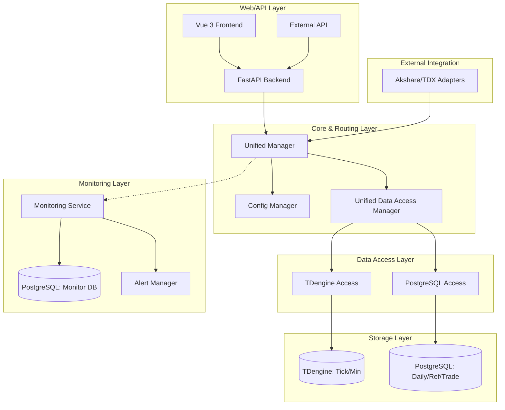

# MyStocks 架构域边界与系统架构图

## 1. 核心域 (Core Domain)
负责系统的生命周期、配置加载、数据库路由及统一入口。

- **路径**: `src/core/`
- **关键组件**:
  - `ConfigDrivenTableManager`: 基于 YAML 自动化管理库表结构。
  - `MyStocksUnifiedManager`: 系统的统一启动与协调中心。
  - `DataClassification`: 5 大数据分类（市场、参考、衍生、交易、元数据）。
  - `DatabasePool`: TDengine 与 PostgreSQL 的连接池管理。

## 2. 数据访问域 (Data Access Domain)
负责具体存储引擎的读写优化与去重逻辑。

- **路径**: `src/data_access/`
- **关键组件**:
  - `TDengineDataAccess`: 高频时序数据（Tick/Minute）专用访问层。
  - `PostgreSQLDataAccess`: 历史 K 线、参考数据、交易记录存储层。
  - `UnifiedDataAccessManager`: 智能路由层，根据数据分类分发到不同引擎。

## 3. 业务服务域 (Service Domain)
负责执行具体的量化任务与数据集成。

- **路径**: `src/services/`, `src/adapters/`
- **关键组件**:
  - `AkshareDataSource`, `TdxAdapter`: 数据源集成适配器。
  - `A-Stock-Realtime`: 实时行情处理服务。
  - `A-Stock-Backtest`: 策略回测引擎。

## 4. 监控与质量域 (Monitoring & Quality Domain)
负责系统稳定性、数据完整性及实时指标。

- **路径**: `src/monitoring/`, `monitoring/`
- **关键组件**:
  - `MonitoringDatabase`: 独立于业务库的监控日志存储（PostgreSQL Schema）。
  - `AlertManager`: 多渠道告警触发（Email, Webhook）。
  - `DataQualityMonitor`: 实时验证数据空值、异常值及连续性。

## 5. Web 与 API 域 (Web & API Domain)
负责展示与外部交互。

- **路径**: `web/backend/`, `web/frontend/`, `api/`
- **关键组件**:
  - `FastAPI App`: 后端 REST API。
  - `Vue 3 Frontend`: 基于 Pinia 的前端管理后台。

---

## 系统架构图 (Mermaid)

