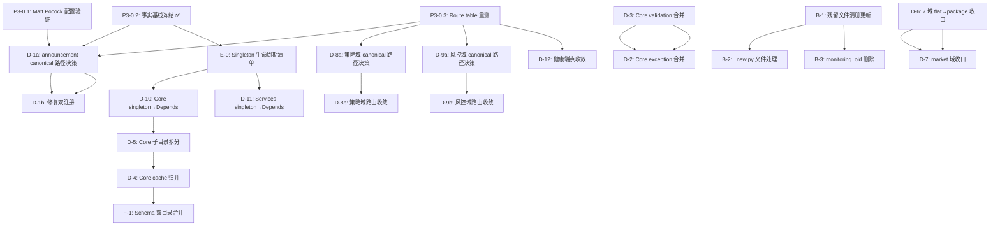

# MyStocks 后端审计 Phase 3 修订计划

> **历史文档说明**:
> 本文件是历史快照、历史方案或历史总结，不代表当前仓库的唯一事实状态。
> 若需确认当前共享规则、执行口径、目录结构或实现状态，请优先以 `architecture/STANDARDS.md`、根目录 `AGENTS.md`、根目录 `CLAUDE.md`、当前代码与最近一次实际验证结果为准。

> **日期**: 2026-05-17（修订 2026-05-18）
> **状态**: 待审核（第二轮修订，解决 baseline review 全部 9 项）
> **事实基线**: `docs/reports/quality/backend-audit-phase3-fact-baseline-2026-05-17.md`
> **Route baseline**: `docs/reports/quality/backend-route-table-openapi-baseline-2026-05-18.md`
> **生成脚本**: `scripts/dev/backend_audit_baseline.py`
> **审核来源**: `docs/reports/quality/backend-audit-phase2-phase3-plan-review-2026-05-17.md`、`docs/reports/quality/backend-audit-phase3-baseline-and-plan-review-2026-05-17.md`

---

## 一、Phase 3 结构（P3-0 / 3A / 3B / 3C）

按审核建议重组为 4 个子阶段，每个子阶段有明确的准入和退出条件。

```
P3-0 Readiness ──→ P3-A Decision ──→ P3-B Safe Closure ──→ P3-C Structural Migration
(基线+配置)        (路径+生命周期决策)   (低风险flat→package)    (OpenSpec审批后执行)
```

---

## 二、依赖图



---

## 三、Issue 清单

### P3-0: Readiness（前置准备）

| # | Issue | OpenSpec | Blocked by | Output |
|---|-------|----------|------------|--------|
| P3-0.1 | 验证 Matt Pocock skills 配置完整性 | not required | none | 确认 docs/agents/*.md 完整 |
| P3-0.2 | 冻结后端审计事实基线 | not required | none | ✅ `backend-audit-phase3-fact-baseline-2026-05-17.md` |
| P3-0.3 | Route table + OpenAPI baseline (local decorator) | not required | P3-0.2 | ✅ `backend-route-table-openapi-baseline-2026-05-18.md` |
| P3-0.4 | 基线生成脚本 | not required | none | ✅ `scripts/dev/backend_audit_baseline.py` |
| P3-0.5 | Final full-path route table (展开 prefix) | not required | P3-0.3 | 需解析 VERSION_MAPPING + router prefix + APIRouter prefix |
| P3-0.6 | Route duplicate 指标统一（81 local vs ~200 full-path） | not required | P3-0.5 | 三分类：local decorator duplicate / full-path conflict / domain alias |

### P3-A: Decision Issues（决策类，产出 decision record）

| # | Issue | OpenSpec | Blocked by | Output |
|---|-------|----------|------------|--------|
| P3-A1 | announcement canonical route decision | maybe | P3-0.2, P3-0.3 | Decision record |
| P3-A2 | 策略域 canonical route decision | required | P3-0.3 | OpenSpec proposal |
| P3-A3 | 风控域 canonical route decision | required | P3-0.3 | OpenSpec proposal |
| P3-A4 | Singleton lifecycle inventory | required/design | P3-0.2 | 分类表 + 迁移目标映射 |
| P3-A5 | Health/status route taxonomy decision | required | P3-0.3, P3-0.6 | 三类语义：platform liveness / dependency health / domain status |
| P3-A6 | Trading canonical route owner decision | required | P3-0.3 | trading_runtime.py vs trading_monitor.py 8 个重复路由 |
| P3-A7 | Backup route owner + security boundary decision | required | P3-0.3 | backup_recovery.py vs backup_recovery_secure/ 11 个重复路由 |

### P3-B: Safe Closure（安全收口，低风险，无 OpenSpec 或已豁免）

| # | Issue | OpenSpec | Blocked by | 风险 |
|---|-------|----------|------------|------|
| P3-B1 | 修复 announcement 双注册 | not required (决策已在 P3-A1) | P3-A1 | 低 |
| P3-B2 | Core validation 文件分类与 canonical decision（5 文件分类，仅合并 3 个 generic） | maybe | none | 低 |
| P3-B3 | 残留文件清册更新 + _new.py 判定 | not required | P3-0.2 | 诊断性 |
| P3-B4 | _new.py 文件处理（4 个） | not required | P3-B3 | 中 |
| P3-B5 | monitoring_old 删除（确认无引用后） | not required | P3-B3 | 低 |
| P3-B6a | algorithms 域 flat→package 收口 | maybe | P3-0.3 | 低 |
| P3-B6b | indicators 域 flat→package 收口 | maybe | P3-0.3 | 低 |
| P3-B6c | stock_search 域 flat→package 收口 | maybe | P3-0.3 | 低 |
| P3-B6d | multi_source 域 flat→package 收口 | maybe | P3-0.3 | 低 |
| P3-B6e | system 域 flat→package 收口 | maybe | P3-0.3 | 低 |
| P3-B6f | backup_recovery_secure 域 flat→package 收口 | maybe | P3-0.3 | 低 |
| P3-B6g | signal_monitoring 域 flat→package 收口 | maybe | P3-0.3 | 低 |

### P3-C: Structural Migration（结构迁移，全部走 OpenSpec）

| # | Issue | OpenSpec | Blocked by | 风险 |
|---|-------|----------|------------|------|
| P3-C1 | 策略域 3 flat → 1 canonical 路由收敛 | required | P3-A2 | 高 |
| P3-C2 | 风控域 5 入口 → canonical 收敛 | required | P3-A3 | 高 |
| P3-C3 | Core 层 singleton→Depends（database 批次） | required | P3-A4, P3-C8 | 中-高 |
| P3-C4 | Services 层 singleton→Depends | required | P3-C3 | 中-高 |
| P3-C5 | Core exception ×3 → 1 canonical | required | P3-B2 | 中 |
| P3-C6 | market 域 flat→package 收口 | required | P3-0.3 | 中 |
| P3-C7 | 健康端点 37 碎片收敛 | required | P3-0.3 | 中 |
| P3-C8 | Core 子目录拆分（database/, security/, socketio/, sse/） | required | P3-A4 | 中 |
| P3-C9 | Core cache 根级文件归并到 cache/ 子目录 | required | P3-C8 | 中 |
| P3-C10 | Schema 双目录合并（schema/ → schemas/） | required | P3-A4（独立 OpenSpec proposal） | 低-中 |

---

## 四、Issue 模板（升级版）

每个 Issue 使用以下模板，满足 `to-issues` 的 independently-grabbable 标准：

```markdown
## Source
[基线文件行号 / 审计子文档 / ADR 编号]

## Current State
[引用 `backend-audit-phase3-fact-baseline-2026-05-17.md` 中的具体数字和文件路径]

## Target State
[canonical 状态描述，不含模糊词]

## Scope
- In: [明确列出涉及的文件或模块]
- Out: [明确排除的部分]

## Blocked By
- [issue id / proposal id / none]

## OpenSpec
- required: yes / no / maybe
- proposal: [path or pending]
- reason: [为什么需要或不需要 OpenSpec]

## Implementation Notes
- Likely files: [文件列表]
- GitNexus impact target: [符号名]
- Compatibility rule: [re-export / redirect / breaking]
- Route/import/OpenAPI diff expected: yes/no

## Non-goals
[明确排除的部分]

## Triage label
`needs-triage` / `ready-for-agent` / `ready-for-human`

## Ready-for-agent criteria
- [ ] OpenSpec status resolved (required/豁免)
- [ ] Blocked by issues all completed
- [ ] Verification commands executable without human judgment

## Acceptance Criteria
- [ ] 事实基线已更新（如数字变化）
- [ ] route/import/OpenAPI diff 已审查（如涉及路由或 import）
- [ ] `CONTEXT.md` 已更新（如涉及 canonical 路径或术语变更）
- [ ] 相关测试通过
- [ ] `gitnexus_detect_changes(scope: staged)` 已审查

## Rollback / Compatibility Exit Condition
[回滚方案或兼容层退役条件]

## Verification Commands
[具体可执行的验证命令]
```

---

## 四-B、Decision Record 模板（P3-A issues 产出格式）

```markdown
# Decision Record: [标题]

## Context
[为什么需要做这个决策]

## Current Facts
[引用事实基线和 route table baseline 的具体数据]

## Options Considered
1. [选项A] — [优缺点]
2. [选项B] — [优缺点]
3. [选项C] — [优缺点]

## Decision
[选择的选项和理由]

## Compatibility Policy
[兼容路径、退役条件、过渡期]

## OpenSpec
- required: yes/no
- proposal path: [if applicable]

## Follow-up Issues Unlocked
- [ ] P3-Bxxx: [实现 issue]
- [ ] P3-Cxxx: [实现 issue]

## Verification / Rollback Strategy
[如何验证决策正确，以及如何回退]
```

---

## 五、执行约束

1. **P3-0 完成前**：不创建 P3-A/P3-B/P3-C Issues
2. **P3-A decision record 批准前**：对应 P3-B/P3-C Issue 不得进入 `ready-for-agent`
3. **OpenSpec proposal 批准前**：P3-C Issues 不得进入实现
4. **每个 Issue 完成后**：更新事实基线数字（如受影响）
5. **估算**：精确工时在 P3-0 完成后、每个子阶段开始前确定

---

## 六、与原 Phase 3 计划的变更对照

| 原计划 | 修订后 | 变更原因 |
|--------|--------|----------|
| 4 批次按时间排序 | P3-0/3A/3B/3C 按依赖排序 | 审核建议：明确准入/退出条件 |
| D-1 单个 issue | 拆为 D-1a(决策) + D-1b(实现) | 审核建议：independently-grabbable |
| D-2/D-4 在第二批"低风险" | 移入 P3-C 走 OpenSpec | 审核建议：改变 canonical 归属需 proposal |
| Singleton "全 per-app 低风险" | 新增 E-0 生命周期清单 | 审核建议：分类后再定迁移策略 |
| 无依赖图 | 新增依赖图 | 审核建议：驱动并行执行 |
| 估算 3h/issue | 精确工时延后到各子阶段前 | 用户决策 |
| 2 个 triage labels | 使用 docs/agents/triage-labels.md 的 5 个 labels | 配置已存在 |
| 26 issues | 20 issues（合并部分，拆分关键项） | 依赖图驱动 |
| 无 route duplicate 治理 | 新增 P3-A5/A6/A7 + P3-0.5/0.6 | route table review 发现 |
| P3-B6 七域合一 | 拆为 7 个独立 issue | 审核建议 |
| P3-C7 "11+ 碎片" | 改为 "37 fragmented"，需 P3-A5 taxonomy | route table review |

---

## 七、与 Route Table Duplicate Review 的对齐

> **审核来源**: `docs/reports/quality/backend-route-table-duplicate-routes-mattpocock-review-2026-05-18.md`

本次修订已纳入该审核的全部 6 项最小变更要求：

| # | 要求 | 处理 |
|---|------|------|
| 1 | 区分 local decorator duplicate vs full-path conflict | baseline 文档已修正表述，P3-0.5 新增 full-path 展开任务 |
| 2 | 统一 ~200 vs 81 指标 | baseline 已改为精确值 81，~200 已删除，P3-0.6 新增指标统一任务 |
| 3 | 迁移 JSON 产物到正确路径 | ✅ `docs/reports/quality/generated/backend-audit-baseline.json` |
| 4 | 更新 CONTEXT.md 健康端点数字 | P3-A5 完成后更新 |
| 5 | 新增 P3-A5/A6/A7 | ✅ 已加入 P3-A decision issues |
| 6 | 所有 route 相关 issue 标 needs-triage | ✅ 执行约束已明确"OpenSpec proposal 批准前不得进入实现" |

新增深化机会（来自 review §Deepening Opportunities）：

| # | 机会 | 说明 |
|---|------|------|
| DO-1 | API Route Contract Registry | 声明式路由契约注册表，记录 canonical owner / prefix / compat alias / sunset 条件 |
| DO-2 | Health/Status Contract Layer | 三类契约：platform health / dependency health / domain operational status |
| DO-3 | Domain Route Ownership Map | 域路由所有权图，绑定 OpenSpec 决策，flat/package 退场变为 contract-preserving move |

---

*关联文档*:
- 事实基线: `docs/reports/quality/backend-audit-phase3-fact-baseline-2026-05-17.md`
- Phase 2 总结: `docs/reports/quality/backend-audit-phase2-summary-and-phase3-plan.md`
- 审核报告: `docs/reports/quality/backend-audit-phase2-phase3-plan-review-2026-05-17.md`
- ADR-0001: `docs/architecture/0001-core-directory-restructure.md`
- ADR-0002: `docs/architecture/0002-api-flat-to-package-migration.md`
- ADR-0003: `docs/architecture/0003-singleton-to-di-migration.md`
