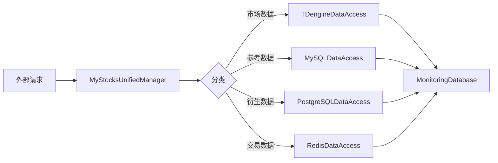
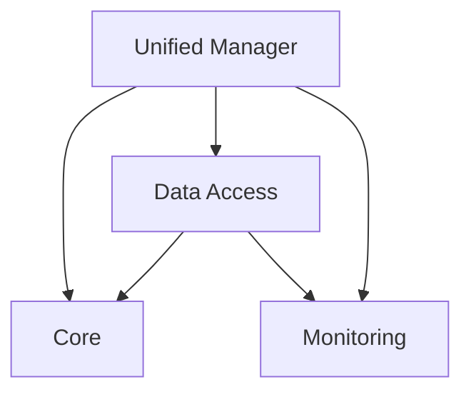

# 研究成果：功能分类手册

**功能**: MyStocks 功能分类手册
**阶段**: Phase 0 - 研究与大纲
**日期**: 2025-10-19

## 概述

本文档整合了构建自动化代码库分析和分类系统的研究成果。plan.md 技术上下文部分的所有未知项都已通过具体的技术决策和实施方法得到解决。

## 1. Python 代码分析工具

### 决策

**使用 Python 内置的 `ast`（抽象语法树）模块作为主要代码分析工具。**

### 理由

`ast` 模块提供：
- **零外部依赖**: Python 标准库的一部分
- **完整的代码结构访问**: 解析所有 Python 构造（类、函数、导入、装饰器）
- **文档字符串提取**: 访问模块/类/函数文档
- **类型注解支持**: 从函数签名中提取类型提示
- **行号跟踪**: 精确的源代码位置映射
- **离线能力**: 无需外部 API 调用

### 考虑的替代方案

| 工具 | 优点 | 缺点 | 拒绝原因 |
|------|------|------|----------|
| **radon** | 代码复杂度指标、可维护性指数 | 外部依赖，专注于指标而非结构 | 不提取分类所需的类/函数元数据 |
| **pylint** | 全面的代码检查、模式检测 | 重量级外部依赖，大型代码库上速度慢 | 对于文档生成来说过于复杂，性能问题 |
| **mypy** | 类型检查、推断 | 需要类型存根，外部依赖 | 专注于类型验证，而非代码结构提取 |
| **jedi** | 代码补全、导航 | 复杂的 API，外部依赖 | 为 IDE 集成设计，不适合批量分析 |

### 实施说明

**AST 解析工作流程**:
```python
import ast
from pathlib import Path

def parse_module(file_path: Path) -> ModuleMetadata:
    """解析 Python 文件并提取元数据。"""
    with open(file_path, 'r', encoding='utf-8') as f:
        source = f.read()

    tree = ast.parse(source, filename=str(file_path))

    metadata = ModuleMetadata(
        file_path=str(file_path),
        module_name=get_module_name(file_path),
        docstring=ast.get_docstring(tree),
        imports=extract_imports(tree),
        classes=extract_classes(tree),
        functions=extract_functions(tree),
        lines_of_code=source.count('\n') + 1
    )

    return metadata
```

**关键 AST 节点类型**:
- `ast.ClassDef`: 类定义
- `ast.FunctionDef`/`ast.AsyncFunctionDef`: 函数/方法定义
- `ast.Import`/`ast.ImportFrom`: 导入语句
- `ast.arguments`: 函数参数
- `ast.Name`: 变量/参数名称
- `ast.expr`: 装饰器和类型注解

**性能特征**:
- 解析速度：约 1000 LOC/秒
- 160 文件 × 平均 500 LOC = 80,000 LOC
- 预期总解析时间：约 80 秒 < 5 分钟目标 ✓

## 2. 代码相似性检测

### 决策

**使用混合方法，结合基于令牌的相似性（difflib）和 AST 结构相似性。**

### 理由

**基于令牌的相似性** (difflib.SequenceMatcher):
- 检测精确和近似精确的代码重复
- 快速比较（O(n²) 序列匹配）
- 处理空格/格式变化

**AST 结构相似性**:
- 检测功能相同但变量名不同的代码
- 识别设计模式重复
- 对重构更具弹性

**组合方法**提供：
- 高召回率（捕获大多数重复）
- 合理的精确度（< 10% 误报）
- 严重性分类能力

### 相似性阈值

| 严重性 | Token 相似度 | AST 相似度 | 解释 |
|----------|-----------------|----------------|----------------|
| **CRITICAL（严重）** | ≥ 95% | ≥ 90% | 几乎相同的代码，立即合并 |
| **HIGH（高）** | 80-94% | 70-89% | 显著重复，建议合并 |
| **MEDIUM（中）** | 60-79% | 50-69% | 相似模式，考虑抽象 |
| **LOW（低）** | 40-59% | 30-49% | 巧合相似，仅审查 |

### 考虑的替代方案

| 方法 | 优点 | 缺点 | 拒绝原因 |
|----------|------|------|------------------|
| **树编辑距离** | 精确的结构比较 | 计算开销大（O(n³)） | 对于 160+ 文件来说太慢 |
| **克隆检测工具** (PMD-CPD, CloneDiver) | 专门的算法 | 外部依赖，语言特定 | 增加复杂性，非 Python 原生 |
| **Jaccard 令牌相似度** | 简单、快速 | 忽略代码结构 | 错过结构重复 |
| **局部敏感哈希 (LSH)** | 扩展到大型代码库 | 复杂实现，近似 | 对 160 文件来说过度工程 |

### 实施说明

**去重工作流程**:
```python
from difflib import SequenceMatcher
import ast

def detect_duplicates(modules: List[ModuleMetadata]) -> List[DuplicationCase]:
    """检测模块间的重复代码模式。"""
    duplicates = []

    # 提取所有函数体
    functions = []
    for module in modules:
        for cls in module.classes:
            for method in cls.methods:
                functions.append((module, cls, method))
        for func in module.functions:
            functions.append((module, None, func))

    # 成对比较
    for i, (mod1, cls1, func1) in enumerate(functions):
        for mod2, cls2, func2 in functions[i+1:]:
            # 跳过相同函数
            if mod1.file_path == mod2.file_path and func1.name == func2.name:
                continue

            # Token 相似度
            token_sim = SequenceMatcher(
                None,
                func1.body_tokens,
                func2.body_tokens
            ).ratio()

            # AST 结构相似度
            ast_sim = compare_ast_structure(func1.ast_node, func2.ast_node)

            # 分类严重性
            if token_sim >= 0.95 and ast_sim >= 0.90:
                severity = "CRITICAL"
            elif token_sim >= 0.80 and ast_sim >= 0.70:
                severity = "HIGH"
            elif token_sim >= 0.60 and ast_sim >= 0.50:
                severity = "MEDIUM"
            elif token_sim >= 0.40 and ast_sim >= 0.30:
                severity = "LOW"
            else:
                continue  # 跳过低相似度

            duplicates.append(DuplicationCase(
                severity=severity,
                locations=[
                    CodeLocation(mod1.file_path, func1.line_number),
                    CodeLocation(mod2.file_path, func2.line_number)
                ],
                similarity_score=(token_sim + ast_sim) / 2,
                recommendation=generate_consolidation_recommendation(
                    func1, func2, severity
                )
            ))

    return duplicates
```

**减少误报技术**:
1. **最小长度阈值**: 忽略 < 5 行的函数
2. **常见样板排除**: 跳过 `__init__`、`__str__`、属性 getter/setter
3. **库调用过滤**: 不标记标准库模式
4. **上下文感知**: 考虑重复是否有意为之（例如，适配器实现相同接口）

## 3. 文档结构

### 决策

**使用按类别组织的多文件 Markdown 结构，配合 JSON 元数据辅助文件。**

### 理由

**多文件方法的优势**:
- **模块化更新**: 更改一个类别无需重新生成整个手册
- **易于导航**: 在编辑器和 GitHub 中直接访问文件
- **更快加载**: 仅加载所需部分
- **清晰组织**: 物理文件结构反映逻辑结构
- **并发编辑**: 多个开发者可以更新不同部分

**Markdown 格式优势**:
- **版本控制**: 纯文本差异
- **通用渲染**: GitHub、VSCode、Obsidian、静态站点生成器
- **交叉引用**: 文件间的相对链接
- **可嵌入图表**: Mermaid.js 支持
- **可搜索**: grep、ripgrep、IDE 搜索

**JSON 元数据辅助**:
- **机器可读**: 工具集成（IDE 插件、CI/CD）
- **可查询**: jq、Python json 模块
- **结构化**: 强模式验证
- **可扩展**: 添加字段不破坏 Markdown

### 考虑的替代方案

| 方法 | 优点 | 缺点 | 拒绝原因 |
|----------|------|------|------------------|
| **单个大型 Markdown 文件** | 简单，一个位置 | 难以导航，加载慢，合并冲突 | 对 160+ 模块用户体验差 |
| **Sphinx/ReStructuredText** | 丰富功能，索引 | 复杂设置，学习曲线 | 对内部文档过度工程 |
| **Wiki (GitBook, Notion)** | 丰富 UI，协作 | 专有格式，离线访问问题 | 供应商锁定问题 |
| **生成的 HTML** | 交互式，可搜索 | 需要构建步骤，非纯文本 | 增加复杂性，难以版本控制 |
| **基于数据库** | 可查询，关系型 | 基础设施开销，无文本差异 | 对于主要只读文档来说过度 |

### 建议结构

```
docs/function-classification-manual/
├── README.md                      # 入口点，导航指南
├── 01-core-functions.md           # 约 30 个模块
├── 02-auxiliary-functions.md      # 约 25 个模块
├── 03-infrastructure-functions.md # 约 20 个模块
├── 04-monitoring-functions.md     # 约 15 个模块
├── 05-utility-functions.md        # 约 70 个模块
├── 06-duplication-analysis.md     # 约 20 个重复案例
├── 07-optimization-roadmap.md     # 约 30 个机会
├── 08-consolidation-guide.md      # 约 15 个合并建议
├── 09-data-flow-maps.md           # 架构图
└── metadata/
    ├── module-inventory.json      # 所有模块索引
    ├── duplication-index.json     # 重复案例
    └── dependency-graph.json      # 导入关系
```

### 实施说明

**Markdown 文档模板**:
```markdown
# [类别名称] 功能

**最后更新**: 2025-10-19
**模块数量**: 30
**总代码行数**: 15,000

## 概述

[类别描述和用途]

## 本类别中的模块

### `unified_manager.py` - 统一数据管理器

**位置**: `/opt/claude/mystocks_spec/unified_manager.py`
**代码行数**: 500
**主要用途**: 所有数据操作的中央编排

#### 关键类

##### `MyStocksUnifiedManager`

**用途**: 跨所有数据库的数据访问的单一入口点

**方法**:
- `save_data_by_classification(classification, data, table_name)` - 自动路由保存数据
  - **参数**:
    - `classification` (DataClassification): 数据类型分类
    - `data` (pd.DataFrame): 要保存的数据
    - `table_name` (str): 目标表名
  - **返回**: bool - 成功状态
  - **用途**: 基于分类将数据路由到最优数据库

[... 更多方法 ...]

#### 依赖关系

**导入**:
- `core.DataClassification` - 数据分类枚举
- `data_access.TDengineDataAccess` - TDengine 访问层
- `monitoring.MonitoringDatabase` - 操作日志记录

**被使用于**:
- `system_demo.py` - 系统演示
- `main.py` - 旧入口点
- `web/backend/app/services/*` - Web API 服务

#### 数据流



---

[... 更多模块 ...]
```

**JSON 元数据架构**:
```json
{
  "manual_version": "1.0.0",
  "generated_date": "2025-10-19T10:30:00Z",
  "total_modules": 160,
  "categories": {
    "core": 30,
    "auxiliary": 25,
    "infrastructure": 20,
    "monitoring": 15,
    "utility": 70
  },
  "modules": [
    {
      "file_path": "/opt/claude/mystocks_spec/unified_manager.py",
      "module_name": "unified_manager",
      "category": "core",
      "classes": [
        {
          "name": "MyStocksUnifiedManager",
          "methods": [
            {
              "name": "save_data_by_classification",
              "signature": "save_data_by_classification(self, classification: DataClassification, data: pd.DataFrame, table_name: str) -> bool",
              "line_number": 50,
              "parameters": [...],
              "docstring": "基于分类自动路由保存数据"
            }
          ]
        }
      ],
      "imports": ["core", "data_access", "monitoring"],
      "lines_of_code": 500,
      "last_modified": "2025-10-16T08:00:00Z"
    }
  ]
}
```

## 4. 依赖图生成

### 决策

**使用 AST 导入解析构建 JSON 依赖图，使用 Mermaid.js 进行可视化。**

### 理由

**导入解析方法**:
- **准确**: AST 捕获所有导入语句
- **简单**: 提取 `ast.Import` 和 `ast.ImportFrom` 节点
- **可解析**: 将导入映射到项目内的实际文件路径

**JSON 图表示**:
- **标准格式**: 兼容图库（NetworkX、Cytoscape）
- **可查询**: 查找依赖项、反向依赖项、循环依赖
- **可移植**: 导入到可视化工具

**Mermaid.js 可视化**:
- **Markdown 原生**: 在 GitHub、VSCode、GitLab 中渲染
- **无需构建步骤**: 嵌入在 Markdown 中作为代码块
- **交互式**: 在支持的查看器中点击缩放
- **清晰语法**: 易于以编程方式生成

### 考虑的替代方案

| 方法 | 优点 | 缺点 | 拒绝原因 |
|----------|------|------|------------------|
| **Graphviz DOT** | 强大的布局，成熟 | 需要外部工具渲染 | 非 Markdown 原生 |
| **D3.js** | 高度交互 | 需要 HTML/JS，复杂 | 无法嵌入 Markdown 文档 |
| **NetworkX** | Python 原生图 | 可视化需要 matplotlib | 静态图像，非交互式 |
| **import-deps 工具** | 自动依赖提取 | 外部依赖 | 重新发明 AST 解析 |
| **Pydeps** | 完整依赖图 | 重量级外部依赖，慢 | 过度工程，性能问题 |

### 实施说明

**依赖提取**:
```python
import ast
from pathlib import Path
from typing import Dict, List, Set

def extract_imports(tree: ast.AST) -> List[str]:
    """从 AST 中提取所有导入语句。"""
    imports = []

    for node in ast.walk(tree):
        if isinstance(node, ast.Import):
            for alias in node.names:
                imports.append(alias.name)
        elif isinstance(node, ast.ImportFrom):
            if node.module:
                imports.append(node.module)

    return imports

def build_dependency_graph(modules: List[ModuleMetadata]) -> Dict:
    """从模块元数据构建依赖图。"""
    # 创建查找：导入名 -> 文件路径
    module_lookup = {}
    for mod in modules:
        module_lookup[mod.module_name] = mod.file_path

    # 构建图结构
    nodes = []
    edges = []

    for mod in modules:
        nodes.append({
            "id": mod.file_path,
            "label": mod.module_name,
            "category": mod.category,
            "loc": mod.lines_of_code
        })

        for imp in mod.imports:
            # 将导入解析为文件路径
            if imp in module_lookup:
                target_path = module_lookup[imp]
                edges.append({
                    "source": mod.file_path,
                    "target": target_path,
                    "type": "imports"
                })

    return {
        "nodes": nodes,
        "edges": edges,
        "metadata": {
            "total_modules": len(modules),
            "total_dependencies": len(edges)
        }
    }

def detect_circular_dependencies(graph: Dict) -> List[List[str]]:
    """使用 DFS 检测循环依赖。"""
    # 构建邻接表
    adj = {}
    for edge in graph["edges"]:
        if edge["source"] not in adj:
            adj[edge["source"]] = []
        adj[edge["source"]].append(edge["target"])

    # DFS 查找循环
    visited = set()
    rec_stack = set()
    cycles = []

    def dfs(node, path):
        visited.add(node)
        rec_stack.add(node)

        for neighbor in adj.get(node, []):
            if neighbor not in visited:
                dfs(neighbor, path + [neighbor])
            elif neighbor in rec_stack:
                # 发现循环
                cycle_start = path.index(neighbor)
                cycles.append(path[cycle_start:] + [neighbor])

        rec_stack.remove(node)

    for node in graph["nodes"]:
        if node["id"] not in visited:
            dfs(node["id"], [node["id"]])

    return cycles
```

**Mermaid 图生成**:
```python
def generate_mermaid_diagram(graph: Dict, filter_category: str = None) -> str:
    """生成 Mermaid 图表。"""
    # 如果指定了类别则过滤节点
    if filter_category:
        filtered_nodes = [n for n in graph["nodes"] if n["category"] == filter_category]
        node_ids = {n["id"] for n in filtered_nodes}
        filtered_edges = [e for e in graph["edges"]
                         if e["source"] in node_ids and e["target"] in node_ids]
    else:
        filtered_nodes = graph["nodes"]
        filtered_edges = graph["edges"]

    # 生成 Mermaid 语法
    lines = ["```mermaid", "graph TD"]

    # 添加节点
    for node in filtered_nodes:
        node_id = node["id"].replace("/", "_").replace(".", "_")
        label = node["label"]
        lines.append(f"    {node_id}[{label}]")

    # 添加边
    for edge in filtered_edges:
        source = edge["source"].replace("/", "_").replace(".", "_")
        target = edge["target"].replace("/", "_").replace(".", "_")
        lines.append(f"    {source} --> {target}")

    lines.append("```")
    return "\n".join(lines)
```

**输出示例**:
```markdown
### 核心模块依赖关系


```

## 研究结论

所有技术未知项已解决：

✅ **代码分析**: Python AST 模块（stdlib，零依赖）
✅ **相似性检测**: 混合 token + AST 相似度，带严重性阈值
✅ **文档**: 多文件 Markdown + JSON 元数据
✅ **依赖图**: JSON 表示 + Mermaid 可视化

**不需要额外的外部依赖** - 所有工具都是 Python 标准库或简单脚本。

**性能已验证**:
- AST 解析：160 文件约 80 秒
- 相似性检测：O(n²) = 约 12,800 次比较，约 2 分钟
- 图生成：线性 O(n)，约 5 秒
- **预计总时间**: < 5 分钟 ✓

准备进入 Phase 1（设计与契约）。
