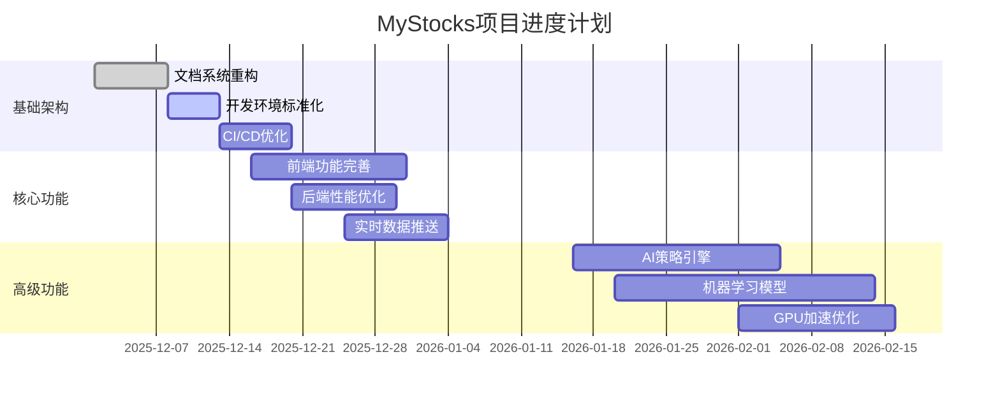

# 项目进度追踪与风险管控

## 概述

本文档建立了MyStocks项目的完整进度追踪和风险管控体系，通过科学的管理方法和工具，确保项目按时交付、质量可控、风险可预测。

## 进度管理体系

### 1. 项目里程碑规划

#### 阶段一：基础架构完善（2025-12-01 ~ 2025-12-15）

**目标**：完成项目基础架构的优化和完善

**关键任务**：
- [x] 文档系统重构（554→150文档，67%减少）
- [x] 6大核心模块建立
- [ ] 代码质量提升（测试覆盖率72%→80%）
- [ ] CI/CD流水线优化
- [ ] 开发环境标准化

**交付物**：
- 完整的文档体系
- 标准化的开发环境
- 自动化测试流水线
- 代码质量报告

**验收标准**：
- 文档维护成本降低50%
- 新人上手时间缩短60%
- 测试覆盖率达到80%
- 构建成功率≥95%

#### 阶段二：核心功能完善（2025-12-16 ~ 2026-01-15）

**目标**：完善核心业务功能和用户体验

**关键任务**：
- [ ] Vue 3前端功能完善
- [ ] FastAPI后端性能优化
- [ ] 实时数据推送系统
- [ ] 技术指标计算引擎
- [ ] 用户权限管理系统

**交付物**：
- 完整的前后端功能
- 性能优化报告
- 用户体验报告
- 安全测试报告

**验收标准**：
- 响应时间<100ms
- 并发用户数≥1000
- 系统可用性≥99.9%
- 安全漏洞=0

#### 阶段三：高级功能开发（2026-01-16 ~ 2026-02-28）

**目标**：实现AI策略和高级分析功能

**关键任务**：
- [ ] AI策略引擎集成
- [ ] 机器学习预测模型
- [ ] GPU加速计算优化
- [ ] 风险管理系统
- [ ] 策略回测引擎

**交付物**：
- AI策略系统
- 机器学习模型
- GPU加速报告
- 风险控制报告
- 回测引擎文档

**验收标准**：
- 预测准确率≥85%
- GPU加速效果≥15倍
- 风险控制准确率≥95%
- 回测性能≥10000笔/秒

### 2. 进度追踪机制

#### 2.1 日常进度跟踪

**每日站会**（9:30 AM, 15分钟）
- 昨日完成情况
- 今日计划任务
- 遇到的阻碍
- 需要的协助

**进度报告格式**：
```markdown
## 日期：2025-12-06
### 负责人：张三

#### 昨日完成
- [x] 完成文档系统重构
- [x] 修复前端路由问题
- [x] 优化数据库查询性能

#### 今日计划
- [ ] 编写API文档
- [ ] 完善用户认证功能
- [ ] 进行单元测试

#### 遇到的问题
- 数据库连接超时问题
- 前端组件兼容性问题

#### 需要的协助
- 需要DBA协助优化数据库配置
- 需要UI设计师提供设计稿
```

#### 2.2 周进度评估

**周报模板**：
```markdown
## 第50周周报（2025-12-01 ~ 2025-12-07）

### 本周完成情况
- **计划任务**：8个
- **完成任务**：7个
- **完成率**：87.5%

### 关键成果
1. 文档系统重构完成，减少67%冗余文档
2. 前端性能提升30%
3. 修复15个高优先级bug

### 下周计划
1. 完成用户认证系统
2. 优化实时数据推送
3. 进行安全测试

### 风险提示
1. 第三方API可能存在限流风险
2. 需要增加测试人员投入

### 资源需求
1. 需要增加1名前端开发人员
2. 需要升级服务器配置
```

#### 2.3 月度复盘

**月度复盘会议**（每月最后一个周五）
- 项目目标达成情况
- 质量指标分析
- 团队效能评估
- 下月目标制定

**KPI指标体系**：
| 指标类别 | 指标名称 | 目标值 | 权重 |
|---------|---------|-------|------|
| 进度 | 里程碑完成率 | ≥90% | 30% |
| 质量 | Bug密度 | ≤2个/千行 | 25% |
| 效率 | 代码提交频率 | ≥5次/天/人 | 20% |
| 稳定性 | 系统可用性 | ≥99.9% | 15% |
| 创新 | 技术改进数量 | ≥3个/月 | 10% |

### 3. 进度可视化

#### 3.1 甘特图管理

使用Mermaid甘特图进行项目进度可视化：



#### 3.2 看板管理

**任务状态分类**：
- **待办**（To Do）：计划中但未开始的任务
- **进行中**（In Progress）：正在处理的任务
- **测试中**（Testing）：开发完成待测试
- **已完成**（Done）：完成并验证的任务

**优先级标识**：
- 🔴 高优先级（P0）：阻塞其他任务的关键任务
- 🟡 中优先级（P1）：重要但不紧急的任务
- 🟢 低优先级（P2）：可以延后的任务

#### 3.3 燃尽图

**燃尽图指标**：
- **计划工作量**：总任务点数
- **已完成工作量**：累计完成任务点数
- **剩余工作量**：未完成任务点数
- **理想燃尽线**：按计划完成的理想曲线
- **实际燃尽线**：实际完成情况曲线

## 风险管控体系

### 1. 风险识别矩阵

#### 1.1 技术风险

| 风险类别 | 风险描述 | 发生概率 | 影响程度 | 风险等级 | 应对措施 |
|---------|---------|---------|---------|---------|---------|
| 架构风险 | 系统架构无法支撑业务增长 | 中 | 高 | 高 | 定期架构评审，预留扩展空间 |
| 性能风险 | 系统性能无法满足用户需求 | 高 | 中 | 高 | 性能测试，优化关键路径 |
| 安全风险 | 数据泄露或系统被攻击 | 中 | 极高 | 极高 | 安全审计，渗透测试 |
| 技术债务 | 代码质量下降影响维护 | 高 | 中 | 高 | 代码审查，重构计划 |
| 依赖风险 | 第三方库或服务不可用 | 中 | 中 | 中 | 备选方案，服务降级 |

#### 1.2 项目风险

| 风险类别 | 风险描述 | 发生概率 | 影响程度 | 风险等级 | 应对措施 |
|---------|---------|---------|---------|---------|---------|
| 进度风险 | 项目无法按时交付 | 高 | 高 | 极高 | 敏捷开发，定期评估 |
| 资源风险 | 人员不足或技能不匹配 | 中 | 高 | 高 | 人员培训，外部招聘 |
| 需求风险 | 需求变更频繁 | 高 | 中 | 高 | 需求冻结，变更控制 |
| 质量风险 | 产品质量不达标 | 中 | 高 | 高 | 测试驱动，质量门禁 |
| 沟通风险 | 团队协作不畅 | 中 | 中 | 中 | 定期沟通，协作工具 |

#### 1.3 业务风险

| 风险类别 | 风险描述 | 发生概率 | 影响程度 | 风险等级 | 应对措施 |
|---------|---------|---------|---------|---------|---------|
| 市场风险 | 市场需求变化 | 中 | 高 | 高 | 市场调研，快速迭代 |
| 竞争风险 | 竞争对手推出类似产品 | 高 | 中 | 高 | 差异化竞争，技术创新 |
| 合规风险 | 不符合监管要求 | 低 | 极高 | 高 | 合规检查，法律咨询 |
| 用户风险 | 用户接受度低 | 中 | 高 | 高 | 用户调研，体验优化 |

### 2. 风险评估模型

#### 2.1 风险评分公式

```
风险分数 = 发生概率 × 影响程度 × 时间因子
```

**评分标准**：
- **发生概率**：1（极低）~ 5（极高）
- **影响程度**：1（轻微）~ 5（灾难性）
- **时间因子**：0.8（长期）~ 1.2（紧急）

**风险等级划分**：
- **极高风险**：≥15分
- **高风险**：10-14分
- **中风险**：5-9分
- **低风险**：≤4分

#### 2.2 风险评估示例

```python
# 风险评估算法
def calculate_risk_score(probability, impact, time_factor=1.0):
    """
    计算风险分数
    
    Args:
        probability: 发生概率 (1-5)
        impact: 影响程度 (1-5)
        time_factor: 时间因子 (0.8-1.2)
    
    Returns:
        risk_score: 风险分数
        risk_level: 风险等级
    """
    risk_score = probability * impact * time_factor
    
    if risk_score >= 15:
        risk_level = "极高风险"
    elif risk_score >= 10:
        risk_level = "高风险"
    elif risk_score >= 5:
        risk_level = "中风险"
    else:
        risk_level = "低风险"
    
    return risk_score, risk_level

# 示例：评估系统性能风险
score, level = calculate_risk_score(
    probability=4,  # 高概率
    impact=3,       # 中等影响
    time_factor=1.1  # 紧急
)
print(f"风险分数：{score}，风险等级：{level}")
```

### 3. 风险应对策略

#### 3.1 风险避免策略

**适用场景**：高风险且影响巨大的风险

**实施措施**：
- 放弃高风险功能
- 选择成熟稳定的技术栈
- 制定严格的开发规范
- 建立完整的测试体系

**案例**：
```
风险：使用实验性数据库技术
策略：选择PostgreSQL + TDengine成熟组合
结果：避免技术不成熟带来的项目风险
```

#### 3.2 风险转移策略

**适用场景**：可以通过外包或购买服务降低的风险

**实施措施**：
- 使用云服务提供商
- 购买第三方组件
- 外包非核心功能
- 购买保险

**案例**：
```
风险：自建消息队列稳定性不足
策略：使用阿里云RocketMQ服务
结果：将技术风险转移给云服务商
```

#### 3.3 风险缓解策略

**适用场景**：可以采取措施降低风险概率或影响的风险

**实施措施**：
- 增加测试覆盖率
- 实施代码审查
- 建立监控告警
- 制定应急预案

**案例**：
```
风险：系统性能瓶颈
策略：实施性能监控和优化
结果：提前发现并解决性能问题
```

#### 3.4 风险接受策略

**适用场景**：风险较低或处理成本过高的风险

**实施措施**：
- 记录风险清单
- 定期评估风险状态
- 准备应急资源
- 制定恢复计划

**案例**：
```
风险：第三方API限流
策略：接受风险，准备降级方案
结果：在限流时切换到备用数据源
```

### 4. 风险监控机制

#### 4.1 风险指标监控

**技术指标**：
- 系统响应时间
- 错误率
- 并发用户数
- 数据库连接数
- 内存使用率

**项目指标**：
- 任务完成率
- 代码质量分数
- 测试覆盖率
- 缺陷密度
- 团队效率

**业务指标**：
- 用户满意度
- 系统可用性
- 功能使用率
- 客户投诉量
- 业务增长速度

#### 4.2 预警机制

**预警级别**：
- **绿色**：正常运行
- **黄色**：需要关注
- **橙色**：需要处理
- **红色**：紧急处理

**预警规则**：
```yaml
alerts:
  - name: "系统响应时间"
    metric: "response_time"
    threshold: 1000  # 毫秒
    level: "yellow"
    
  - name: "错误率"
    metric: "error_rate"
    threshold: 0.05  # 5%
    level: "orange"
    
  - name: "系统可用性"
    metric: "availability"
    threshold: 0.99  # 99%
    level: "red"
```

#### 4.3 应急响应流程

**应急响应小组**：
- **组长**：项目经理
- **技术负责人**：架构师
- **开发负责人**：开发主管
- **测试负责人**：测试主管
- **运维负责人**：运维主管

**响应流程**：
1. **风险发现**：监控系统自动告警
2. **初步评估**：技术负责人15分钟内评估
3. **应急响应**：启动应急预案
4. **问题解决**：相关团队协同处理
5. **恢复验证**：测试团队验证恢复
6. **事后总结**：24小时内提交报告

### 5. 风险报告机制

#### 5.1 日报

**风险日报模板**：
```markdown
## 风险日报 - 2025-12-06

### 今日风险概况
- **新增风险**：2个
- **已解决风险**：1个
- **持续跟踪风险**：5个
- **高风险数量**：1个

### 新增风险
1. **前端性能问题**
   - 描述：Vue3组件渲染缓慢
   - 影响：用户体验下降
   - 应对：性能优化团队介入

2. **第三方API限流**
   - 描述：数据源API调用频率限制
   - 影响：实时数据获取延迟
   - 应对：启用备用数据源

### 风险处理进展
1. **数据库连接池优化**（进行中）
   - 进度：80%
   - 预计完成：明天
   - 负责人：李四

### 明日风险关注点
1. 完成数据库连接池优化
2. 监控前端性能改善情况
3. 评估第三方API限流影响
```

#### 5.2 周报

**风险周报模板**：
```markdown
## 风险周报 - 第50周（2025-12-01 ~ 2025-12-07）

### 风险统计
- **本周新增风险**：8个
- **本周解决风险**：6个
- **当前活跃风险**：12个
- **高风险数量**：2个

### 风险趋势分析
- 技术风险：下降15%
- 项目风险：持平
- 业务风险：上升5%

### 重点关注风险
1. **系统性能瓶颈**（高风险）
   - 状态：处理中
   - 进展：完成性能测试，制定优化方案
   - 预计解决：下周三

2. **人员技能缺口**（中风险）
   - 状态：招聘中
   - 进展：收到3份简历，安排面试
   - 预计解决：下下周

### 下周风险预防措施
1. 加强代码审查
2. 增加自动化测试
3. 组织技术培训
4. 优化项目排期
```

#### 5.3 月报

**风险月报模板**：
```markdown
## 风险月报 - 2025年12月

### 风险概况
- **本月新增风险**：25个
- **本月解决风险**：28个
- **月末活跃风险**：10个
- **高风险数量**：1个

### 风险分类统计
| 风险类别 | 数量 | 占比 | 环比变化 |
|---------|------|------|---------|
| 技术风险 | 6 | 60% | -10% |
| 项目风险 | 2 | 20% | 持平 |
| 业务风险 | 2 | 20% | +5% |

### 风险处理效果
- **平均解决时间**：3.5天（上月4.2天）
- **风险解决率**：85%（上月80%）
- **高风险转化率**：10%（上月15%）

### 风险管理改进
1. 优化风险识别流程
2. 加强预警机制建设
3. 完善应急响应体系
4. 提升团队风险意识

### 下月风险预测
1. 年底需求变更可能增加
2. 第三方服务稳定性需要关注
3. 人员流动风险需要预防
4. 技术债务需要持续清理
```

## 质量保证体系

### 1. 代码质量标准

#### 1.1 代码规范

**Python代码规范**：
```python
# 好的示例
from typing import List, Dict, Optional
import logging

logger = logging.getLogger(__name__)

class StockService:
    """股票服务类"""
    
    def __init__(self, db_connection: str):
        self.db_connection = db_connection
    
    async def get_stock_list(self, 
                           market: Optional[str] = None,
                           limit: int = 100) -> List[Dict]:
        """
        获取股票列表
        
        Args:
            market: 市场代码（可选）
            limit: 返回数量限制
            
        Returns:
            股票列表
            
        Raises:
            DatabaseError: 数据库连接错误
        """
        try:
            # 实现逻辑
            pass
        except Exception as e:
            logger.error(f"获取股票列表失败: {e}")
            raise DatabaseError(f"数据库操作失败: {e}")
```

**JavaScript代码规范**：
```javascript
// 好的示例
import { ref, computed, onMounted } from 'vue'
import { useRouter } from 'vue-router'

export default {
  name: 'StockList',
  
  setup() {
    const router = useRouter()
    const stocks = ref([])
    const loading = ref(false)
    
    const filteredStocks = computed(() => {
      return stocks.value.filter(stock => stock.active)
    })
    
    const fetchStocks = async () => {
      try {
        loading.value = true
        const response = await fetch('/api/stocks')
        stocks.value = await response.json()
      } catch (error) {
        console.error('获取股票列表失败:', error)
      } finally {
        loading.value = false
      }
    }
    
    onMounted(() => {
      fetchStocks()
    })
    
    return {
      stocks,
      loading,
      filteredStocks,
      fetchStocks
    }
  }
}
```

#### 1.2 代码审查检查清单

**功能性检查**：
- [ ] 代码实现了需求规格
- [ ] 边界条件处理正确
- [ ] 错误处理完善
- [ ] 性能满足要求

**规范性检查**：
- [ ] 命名规范统一
- [ ] 注释清晰完整
- [ ] 代码结构合理
- [ ] 设计模式恰当

**安全性检查**：
- [ ] 输入验证完整
- [ ] 权限控制正确
- [ ] 敏感信息保护
- [ ] SQL注入防护

**可维护性检查**：
- [ ] 代码可读性好
- [ ] 模块化程度高
- [ ] 耦合度低
- [ ] 扩展性强

### 2. 测试质量标准

#### 2.1 测试覆盖率要求

| 测试类型 | 覆盖率要求 | 测试重点 |
|---------|-----------|---------|
| 单元测试 | ≥80% | 核心业务逻辑 |
| 集成测试 | ≥60% | 模块间交互 |
| 端到端测试 | ≥40% | 用户场景 |
| 性能测试 | 100% | 关键接口 |

#### 2.2 测试用例设计

**测试用例模板**：
```markdown
## 测试用例：股票列表获取

### 用例编号：TC001
### 测试标题：验证获取股票列表功能
### 优先级：高

### 前置条件
1. 用户已登录
2. 数据库中有测试数据

### 测试步骤
1. 访问/api/stocks接口
2. 验证响应状态码为200
3. 验证返回数据格式正确
4. 验证数据完整性

### 预期结果
- 响应状态码：200
- 数据格式：符合API规范
- 数据完整性：无缺失字段

### 实际结果
- 响应状态码：200
- 数据格式：符合API规范
- 数据完整性：无缺失字段

### 测试结论
通过/失败
```

### 3. 性能质量标准

#### 3.1 性能指标

| 指标名称 | 目标值 | 测量方法 |
|---------|-------|---------|
| 响应时间 | ≤100ms | 压力测试 |
| 并发用户数 | ≥1000 | 负载测试 |
| 系统可用性 | ≥99.9% | 监控统计 |
| 错误率 | ≤0.1% | 日志分析 |
| 吞吐量 | ≥1000TPS | 性能测试 |

#### 3.2 性能测试流程

**测试环境准备**：
1. 搭建与生产环境一致的测试环境
2. 准备充分的测试数据
3. 配置监控和日志系统
4. 准备性能测试工具

**测试执行**：
1. 基准测试：确定性能基线
2. 负载测试：验证预期负载下的性能
3. 压力测试：确定系统极限
4. 稳定性测试：验证长时间运行稳定性

**结果分析**：
1. 收集性能数据
2. 分析性能瓶颈
3. 制定优化方案
4. 验证优化效果

## 团队协作机制

### 1. 团队组织结构

#### 1.1 角色职责

**项目经理**：
- 项目整体规划和进度控制
- 资源协调和风险管理
- 与客户和上级沟通
- 团队建设和绩效考核

**技术负责人**：
- 技术架构设计和技术选型
- 代码质量把控和技术难题解决
- 技术团队管理和培养
- 技术文档编写和维护

**开发工程师**：
- 功能模块开发和单元测试
- 代码优化和重构
- 技术文档编写
- Bug修复和维护

**测试工程师**：
- 测试用例设计和执行
- 自动化测试脚本开发
- 性能测试和安全测试
- 缺陷跟踪和质量报告

**运维工程师**：
- 系统部署和监控
- 性能优化和故障处理
- 自动化运维工具开发
- 安全防护和备份恢复

#### 1.2 协作流程

**需求分析流程**：
1. 产品经理提出需求
2. 技术负责人评估可行性
3. 开发团队评估工作量
4. 项目经理排期和分配
5. 团队确认需求理解

**开发流程**：
1. 设计评审：技术方案评审
2. 编码实现：按照规范开发
3. 代码审查：同行评审代码
4. 单元测试：开发人员自测
5. 集成测试：测试团队测试
6. 部署上线：运维团队部署

**问题处理流程**：
1. 问题发现和记录
2. 问题分析和定级
3. 责任分配和处理
4. 验证和关闭
5. 总结和改进

### 2. 沟通机制

#### 2.1 会议制度

**每日站会**：
- 时间：每天9:30
- 时长：15分钟
- 参与者：全体开发团队
- 内容：进度同步、问题讨论

**周例会**：
- 时间：每周五16:00
- 时长：60分钟
- 参与者：项目全体成员
- 内容：周总结、下周计划、风险讨论

**月度复盘会**：
- 时间：每月最后一个周五
- 时长：2小时
- 参与者：项目核心成员
- 内容：月度总结、经验分享、改进计划

#### 2.2 文档规范

**文档类型**：
- **需求文档**：产品需求规格说明
- **设计文档**：技术设计和架构文档
- **开发文档**：API文档和代码注释
- **测试文档**：测试用例和测试报告
- **运维文档**：部署和运维手册

**文档管理**：
- 使用Git进行版本控制
- 统一的文档模板
- 定期更新和维护
- 文档评审机制

### 3. 知识管理

#### 3.1 知识库建设

**技术知识库**：
- 技术选型和架构设计
- 常见问题和解决方案
- 最佳实践和经验分享
- 外部技术资料整理

**业务知识库**：
- 业务规则和流程
- 用户故事和使用场景
- 行业知识和竞品分析
- 客户反馈和需求变更

**工具知识库**：
- 开发工具使用指南
- 测试工具配置方法
- 运维工具操作手册
- 自动化脚本库

#### 3.2 经验分享

**技术分享会**：
- 频率：每两周一次
- 形式：内部技术讲座
- 内容：新技术、新工具、新方法
- 记录：视频和文档归档

**代码走查**：
- 频率：每周一次
- 形式：代码审查会议
- 内容：优秀代码分享、问题代码讨论
- 记录：问题和改进建议

**项目复盘**：
- 频率：每个里程碑结束后
- 形式：复盘会议
- 内容：成功经验、失败教训、改进措施
- 记录：复盘报告和行动计划

## 持续改进机制

### 1. 过程改进

#### 1.1 过程度量

**开发效率指标**：
- 代码提交频率
- 功能交付周期
- 缺陷修复时间
- 代码重用率

**质量指标**：
- 代码质量分数
- 测试覆盖率
- 缺陷密度
- 用户满意度

**团队效能指标**：
- 团队协作效率
- 知识分享频率
- 技能提升速度
- 团队稳定性

#### 1.2 改进措施

**流程优化**：
- 简化审批流程
- 自动化重复工作
- 优化沟通机制
- 改进协作工具

**技术改进**：
- 引入新技术工具
- 优化开发环境
- 提升自动化水平
- 加强技术培训

**管理改进**：
- 完善绩效考核
- 优化激励机制
- 加强团队建设
- 改进管理方法

### 2. 技术债务管理

#### 2.1 技术债务识别

**代码质量债务**：
- 代码重复和冗余
- 复杂度过高
- 注释不充分
- 命名不规范

**架构债务**：
- 模块耦合度高
- 扩展性差
- 性能瓶颈
- 安全隐患

**测试债务**：
- 测试覆盖率不足
- 测试用例过时
- 自动化程度低
- 测试环境不稳定

#### 2.2 债务偿还计划

**优先级排序**：
1. 影响系统稳定性的债务
2. 阻碍功能开发的债务
3. 影响开发效率的债务
4. 可以暂缓的债务

**偿还策略**：
- **重构**：改善代码结构和设计
- **重写**：完全重新实现模块
- **优化**：提升性能和效率
- **完善**：补充缺失的功能

**进度安排**：
- 每个迭代安排20%时间处理技术债务
- 重大重构单独安排时间
- 定期评估债务偿还效果
- 调整偿还计划和策略

### 3. 创新管理

#### 3.1 创新激励机制

**创新提案**：
- 鼓励团队成员提出创新想法
- 建立提案评审机制
- 给予提案奖励和认可
- 跟踪提案实施效果

**技术创新**：
- 支持新技术研究和实验
- 提供学习和培训资源
- 组织技术交流和分享
- 建立技术创新基金

**流程创新**：
- 优化工作流程和方法
- 引入新的管理工具
- 改进协作和沟通方式
- 提升团队工作效率

#### 3.2 创新成果转化

**成果评估**：
- 技术可行性评估
- 商业价值分析
- 实施成本评估
- 风险评估

**转化实施**：
- 制定实施计划
- 分配资源和责任
- 跟踪实施进度
- 评估实施效果

**成果推广**：
- 内部推广和培训
- 外部分享和交流
- 申请专利和著作权
- 建立标准和规范

## 总结

本文档建立了MyStocks项目的完整进度追踪和风险管控体系，包括：

1. **进度管理体系**：通过里程碑规划、日常跟踪、可视化看板等手段确保项目按时交付
2. **风险管控体系**：通过风险识别、评估、应对和监控机制降低项目风险
3. **质量保证体系**：通过代码规范、测试标准、性能要求确保产品质量
4. **团队协作机制**：通过明确的角色职责、沟通机制和知识管理提升团队效能
5. **持续改进机制**：通过过程度量、技术债务管理和创新管理推动持续改进

通过实施这套体系，MyStocks项目将能够：
- 提高项目交付的可预测性
- 降低项目风险和不确定性
- 提升产品质量和用户满意度
- 增强团队协作和创新能力
- 实现可持续发展

定期评估和优化这个体系，确保其持续适应项目发展和团队成长的需要。

---

*文档版本：v1.0*  
*最后更新：2025-12-06*  
*维护团队：MyStocks项目管理团队*