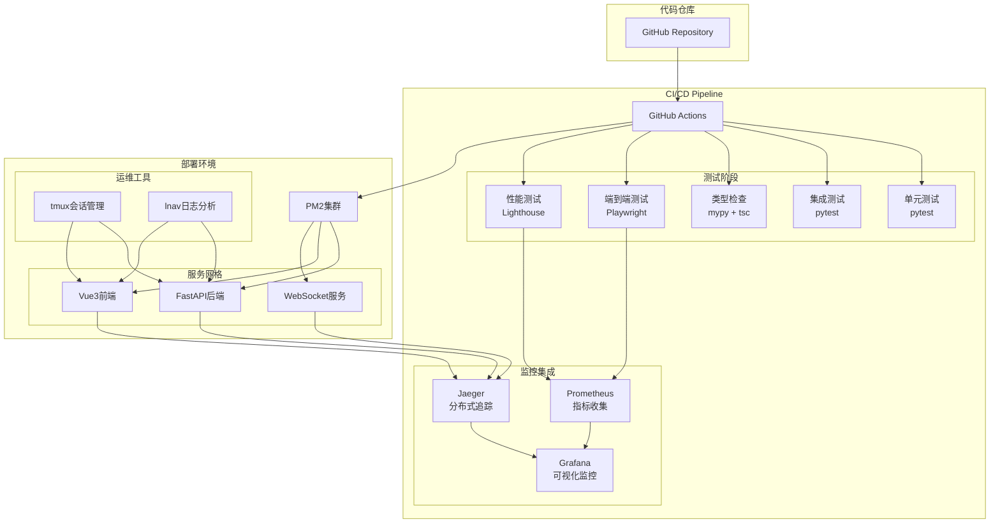

# MyStocks 企业级 CI/CD 优化体系

**版本**: v2.0 (企业级优化版)
**创建时间**: 2026-01-13
**适用场景**: 量化交易系统生产级CI/CD
**核心理念**: **智能化测试、分布式监控、自动化运维**

---

## 📊 当前体系分析

### 现有CI/CD架构评估

**✅ 已实现功能**:
- 三层测试架构（单元测试、集成测试、E2E测试）
- Playwright多浏览器E2E测试框架
- PM2进程管理自动化
- tmux多窗格开发环境
- 基础的CI/CD脚本 (`scripts/cicd_pipeline.sh`)

**⚠️ 待优化问题**:
- 缺乏GitHub Actions工作流配置
- 未集成分布式追踪（Jaeger）和指标监控（Prometheus）
- 类型检查未集成到CI/CD流程
- tmux和lnav未与PM2深度集成
- 缺少端到端测试在CI/CD中的完整流程

---

## 🎯 优化目标

### 1. 端到端测试深度集成
- **目标**: 将E2E测试完全集成到CI/CD管道，实现真正的端到端验证
- **覆盖范围**: 用户注册 → 数据获取 → 策略运行 → 结果展示的全流程
- **触发机制**: 代码变更自动触发，人工确认后部署

### 2. 分布式监控协同体系
- **Jaeger**: 分布式追踪，跟踪用户请求在微服务集群中的完整路径
- **Prometheus**: 指标监控，收集系统性能、业务指标、错误率等
- **协同工作**: Jaeger提供请求追踪，Prometheus提供指标聚合

### 3. 增强自动化测试能力
- **Playwright**: 多浏览器并行测试，支持Chrome DevTools协议
- **Chrome Dev**: 开发者工具集成，实现视觉回归测试
- **智能测试选择**: 根据代码变更范围自动选择相关测试用例

### 4. 运维框架深度集成
- **PM2+tmux+lnav**: 构建完整的自动化测试运维框架
- **tmux会话管理**: 多服务协同测试环境
- **lnav日志分析**: 实时日志监控和问题诊断

### 5. 类型安全保障
- **Python mypy**: 静态类型检查，防止运行时类型错误
- **TypeScript tsc**: 编译时类型检查，确保前端类型安全
- **集成到CI/CD**: 代码质量门禁，阻止类型错误进入生产

---

## 🏗️ 优化后的CI/CD架构

### 整体架构图



### 核心组件详解

#### 1. GitHub Actions工作流

```yaml
# .github/workflows/ci-cd-pipeline.yml
name: MyStocks CI/CD Pipeline

on:
  push:
    branches: [ main, develop ]
  pull_request:
    branches: [ main ]

env:
  PYTHON_VERSION: '3.8'
  NODE_VERSION: '16'

jobs:
  # 代码质量检查
  quality-check:
    runs-on: ubuntu-latest
    steps:
      - uses: actions/checkout@v4

      - name: Setup Python
        uses: actions/setup-python@v4
        with:
          python-version: ${{ env.PYTHON_VERSION }}

      - name: Setup Node.js
        uses: actions/setup-node@v4
        with:
          node-version: ${{ env.NODE_VERSION }}

      - name: Cache dependencies
        uses: actions/cache@v3
        with:
          path: |
            ~/.cache/pip
            ~/.npm
          key: ${{ runner.os }}-deps-${{ hashFiles('**/requirements*.txt', '**/package*.json') }}

      # 类型检查集成
      - name: Python Type Check (mypy)
        run: |
          pip install mypy
          mypy src/ --config-file mypy.ini

      - name: TypeScript Type Check
        run: |
          cd web/frontend
          npm ci
          npm run type-check

      # 代码质量检查
      - name: Code Quality
        run: |
          pip install black ruff
          black --check src/
          ruff check src/

  # 三层测试架构
  test-suite:
    needs: quality-check
    runs-on: ubuntu-latest
    strategy:
      matrix:
        test-type: [unit, integration, e2e]
        include:
          - test-type: unit
            command: pytest tests/unit/ -v --cov=src --cov-report=xml
          - test-type: integration
            command: pytest tests/integration/ -v --cov=src --cov-report=xml
          - test-type: e2e
            command: |
              playwright install chromium firefox webkit
              pytest tests/e2e/ -v --browser chromium --browser firefox

    steps:
      - uses: actions/checkout@v4

      - name: Setup Python
        uses: actions/setup-python@v4
        with:
          python-version: ${{ env.PYTHON_VERSION }}

      - name: Setup Node.js
        uses: actions/setup-node@v4
        with:
          node-version: ${{ env.NODE_VERSION }}

      - name: Install dependencies
        run: |
          pip install -r requirements.txt
          pip install pytest pytest-cov pytest-playwright

      - name: Run ${{ matrix.test-type }} tests
        run: ${{ matrix.command }}

      - name: Upload coverage reports
        uses: codecov/codecov-action@v3
        with:
          file: ./coverage.xml

  # 端到端测试专用
  e2e-full:
    needs: test-suite
    runs-on: ubuntu-latest
    services:
      tdengine:
        image: tdengine/tdengine:3.3.0.0
        ports:
          - 6030:6030
      postgres:
        image: postgres:15
        env:
          POSTGRES_PASSWORD: test123
        ports:
          - 5432:5432

    steps:
      - uses: actions/checkout@v4

      - name: Setup environment
        run: |
          # 启动后端服务
          cd web/backend
          pip install -r requirements.txt
          python -m uvicorn app.main:app --host 0.0.0.0 --port 8000 &
          BACKEND_PID=$!

          # 等待服务启动
          timeout 60 bash -c 'until curl -f http://localhost:8000/health; do sleep 2; done'

      - name: Install Playwright
        run: |
          cd web/frontend
          npm ci
          npx playwright install chromium firefox webkit

      - name: Run E2E tests
        run: |
          cd web/frontend
          npx playwright test --config=playwright.config.ts --reporter=github

      - name: Upload test results
        uses: actions/upload-artifact@v3
        if: always()
        with:
          name: playwright-report
          path: web/frontend/playwright-report/

  # 性能测试
  performance-test:
    needs: e2e-full
    runs-on: ubuntu-latest

    steps:
      - uses: actions/checkout@v4

      - name: Setup Lighthouse
        run: npm install -g lighthouse @lhci/cli

      - name: Run Lighthouse
        run: |
          # 启动应用
          cd web/backend
          python -m uvicorn app.main:app --host 0.0.0.0 --port 8000 &
          BACKEND_PID=$!

          # 等待服务启动
          sleep 10

          # 运行性能测试
          lighthouse http://localhost:8000/docs --output json --output html --output-path ./lighthouse-report.html

      - name: Upload performance report
        uses: actions/upload-artifact@v3
        with:
          name: lighthouse-report
          path: ./lighthouse-report.html

  # 部署到测试环境
  deploy-test:
    needs: [test-suite, e2e-full, performance-test]
    runs-on: ubuntu-latest
    if: github.ref == 'refs/heads/develop'

    steps:
      - uses: actions/checkout@v4

      - name: Deploy to test environment
        run: |
          echo "Deploying to test environment..."
          # 这里添加实际的部署脚本

  # 部署到生产环境
  deploy-prod:
    needs: deploy-test
    runs-on: ubuntu-latest
    if: github.ref == 'refs/heads/main'

    steps:
      - uses: actions/checkout@v4

      - name: Deploy to production
        run: |
          echo "Deploying to production..."
          # 这里添加实际的生产部署脚本
```

#### 2. Jaeger + Prometheus 协同监控体系

```yaml
# docker-compose.monitoring.yml
version: '3.8'

services:
  # Jaeger分布式追踪
  jaeger:
    image: jaegertracing/all-in-one:1.41
    ports:
      - "16686:16686"  # Jaeger UI
      - "14268:14268"  # Jaeger接收端点
    environment:
      COLLECTOR_OTLP_ENABLED: true
    networks:
      - monitoring

  # Prometheus指标监控
  prometheus:
    image: prom/prometheus:latest
    ports:
      - "9090:9090"
    volumes:
      - ./monitoring/prometheus.yml:/etc/prometheus/prometheus.yml
      - prometheus_data:/prometheus
    command:
      - '--config.file=/etc/prometheus/prometheus.yml'
      - '--storage.tsdb.path=/prometheus'
      - '--web.console.libraries=/etc/prometheus/console_libraries'
      - '--web.console.templates=/etc/prometheus/consoles'
      - '--storage.tsdb.retention.time=200h'
      - '--web.enable-lifecycle'
    networks:
      - monitoring

  # Grafana可视化
  grafana:
    image: grafana/grafana:latest
    ports:
      - "3001:3000"
    volumes:
      - grafana_data:/var/lib/grafana
    environment:
      GF_SECURITY_ADMIN_PASSWORD: admin
    networks:
      - monitoring

  # OpenTelemetry Collector (可选，用于收集应用指标)
  otel-collector:
    image: otel/opentelemetry-collector:latest
    command: ["--config=/etc/otel-collector-config.yaml"]
    volumes:
      - ./monitoring/otel-collector-config.yaml:/etc/otel-collector-config.yaml
    ports:
      - "4317:4317"  # OTLP gRPC
      - "4318:4318"  # OTLP HTTP
    networks:
      - monitoring

networks:
  monitoring:
    driver: bridge

volumes:
  prometheus_data:
  grafana_data:
```

#### 3. PM2 + tmux + lnav 运维框架

```javascript
// ecosystem.config.js - 增强版PM2配置
module.exports = {
  apps: [
    {
      name: 'mystocks-backend',
      script: 'web/backend/main.py',
      instances: 2,
      exec_mode: 'cluster',
      env: {
        NODE_ENV: 'production',
        JAEGER_ENDPOINT: 'http://jaeger:14268/api/traces',
        PROMETHEUS_PORT: 8001
      },
      // 集成tmux会话管理
      args: '--tmux-session mystocks-backend',
      // 集成lnav日志分析
      log_file: '/var/log/pm2/mystocks-backend.log',
      out_file: '/var/log/pm2/mystocks-backend-out.log',
      error_file: '/var/log/pm2/mystocks-backend-error.log'
    },
    {
      name: 'mystocks-frontend',
      script: 'serve',
      env: {
        PM2_SERVE_PATH: 'web/frontend/dist',
        PM2_SERVE_PORT: 3000,
        PM2_SERVE_SPA: 'true'
      }
    },
    {
      name: 'mystocks-websocket',
      script: 'web/backend/websocket_server.py',
      instances: 1,
      env: {
        JAEGER_SERVICE_NAME: 'websocket-service'
      }
    }
  ],

  // 部署配置
  deploy: {
    production: {
      user: 'deploy',
      host: 'your-server.com',
      ref: 'origin/main',
      repo: 'git@github.com:your-org/mystocks.git',
      path: '/home/deploy/mystocks',
      'pre-deploy-local': '',
      'post-deploy': 'npm install && pm2 reload ecosystem.config.js',
      'pre-setup': ''
    }
  }
}
```

#### 4. tmux + lnav 集成脚本

```bash
#!/bin/bash
# scripts/setup-dev-environment.sh

# 创建tmux开发环境
create_tmux_session() {
    local session_name="mystocks-dev"

    # 检查是否已存在会话
    if tmux has-session -t "$session_name" 2>/dev/null; then
        echo "Session $session_name already exists. Attaching..."
        tmux attach-session -t "$session_name"
        return
    fi

    # 创建新会话
    tmux new-session -d -s "$session_name" -n "main"

    # 创建多个窗格
    tmux split-window -h
    tmux split-window -v
    tmux select-pane -t 0
    tmux split-window -v

    # 启动服务
    tmux send-keys -t "$session_name:0.0" "cd web/backend && python -m uvicorn app.main:app --reload --port 8000" C-m
    tmux send-keys -t "$session_name:0.1" "cd web/frontend && npm run dev" C-m
    tmux send-keys -t "$session_name:0.2" "cd monitoring && docker-compose up" C-m
    tmux send-keys -t "$session_name:0.3" "lnav /var/log/pm2/*.log" C-m

    # 设置窗格布局
    tmux select-layout tiled

    # 附加到会话
    tmux attach-session -t "$session_name"
}

# 启动lnav日志监控
start_lnav_monitoring() {
    echo "Starting lnav log monitoring..."

    # 创建lnav配置文件
    cat > ~/.lnav/formats/mystocks.json << EOF
{
    "mystocks": {
        "title": "MyStocks Application Logs",
        "description": "Log format for MyStocks application",
        "regex": {
            "basic": {
                "pattern": "^(?<timestamp>\\d{4}-\\d{2}-\\d{2} \\d{2}:\\d{2}:\\d{2}) (?<level>\\w+) (?<module>[^:]+): (?<message>.+)$"
            }
        },
        "level": {
            "field": "level",
            "values": {
                "DEBUG": "debug",
                "INFO": "info",
                "WARNING": "warning",
                "ERROR": "error",
                "CRITICAL": "critical"
            }
        }
    }
}
EOF

    # 启动lnav
    lnav -c "open /var/log/pm2/*.log" -c "switch-to-view log"
}

# 主函数
main() {
    case "$1" in
        "tmux")
            create_tmux_session
            ;;
        "lnav")
            start_lnav_monitoring
            ;;
        "all")
            create_tmux_session &
            sleep 5
            start_lnav_monitoring
            ;;
        *)
            echo "Usage: $0 {tmux|lnav|all}"
            echo "  tmux  - Create tmux development session"
            echo "  lnav  - Start lnav log monitoring"
            echo "  all   - Start both tmux and lnav"
            exit 1
    esac
}

main "$@"