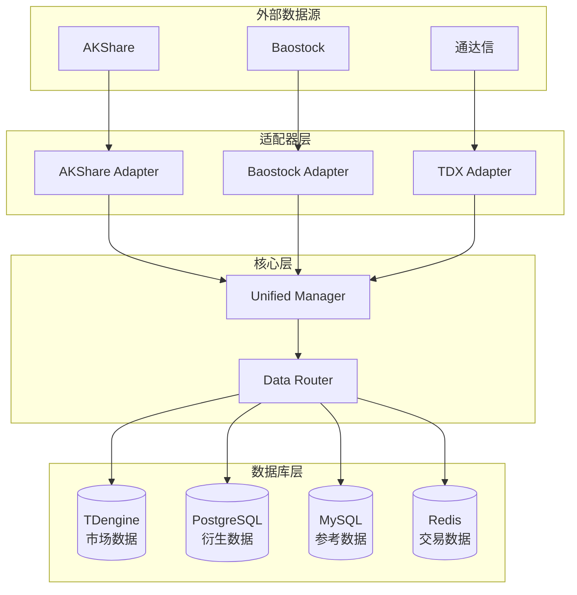

# 数据流图

**数据流数量**: 4

## 系统概览

## 市场数据获取与存储

**ID**: FLOW-001
**描述**: 从外部数据源获取市场数据并存储到 TDengine

**数据分类**: Market Data
**目标数据库**: TDengine

### 流程步骤

1. **adapters/akshare_adapter**.`fetch_realtime_data()` - 从 AKShare 获取实时行情数据
2. **unified_manager**.`save_data_by_classification()` - 根据数据分类自动路由
3. **core**.`DataStorageStrategy.get_target_database()` - 确定目标数据库为 TDengine
4. **data_access**.`TDengineDataAccess.save_market_data()` - 保存到 TDengine 时序数据库

---

## 参考数据管理

**ID**: FLOW-002
**描述**: 管理股票列表、交易日历等参考数据

**数据分类**: Reference Data
**目标数据库**: MySQL

### 流程步骤

1. **adapters/akshare_adapter**.`fetch_stock_list()` - 获取股票列表
2. **unified_manager**.`save_data_by_classification()` - 分类为参考数据
3. **data_access**.`MySQLDataAccess.save_reference_data()` - 保存到 MySQL

---

## 技术指标计算

**ID**: FLOW-003
**描述**: 计算技术指标并存储到 PostgreSQL

**数据分类**: Derived Data
**目标数据库**: PostgreSQL

### 流程步骤

1. **data_access**.`TDengineDataAccess.load_market_data()` - 从 TDengine 加载原始市场数据
2. **indicators**.`calculate_indicators()` - 计算技术指标（MA, MACD, RSI 等）
3. **unified_manager**.`save_data_by_classification()` - 分类为衍生数据
4. **data_access**.`PostgreSQLDataAccess.save_derived_data()` - 保存到 PostgreSQL

---

## 实时交易数据

**ID**: FLOW-004
**描述**: 管理实时持仓和交易数据的热冷分离

**数据分类**: Transaction Data
**目标数据库**: Redis + PostgreSQL

### 流程步骤

1. **strategy**.`execute_trade()` - 执行交易策略
2. **data_access**.`RedisDataAccess.save_hot_data()` - 保存活跃持仓到 Redis
3. **automation**.`archive_cold_data()` - 定时归档冷数据
4. **data_access**.`PostgreSQLDataAccess.save_transaction_history()` - 保存历史交易到 PostgreSQL

---
