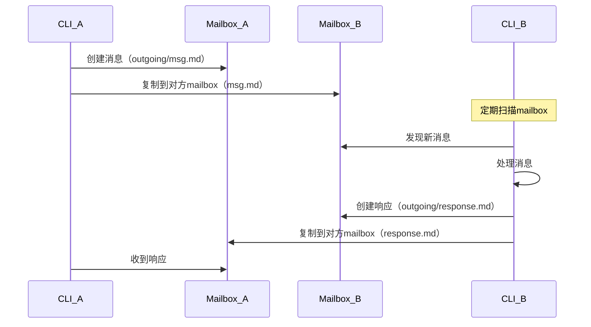
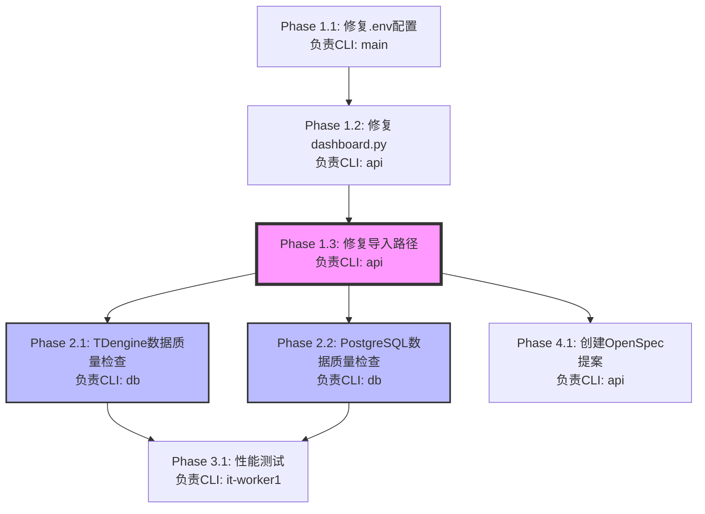

# 多CLI实时协作方法优化方案

**创建日期**: 2026-01-01
**版本**: v1.0
**作者**: MyStocks Development Team

---

## 📋 目录

1. [方法概述](#方法概述)
2. [核心优点](#核心优点)
3. [潜在问题与优化方案](#潜在问题与优化方案)
4. [完整架构设计](#完整架构设计)
5. [工具脚本](#工具脚本)
6. [工作流程](#工作流程)
7. [实施建议](#实施建议)
8. [附录](#附录)

---

## 方法概述

### 核心思想

通过多CLI并行协作，实现从Mock到Real数据源的顺利切换。每个CLI专注于特定职责域，通过异步通信和共享状态文件实现实时协作。

### CLI角色定义

| CLI | 角色 | 职责 | 数量 |
|-----|------|------|------|
| **CLI-main** | 全局管理者 | 任务分配、依赖管理、冲突协调、进度汇总 | 1 |
| **CLI-web** | 前端开发者 | 页面设计/管理、前端API对接、页面元素设计 | 1 |
| **CLI-api** | API开发者 | API设计/开发/管理/测试、API契约管理、API与组件对接 | 1 |
| **CLI-db** | 数据库管理者 | 数据架构/流转逻辑管理、数据提供、数据分层管理 | 1 |
| **CLI-it** | Worker | 完成其他任务、main分配的临时任务 | 可多（worker1, worker2...） |

### 核心规则

1. **分工明确**: 每个CLI严格按照职责域工作
2. **文档驱动**: 所有工作通过TASK.md、RULES.md、REPORT.md文档化
3. **异步通信**: 通过mailbox机制实现CLI间通信
4. **状态共享**: 通过STATUS.md实现状态同步
5. **文件锁定**: 通过文件锁避免冲突
6. **检查点机制**: 支持快速回滚

---

## 核心优点

| 优点 | 说明 | 价值 |
|------|------|------|
| **实时协作** | CLI间可以直接通过mailbox通信 | ⭐⭐⭐⭐⭐ 快速解决问题 |
| **职责分离** | 每个CLI专注特定领域 | ⭐⭐⭐⭐⭐ 提高效率、降低混乱 |
| **可追溯性** | TASK/REPORT/STATUS文档完整记录 | ⭐⭐⭐⭐ 便于审查和知识传承 |
| **动态扩展** | 可动态增加worker数量 | ⭐⭐⭐⭐ 灵活调配资源 |
| **问题定位** | 按领域快速找到责任CLI | ⭐⭐⭐ 加快调试和问题解决 |
| **并行开发** | 多个CLI同时工作，互不阻塞 | ⭐⭐⭐⭐⭐ 大幅提升效率 |
| **实时反馈** | 状态文件实时更新，main可实时监控 | ⭐⭐⭐⭐ 及时发现阻塞 |

---

## 潜在问题与优化方案

### 🔴 问题1：CLI间通信机制不明确

#### 问题描述
- CLI A如何知道CLI B能解决这个问题？
- CLI A如何找到CLI B？
- 如何保证消息被及时处理？

#### 优化方案：基于文件系统的异步通信 ✅

**目录结构**:
```
CLIS/
├── main/
│   ├── mailbox/           # 收件箱
│   │   ├── web_20250101_143022.md
│   │   └── api_20250101_143105.md
│   └── outgoing/          # 发件箱（已发送的消息）
│
├── web/
│   ├── mailbox/           # 收件箱
│   │   ├── main_*.md
│   │   └── api_*.md
│   └── outgoing/
│
├── api/
│   ├── mailbox/
│   └── outgoing/
│
├── db/
├── it/
│   ├── worker1/
│   │   ├── mailbox/
│   │   └── outgoing/
│   └── worker2/
```

**消息格式标准**:
```markdown
---
**From**: CLI-web
**To**: CLI-api
**Type**: REQUEST / RESPONSE / NOTIFICATION / ALERT
**Priority**: HIGH / MEDIUM / LOW
**Timestamp**: 2025-01-01 14:30:22
**MessageID**: MSG-20250101-143022

**Subject**: 请求API接口 /api/dashboard 数据格式变更

**Description**:
前端需要dashboard接口返回新增字段`sector_ranking`，请评估实现方案。

**Expected Response Time**: 30分钟

**Context**:
- 相关文件: web/frontend/src/views/Dashboard.vue
- 影响范围: 仪表盘页面
- 依赖任务: CLIS/api/TASK.md#4.1

**Attachments**:
- 需求文档: CLIS/web/outgoing/requirements.md
```

**通信流程**:


**扫描频率**:
- **高优先级ALERT**: 每30秒扫描一次
- **普通REQUEST**: 每1分钟扫描一次
- **NOTIFICATION**: 每2分钟扫描一次

---

### 🔴 问题2：文件冲突和代码合并

#### 问题描述
- 多个CLI可能同时修改同一文件
- 例如：CLI-web和CLI-api都需要修改`web/frontend/src/api/dashboard.ts`
- 如何避免冲突？如何合并代码？

#### 优化方案A：文件锁机制

**锁管理器实现**:
```python
# scripts/dev/file_lock_manager.py

import os
import json
import time
from pathlib import Path

class FileLockManager:
    """文件锁管理器 - 防止多CLI同时修改同一文件"""

    def __init__(self, lock_dir="CLIS/locks"):
        self.lock_dir = Path(lock_dir)
        self.lock_dir.mkdir(parents=True, exist_ok=True)

    def acquire_lock(self, cli_name, file_path, timeout=3600):
        """
        获取文件锁

        Args:
            cli_name: CLI名称（如: web, api, db）
            file_path: 要锁定的文件路径
            timeout: 锁定超时时间（秒）

        Returns:
            (success, message): (是否成功, 消息)
        """
        lock_file = self.lock_dir / f"{file_path.replace('/', '_')}.lock"

        # 检查是否已被锁定
        if lock_file.exists():
            with open(lock_file, 'r') as f:
                lock_info = json.load(f)

            # 检查锁是否超时
            if time.time() - lock_info['timestamp'] < lock_info['timeout']:
                return False, f"File locked by {lock_info['cli']} since {time.ctime(lock_info['timestamp'])}"

            # 锁已超时，删除旧锁
            lock_file.unlink()

        # 创建新锁
        with open(lock_file, 'w') as f:
            json.dump({
                'cli': cli_name,
                'file': file_path,
                'timestamp': time.time(),
                'timeout': timeout
            }, f)

        return True, "Lock acquired"

    def release_lock(self, cli_name, file_path):
        """
        释放文件锁

        Args:
            cli_name: CLI名称
            file_path: 文件路径

        Returns:
            (success, message): (是否成功, 消息)
        """
        lock_file = self.lock_dir / f"{file_path.replace('/', '_')}.lock"

        if not lock_file.exists():
            return True, "No lock to release"

        with open(lock_file, 'r') as f:
            lock_info = json.load(f)

        if lock_info['cli'] != cli_name:
            return False, f"Lock held by {lock_info['cli']}, cannot release"

        lock_file.unlink()
        return True, "Lock released"

    def check_lock(self, file_path):
        """检查文件是否被锁定"""
        lock_file = self.lock_dir / f"{file_path.replace('/', '_')}.lock"

        if not lock_file.exists():
            return None

        with open(lock_file, 'r') as f:
            return json.load(f)

    def list_locks(self):
        """列出所有锁"""
        locks = []
        for lock_file in self.lock_dir.glob("*.lock"):
            with open(lock_file, 'r') as f:
                locks.append(json.load(f))
        return locks
```

**使用规范**:
```markdown
# CLIS/web/RULES.md

## 文件修改规则

### 修改前必须加锁
1. 确认要修改的文件
2. 使用锁管理器加锁：
   ```bash
   python scripts/dev/file_lock_manager.py --acquire --cli=web --file=web/frontend/src/api/dashboard.ts
   ```
3. 如果加锁失败：
   - 查看是哪个CLI持有锁
   - 联系该CLI协调
   - 或向main申请协调

### 修改过程中
1. 尽快完成修改（不超过1小时）
2. 不要在持有锁时做其他事情
3. 如果需要更长时间，请先释放锁，重新申请

### 修改完成后
1. 立即提交代码
2. 立即释放锁：
   ```bash
   python scripts/dev/file_lock_manager.py --release --cli=web --file=web/frontend/src/api/dashboard.ts
   ```
3. 通知等待的CLI（如果有）

### 违反规则的后果
- ⚠️ 第一次：警告
- 🚫 第二次：暂停该CLI的写权限
- ❌ 第三次：强制退出协作
```

#### 优化方案B：按职责域隔离文件（推荐）✅

**文件职责划分**:
```markdown
# CLIS/FILE_RESPONSIBILITY.md

## 文件职责划分

### CLI-web 负责的文件
```
web/frontend/src/**/*.{vue,ts,js,scss}
web/frontend/src/components/**
web/frontend/src/views/**
web/frontend/src/router/**
web/frontend/src/stores/**
web/frontend/public/
```
**职责**: 前端页面、组件、路由、状态管理、静态资源

### CLI-api 负责的文件
```
web/backend/app/api/**/*.py
web/backend/app/core/**/*.py
web/backend/app/models/**/*.py
src/interfaces/**/*.py
src/data_sources/factory.py
openspec/
```
**职责**: API端点、核心逻辑、数据模型、接口定义、API契约

### CLI-db 负责的文件
```
src/data_access/**/*.py
src/storage/**/*.py
src/data_sources/real/**/*.py
src/data_sources/mock/**/*.py
src/adapters/**/*.py
```
**职责**: 数据访问层、存储层、数据源实现、适配器

### CLI-it 负责的文件
```
tests/**/*.py
scripts/tests/**/*.py
docs/guides/**/*.md
docs/reports/**/*.md
```
**职责**: 单元测试、集成测试、文档编写

### 交叉文件的处理规则
如果多个CLI需要修改同一文件：
1. **向main申请修改权限**
2. **main评估后分配给最合适的CLI**
3. **其他CLI提供需求文档**（放在mailbox中）
4. **持有锁的CLI完成后通知其他CLI**

### 示例场景
**场景**: web/frontend/src/api/dashboard.ts 需要修改
- CLI-web: 需要修改TypeScript类型定义
- CLI-api: 需要修改API调用逻辑

**处理流程**:
1. 双方都向main申请修改权限
2. main评估：API调用是核心，类型定义是次要
3. main分配给CLI-api，要求CLI-api同时处理类型定义
4. CLI-web提供类型需求文档给CLI-api
```

---

### 🔴 问题3：任务依赖管理

#### 问题描述
- CLI-web的任务"设计Dashboard页面"依赖CLI-api的任务"实现/api/dashboard接口"
- 如果CLI-api还未完成，CLI-web如何继续？
- 如何避免CLI-web空闲等待？

#### 优化方案A：任务依赖图 ✅

**依赖关系可视化**:
```markdown
# CLIS/main/TASK.md

## 任务依赖关系图



## 任务分配矩阵

| 任务ID | 任务名称 | 负责CLI | 依赖任务 | 状态 | 优先级 | 预计时间 |
|--------|---------|---------|----------|------|--------|----------|
| 1.1 | 修复.env配置 | main | 无 | ✅ 完成 | P0 | 5分钟 |
| 1.2 | 修复dashboard.py | api | 1.1 | ⏳ 进行中 | P0 | 1小时 |
| 1.3 | 修复导入路径 | api | 1.2 | ⏸️ 等待中 | P0 | 30分钟 |
| 2.1 | TDengine数据质量检查 | db | 1.3 | ⏸️ 等待中 | P0 | 2小时 |
| 2.2 | PostgreSQL数据质量检查 | db | 1.3 | ⏸️ 等待中 | P0 | 2小时 |
| 3.1 | 性能测试 | it-worker1 | 2.1, 2.2 | ⏸️ 等待中 | P1 | 3小时 |
| 4.1 | 创建OpenSpec提案 | api | 1.3 | ⏸️ 等待中 | P1 | 2小时 |

## 当前阻塞情况

### 阻塞链分析
```
CLI-db (任务2.1, 2.2)
  ↑ 等待
CLI-api (任务1.3)
  ↑ 等待
CLI-api (任务1.2) ← 当前正在执行
```

### 阻塞影响
- **CLI-db**: 等待任务1.3完成（预计30分钟）
- **CLI-it-worker1**: 等待任务2.1和2.2完成（预计4小时）

## 建议行动
1. ✅ CLI-api优先完成任务1.2和1.3，解除阻塞
2. ✅ CLI-db可以提前准备数据质量检查脚本（不阻塞）
3. ✅ CLI-it-worker1可以先执行其他独立任务（如Phase 5测试用例编写）
```

#### 优化方案B：动态任务分配策略

```markdown
# CLIS/main/WORKFLOW.md

## 工作流程规范

### 任务阻塞时的处理策略

#### 策略1: 等待依赖任务完成
**适用场景**: 依赖任务即将完成（< 30分钟）

**处理流程**:
1. 检查依赖任务的预计完成时间
2. 如果 < 30分钟，可以选择等待
3. 向main报告：在STATUS.md中标注state="waiting"
4. 利用等待时间进行准备工作：
   - 阅读相关文档
   - 编写测试用例
   - 准备数据脚本

#### 策略2: 协助依赖任务（跨CLI协作）
**适用场景**: 依赖任务遇到困难，需要协助

**处理流程**:
1. 向main发送协助请求（mailbox）
2. main评估后，可以：
   - 临时调整任务分配
   - 让你协助完成依赖任务
   - 让你完成依赖任务的一部分

**示例**:
```markdown
**From**: CLI-db
**To**: CLI-main
**Type**: REQUEST
**Subject**: 请求协助任务1.3

我目前被任务1.3阻塞，但我熟悉Python导入路径，是否可以协助CLI-api完成任务1.3？
```

#### 策略3: 执行独立任务
**适用场景**: 有其他不依赖当前阻塞的任务

**处理流程**:
1. 向main请求分配独立任务
2. main从任务池中分配独立任务
3. 完成后继续等待或继续执行独立任务

**示例**:
```markdown
# CLIS/main/TASK.md

## 独立任务池（无依赖）

| 任务ID | 任务名称 | 负责CLI | 优先级 | 状态 |
|--------|---------|---------|--------|------|
| 5.1 | 编写单元测试 | it-worker1 | P2 | 可分配 |
| 5.2 | 编写集成测试 | it-worker2 | P2 | 可分配 |
| 7.1 | 更新文档 | any | P3 | 可分配 |
| 7.2 | 创建故障排查指南 | any | P3 | 可分配 |
```

#### 策略4: 提前准备（预研、设计）
**适用场景**: 没有其他任务，但可以提前准备

**处理流程**:
1. 分析即将执行的任务
2. 进行预研和设计
3. 编写技术方案
4. 准备测试数据

**示例**:
```markdown
# CLI-db被阻塞时的准备工作

## 当前状态
- 等待任务1.3完成（预计30分钟）

## 准备工作
1. ✅ 阅读TDengine数据质量检查文档
2. ✅ 编写数据质量检查脚本框架
3. ✅ 准备测试用例
4. ✅ 熟悉PostgreSQL数据表结构

## 预期收益
- 任务2.1、2.2可以立即开始执行
- 减少执行时间约30分钟
```

### 发现新任务时的处理

#### 流程规范
```markdown
# 发现新任务的分类处理

## 类别1: 紧急bug修复
**定义**: 阻塞其他任务或影响系统稳定性的bug
**处理**: 可以立即修复，但需要向main报告
**报告内容**:
- bug描述
- 影响范围
- 修复方案
- 预计时间

## 类别2: 任务相关的优化改进
**定义**: 在执行任务时发现的优化机会
**处理**: 记录到REPORT.md的"发现的新任务"章节
**示例**:
```markdown
# CLIS/api/REPORT.md

## 发现的新任务

### OPT-001: dashboard.py可以使用依赖注入
**发现时间**: 2025-01-01 14:30
**当前实现**: 直接实例化MockBusinessDataSource
**建议改进**: 使用FastAPI的Dependences实现依赖注入
**优先级**: P3（低优先级）
**是否阻塞**: 否
**建议执行时机**: Phase 1完成后
```

## 类别3: 跨领域的新功能需求
**定义**: 不属于当前职责范围的新需求
**处理**: 向main报告，由main评估是否添加到任务列表

### 任务提前完成时的处理

#### 流程规范
```markdown
# 任务提前完成的标准流程

## Step 1: 验证完成
1. 检查TASK.md中所有任务是否标注为完成状态
2. 生成REPORT.md，记录工作成果
3. 更新STATUS.md，标注state="idle"

## Step 2: 向main报告
发送消息给main：
```markdown
**From**: CLI-web
**To**: CLI-main
**Type**: NOTIFICATION
**Subject**: 任务全部完成

当前任务已全部完成，详见CLIS/web/REPORT.md
可以接受新任务分配
```

## Step 3: 等待main响应
main会根据情况选择：
1. 分配新任务
2. 让你协助其他CLI
3. 让你进行优化改进（仍在职责范围内）
4. 让你暂时休息（等待其他CLI）

## Step 4: 继续工作
根据main的指示继续工作
```
```

---

### 🔴 问题4：CLI-main的负担过重

#### 问题描述
- main需要实时监控5个CLI
- 处理所有跨CLI通信
- 管理任务依赖关系
- 可能成为性能瓶颈和单点故障

#### 优化方案A：main职责分离 ✅

```markdown
# CLIS/main/ROLE_DEFINITION.md

## CLI-main的核心职责（精简版）

### 主要职责

#### 1. 任务分配（30%时间）
- 将大任务分解为小任务
- 根据CLI职责域分配任务
- 更新TASK.md中的任务状态

#### 2. 依赖管理（20%时间）
- 维护任务依赖关系图
- 监控任务执行状态
- 识别阻塞和瓶颈

#### 3. 冲突协调（20%时间）
- 处理文件锁冲突
- 协调跨CLI协作
- 解决资源竞争

#### 4. 进度汇总（30%时间）
- 每5分钟扫描所有CLI的STATUS.md
- 生成全局STATUS.md
- 向用户汇报进度

### 不负责的职责（交给其他机制）

#### ❌ 实时通信 → 使用mailbox异步通信
- CLI间直接通过mailbox通信
- main只在需要协调时介入

#### ❌ 文件锁定 → 使用file_lock_manager.py自动化
- CLI自行管理文件锁
- main只在冲突时介入

#### ❌ 状态同步 → 使用STATUS.md共享状态文件
- CLI自行更新STATUS.md
- main定期扫描汇总

### 工作模式

#### 主动模式（每5分钟）
```python
# main定期执行的扫描任务
def scan_all_clis():
    """扫描所有CLI的状态"""
    statuses = {}

    for cli in ['web', 'api', 'db', 'it']:
        status_file = f"CLIS/{cli}/STATUS.md"
        with open(status_file, 'r') as f:
            statuses[cli] = parse_status(f.read())

    # 生成全局状态
    generate_global_status(statuses)

    # 检查阻塞
    check_blockages(statuses)

    # 生成协调建议
    generate_recommendations(statuses)
```

#### 被动模式（响应mailbox）
- 当收到REQUEST消息时，处理请求
- 当收到ALERT消息时，立即处理
- 其他消息可以批量处理

#### 异常模式（收到ALERT时）
- 立即停止当前工作
- 评估ALERT的严重性
- 协调相关CLI处理
- 向用户报告（如果需要）

### 时间分配建议

| 活动 | 频率 | 单次耗时 | 每小时总耗时 |
|------|------|----------|--------------|
| 扫描STATUS | 每5分钟 | 30秒 | 6分钟 |
| 处理mailbox | 每10分钟 | 2分钟 | 12分钟 |
| 协调冲突 | 按需 | 5-10分钟 | 变动 |
| 分配任务 | 按需 | 5-15分钟 | 变动 |
| 生成报告 | 每1小时 | 5分钟 | 5分钟 |
| **总计** | - | - | **约30分钟/小时** |

**结论**: main有70%的时间可以用于其他工作，不会成为瓶颈
```

#### 优化方案B：引入自动化工具 ✅

**CLI协调器实现**:
```python
# scripts/dev/cli_coordinator.py

"""
CLI协调器 - 自动化管理多CLI协作

功能：
1. 自动扫描各CLI的STATUS.md
2. 检测任务阻塞和依赖关系
3. 自动发送协调建议
4. 生成进度报告
5. 异常检测和告警
"""

import os
import json
from pathlib import Path
from datetime import datetime, timedelta
import re

class CLICoordinator:
    """CLI协调器 - 减轻main负担"""

    def __init__(self, clis_dir="CLIS"):
        self.clis_dir = Path(clis_dir)
        self.status_file = self.clis_dir / "main" / "STATUS.md"
        self.cli_list = ['web', 'api', 'db']

    def scan_all_status(self):
        """扫描所有CLI的状态"""
        statuses = {}

        for cli_name in self.cli_list:
            # 扫描主CLI
            status = self._scan_cli_status(cli_name)
            if status:
                statuses[cli_name] = status

            # 扫描worker CLI
            worker_dir = self.clis_dir / "it"
            if worker_dir.exists():
                for worker_path in worker_dir.iterdir():
                    if worker_path.is_dir() and worker_path.name.startswith('worker'):
                        status = self._scan_cli_status(f"it-{worker_path.name}")
                        if status:
                            statuses[f"it-{worker_path.name}"] = status

        return statuses

    def _scan_cli_status(self, cli_name):
        """扫描单个CLI的状态"""
        cli_dir = self.clis_dir / cli_name
        status_file = cli_dir / "STATUS.md"

        if not status_file.exists():
            return None

        with open(status_file, 'r') as f:
            content = f.read()

        return self._parse_status(content, cli_name)

    def _parse_status(self, content, cli_name):
        """解析STATUS.md内容"""
        status = {
            'name': cli_name,
            'state': 'unknown',
            'current_task': None,
            'last_update': None,
            'blocked_on': None,
            'waiting_time': 0,
            'issues': []
        }

        # 解析state
        state_match = re.search(r'\*\*State\*\*:\s*(\w+)', content)
        if state_match:
            status['state'] = state_match.group(1)

        # 解析current_task
        task_match = re.search(r'\*\*Current Task\*\*:\s*(.+)', content)
        if task_match:
            status['current_task'] = task_match.group(1).strip()

        # 解析last_update
        update_match = re.search(r'\*\*Last Update\*\*:\s*(.+)', content)
        if update_match:
            status['last_update'] = update_match.group(1).strip()

        # 解析blocked_on
        blocked_match = re.search(r'\*\*Blocked On\*\*:\s*(.+)', content)
        if blocked_match:
            status['blocked_on'] = blocked_match.group(1).strip()

        # 解析issues
        issues_section = re.search(r'## Issues\n(.*?)(?=\n##|\Z)', content, re.DOTALL)
        if issues_section:
            issues = re.findall(r'-\s*\[(.+?)\]\s*(.+)', issues_section.group(1))
            status['issues'] = [{'severity': s, 'description': d} for s, d in issues]

        return status

    def check_blockages(self, statuses):
        """检查任务阻塞"""
        blockages = []

        for cli, status in statuses.items():
            if status['state'] == 'blocked':
                # 计算等待时间
                if status['last_update']:
                    last_update = datetime.strptime(status['last_update'], '%Y-%m-%d %H:%M:%S')
                    waiting_time = (datetime.now() - last_update).total_seconds() / 60
                else:
                    waiting_time = 0

                blockages.append({
                    'cli': cli,
                    'blocked_on': status['blocked_on'],
                    'waiting_time': waiting_time,
                    'current_task': status['current_task']
                })

        # 按等待时间排序
        blockages.sort(key=lambda x: x['waiting_time'], reverse=True)

        return blockages

    def find_idle_clis(self, statuses):
        """查找空闲的CLI"""
        idle_clis = []

        for cli, status in statuses.items():
            if status['state'] == 'idle':
                idle_clis.append(cli)

        return idle_clis

    def generate_recommendations(self, blockages, idle_clis):
        """生成协调建议"""
        recommendations = []

        # 建议1: 空闲CLI协助阻塞CLI
        if blockages and idle_clis:
            for blockage in blockages[:3]:  # 只处理前3个
                for idle_cli in idle_clis:
                    recommendations.append({
                        'type': 'reassign',
                        'priority': 'HIGH' if blockage['waiting_time'] > 60 else 'MEDIUM',
                        'from': blockage['cli'],
                        'to': idle_cli,
                        'reason': f"{blockage['cli']}被阻塞{blockage['waiting_time']:.0f}分钟，建议{idle_cli}协助完成依赖任务",
                        'blocked_task': blockage['current_task']
                    })

        # 建议2: 长时间阻塞告警
        for blockage in blockages:
            if blockage['waiting_time'] > 120:  # 超过2小时
                recommendations.append({
                    'type': 'alert',
                    'priority': 'CRITICAL',
                    'cli': blockage['cli'],
                    'reason': f"阻塞时间过长（{blockage['waiting_time']:.0f}分钟），需要main立即介入协调",
                    'suggestion': '考虑重新分配依赖任务或调整执行顺序'
                })

        return recommendations

    def generate_status_report(self, statuses, blockages, recommendations):
        """生成全局状态报告"""
        report = []

        # 报告头部
        report.append("# CLI Status Summary\n")
        report.append(f"**Generated**: {datetime.now().strftime('%Y-%m-%d %H:%M:%S')}\n")
        report.append(f"**Total CLIs**: {len(statuses)}\n")
        report.append(f"**Blocked CLIs**: {len(blockages)}\n")
        report.append(f"**Idle CLIs**: {len(self.find_idle_clis(statuses))}\n\n")

        # CLI状态表格
        report.append("## CLI Status\n\n")
        report.append("| CLI | State | Current Task | Last Update | Issues |\n")
        report.append("|-----|--------|--------------|-------------|--------|\n")

        state_emoji = {
            'active': '🟢',
            'waiting': '🟡',
            'blocked': '🔴',
            'idle': '⚪',
            'error': '❌'
        }

        for cli, status in statuses.items():
            emoji = state_emoji.get(status['state'], '❓')
            issues_count = len(status['issues'])
            issues_str = f"{issues_count} issues" if issues_count > 0 else "None"

            report.append(f"| {cli} | {emoji} {status['state']} | {status['current_task'] or 'N/A'} | {status['last_update'] or 'N/A'} | {issues_str} |\n")

        # 阻塞情况
        if blockages:
            report.append("\n## Current Blockages\n\n")
            for i, blockage in enumerate(blockages, 1):
                report.append(f"### {i}. {blockage['cli']}\n")
                report.append(f"- **Blocked On**: {blockage['blocked_on']}\n")
                report.append(f"- **Waiting Time**: {blockage['waiting_time']:.0f} minutes\n")
                report.append(f"- **Current Task**: {blockage['current_task']}\n\n")

        # 协调建议
        if recommendations:
            report.append("## Recommendations\n\n")
            for i, rec in enumerate(recommendations, 1):
                priority_emoji = {'CRITICAL': '🔴', 'HIGH': '🟠', 'MEDIUM': '🟡', 'LOW': '🟢'}
                emoji = priority_emoji.get(rec['priority'], '⚪')

                report.append(f"### {i}. [{emoji}] {rec['type'].upper()}: {rec.get('from', rec.get('cli', ''))}\n")
                report.append(f"- **Priority**: {rec['priority']}\n")
                report.append(f"- **Reason**: {rec['reason']}\n")
                if rec.get('suggestion'):
                    report.append(f"- **Suggestion**: {rec['suggestion']}\n")
                report.append("\n")

        return ''.join(report)

    def auto_update_status(self):
        """自动更新全局状态文件"""
        # 扫描状态
        statuses = self.scan_all_status()

        # 检查阻塞
        blockages = self.check_blockages(statuses)

        # 查找空闲CLI
        idle_clis = self.find_idle_clis(statuses)

        # 生成建议
        recommendations = self.generate_recommendations(blockages, idle_clis)

        # 生成报告
        report = self.generate_status_report(statuses, blockages, recommendations)

        # 写入文件
        with open(self.status_file, 'w') as f:
            f.write(report)

        return {
            'statuses': statuses,
            'blockages': blockages,
            'recommendations': recommendations
        }

    def send_recommendations(self, recommendations):
        """将建议发送给相关CLI（通过mailbox）"""
        for rec in recommendations:
            if rec['type'] == 'reassign':
                # 发送给空闲CLI
                message = self._create_coordination_message(rec)
                self._send_message(rec['to'], message)

    def _create_coordination_message(self, recommendation):
        """创建协调消息"""
        return f"""---
**From**: CLI-main
**To**: {recommendation['to']}
**Type**: REQUEST
**Priority**: {recommendation['priority']}
**Timestamp**: {datetime.now().strftime('%Y-%m-%d %H:%M:%S')}
**AutoGenerated**: true

**Subject**: 协作请求：协助{recommendation['from']}

**Description**:
{recommendation['reason']}

**Blocked Task**: {recommendation['blocked_task']}

**Action Required**:
请评估是否可以协助完成依赖任务，或者执行其他独立任务。

**Expected Response**: 15分钟内
"""

    def _send_message(self, to_cli, message):
        """发送消息到指定CLI的mailbox"""
        mailbox_dir = self.clis_dir / to_cli / "mailbox"
        mailbox_dir.mkdir(parents=True, exist_ok=True)

        timestamp = datetime.now().strftime('%Y%m%d_%H%M%S')
        message_file = mailbox_dir / f"main_{timestamp}.md"

        with open(message_file, 'w') as f:
            f.write(message)


def main():
    """主函数"""
    import argparse

    parser = argparse.ArgumentParser(description='CLI协调器')
    parser.add_argument('--auto-update', action='store_true', help='自动更新状态并生成报告')
    parser.add_argument('--scan', action='store_true', help='仅扫描状态')
    parser.add_argument('--recommend', action='store_true', help='生成并发送协调建议')
    parser.add_argument('--clis-dir', default='CLIS', help='CLI目录路径')

    args = parser.parse_args()

    coordinator = CLICoordinator(args.clis_dir)

    if args.auto_update:
        result = coordinator.auto_update_status()
        print(f"✅ Status updated: {len(result['statuses'])} CLIs, {len(result['blockages'])} blockages, {len(result['recommendations'])} recommendations")

    elif args.scan:
        statuses = coordinator.scan_all_status()
        print(f"✅ Scanned {len(statuses)} CLIs")

    elif args.recommend:
        statuses = coordinator.scan_all_status()
        blockages = coordinator.check_blockages(statuses)
        idle_clis = coordinator.find_idle_clis(statuses)
        recommendations = coordinator.generate_recommendations(blockages, idle_clis)

        coordinator.send_recommendations(recommendations)
        print(f"✅ Sent {len(recommendations)} recommendations")


if __name__ == '__main__':
    main()
```

**使用方式**:
```bash
# 手动运行协调器
python scripts/dev/cli_coordinator.py --auto-update

# 设置cron任务（每5分钟自动运行）
*/5 * * * * cd /opt/claude/mystocks_spec && python scripts/dev/cli_coordinator.py --auto-update >> CLIS/main/coordinator.log 2>&1
```

---

### 🔴 问题5：错误恢复和回滚机制

#### 问题描述
- CLI-api在实现接口时引入bug
- 导致整个系统无法运行
- 如何快速恢复到稳定状态？

#### 优化方案A：检查点机制 ✅

**检查点管理**:
```markdown
# CLIS/main/CHECKPOINTS.md

## 检查点管理

### 检查点定义
检查点是系统的一个稳定状态，可以用于快速回滚。

### 检查点列表

| 检查点ID | 时间戳 | 描述 | Git Commit | 创建者 | 状态 |
|---------|--------|------|------------|--------|------|
| CP-001 | 2025-01-01 10:00 | Mock数据源工作正常 | abc123def | main | ✅ 稳定 |
| CP-002 | 2025-01-01 12:00 | .env配置完成 | def456ghi | main | ✅ 稳定 |
| CP-003 | 2025-01-01 14:00 | dashboard.py修复完成 | ghi789jkl | api | ✅ 稳定 |
| CP-004 | 2025-01-01 16:00 | 数据质量验证通过 | --- | db | ⏳ 创建中 |

### 检查点内容
每个检查点包含：
1. **Git Commit**: 完整的代码快照
2. **环境配置**: .env文件副本
3. **测试结果**: 所有测试用例的执行结果
4. **数据状态**: 数据库schema和数据快照
5. **文档状态**: 所有相关文档的版本

### 创建检查点的时机
- ✅ 完成一个Phase的所有任务
- ✅ 修复一个关键bug后
- ✅ 系统集成测试通过后
- ✅ 性能测试通过后
- ❌ 不要在任务进行中创建检查点
- ❌ 不要在有测试失败时创建检查点

### 创建检查点的流程
1. **验证系统状态**: 运行所有测试
2. **提交代码**: git commit -m "checkpoint: CP-00X description"
3. **创建标签**: git tag -a CP-00X -m "Checkpoint description"
4. **保存环境配置**: cp .env CLIS/main/checkpoints/cp-00x/.env
5. **保存测试结果**: cp test-results.xml CLIS/main/checkpoints/cp-00x/
6. **更新CHECKPOINTS.md**: 记录检查点信息
7. **推送远程**: git push origin CP-00X

### 回滚流程
1. **识别问题**: 确定需要回滚的原因
2. **选择检查点**: 确定要回滚到哪个检查点
3. **停止服务**: 如果有运行中的服务，先停止
4. **执行回滚**:
   ```bash
   # 方法1: 使用git checkout
   git checkout CP-00X

   # 方法2: 使用git reset（会丢失之后的提交）
   git reset --hard CP-00X

   # 方法3: 使用git revert（保留历史）
   git revert HEAD~3..HEAD  # 回滚最近3个提交
   ```
5. **恢复环境配置**: cp CLIS/main/checkpoints/cp-00x/.env .env
6. **验证系统状态**: 运行测试验证
7. **重新开始**: 从检查点重新执行任务

### 回滚示例
```markdown
## 场景: CLI-api引入bug导致系统崩溃

### 问题发现
- 时间: 2025-01-01 15:30
- 症状: /api/dashboard接口返回500错误
- 责任CLI: api
- 问题提交: bug789xyz

### 影响评估
- 影响范围: Dashboard页面无法加载
- 严重程度: 🔴 Critical（阻塞所有用户）
- 是否可快速修复: 否（需要2小时）

### 回滚决策
1. main评估: 决定回滚到CP-002
2. 通知所有CLI: 停止当前工作
3. 执行回滚: git checkout CP-002
4. 验证系统: Dashboard恢复正常

### 后续处理
1. CLI-api修复bug（在独立分支）
2. 测试通过后，创建新的检查点CP-004
3. 重新合并到主分支
```

#### 优化方案B：增量提交策略 ✅

```markdown
# CLIS/main/RULES.md

## 提交规范

### 小步快跑原则
每个CLI完成任务后，必须立即提交，不要积累多个任务。

### 原子提交
每个提交只包含一个完整的任务，不要混合多个任务。

### 提交频率
- ✅ 完成一个子任务 → 立即提交
- ✅ 修复一个bug → 立即提交
- ✅ 完成一个Phase → 立即提交并创建检查点
- ❌ 不要等所有任务完成才提交
- ❌ 不要将多个任务合并到一个提交
- ❌ 不要在任务未完成时提交

### 提交消息格式
```
[cli-name] task-id: brief description

- Change 1
- Change 2
- Change 3

Related Tasks: CLIS/cli-name/TASK.md#task-id
Test Status: PASS / FAIL
Issue: #issue-id (如果修复了bug)
```

### 提交消息示例
```
[api] 1.2: 修复dashboard.py中的MockBusinessDataSource依赖

- 替换MockBusinessDataSource为get_business_source()
- 修复导入路径，添加项目根目录到sys.path
- 更新get_business_datasource()函数使用工厂模式

Related Tasks: CLIS/api/TASK.md#1.2
Test Status: PASS (所有测试用例通过)
Impact: 解除P0阻塞，允许CLI-db开始数据质量检查
```

### 提交检查清单
在提交前，确保：
- [ ] 代码已本地测试通过
- [ ] 没有print调试语句
- [ ] 没有注释掉的代码
- [ ] 遵循代码规范
- [ ] 更新了相关文档
- [ ] 提交消息格式正确
```

---

## 完整架构设计

### 目录结构

```
CLIS/
├── main/                              # CLI-main工作目录
│   ├── TASK.md                        # 主任务清单
│   ├── RULES.md                       # main的工作规范
│   ├── STATUS.md                      # 全局状态（自动生成）
│   ├── CHECKPOINTS.md                 # 检查点管理
│   ├── WORKFLOW.md                    # 工作流程
│   ├── REPORT.md                      # main的工作报告
│   ├── mailbox/                       # 收件箱
│   │   ├── web_20250101_143022.md
│   │   ├── api_20250101_143105.md
│   │   └── db_20250101_151215.md
│   ├── outgoing/                      # 发件箱（已发送的消息）
│   │   ├── web_20250101_143500.md
│   │   └── api_20250101_143830.md
│   └── checkpoints/                   # 检查点数据
│       ├── cp-001/
│       │   ├── .env
│       │   ├── test-results.xml
│       │   └── metadata.json
│       └── cp-002/
│
├── web/                               # CLI-web工作目录
│   ├── TASK.md                        # 任务清单
│   ├── RULES.md                       # 工作规范
│   ├── REPORT.md                      # 工作报告
│   ├── STATUS.md                      # 当前状态
│   ├── mailbox/                       # 收件箱
│   │   ├── main_*.md
│   │   └── api_*.md
│   └── outgoing/                      # 发件箱
│
├── api/                               # CLI-api工作目录
│   ├── TASK.md
│   ├── RULES.md
│   ├── REPORT.md
│   ├── STATUS.md
│   ├── mailbox/
│   └── outgoing/
│
├── db/                                # CLI-db工作目录
│   ├── TASK.md
│   ├── RULES.md
│   ├── REPORT.md
│   ├── STATUS.md
│   ├── mailbox/
│   └── outgoing/
│
├── it/                                # CLI-it工作目录
│   ├── worker1/
│   │   ├── TASK.md
│   │   ├── RULES.md
│   │   ├── REPORT.md
│   │   ├── STATUS.md
│   │   ├── mailbox/
│   │   └── outgoing/
│   └── worker2/
│       ├── TASK.md
│       ├── RULES.md
│       ├── REPORT.md
│       ├── STATUS.md
│       ├── mailbox/
│       └── outgoing/
│
├── locks/                             # 文件锁（自动管理）
│   ├── web_frontend_api_dashboard_ts.lock
│   ├── api_dashboard_py.lock
│   └── db_tdengine_timeseries_py.lock
│
└── SHARED/                            # 共享资源
    ├── TASKS_POOL.md                  # 独立任务池
    ├── KNOWLEDGE_BASE.md              # 知识库（常见问题、解决方案）
    └── COORDINATION_LOG.md            # 协调日志
```

### 核心文档说明

#### TASK.md（任务清单）
```markdown
# CLIS/api/TASK.md

## 任务概览

| 任务ID | 任务名称 | 依赖任务 | 状态 | 优先级 | 预计时间 |
|--------|---------|---------|------|--------|----------|
| 1.2 | 修复dashboard.py | 1.1 | ✅ 完成 | P0 | 1小时 |
| 1.3 | 修复导入路径 | 1.2 | ⏳ 进行中 | P0 | 30分钟 |
| 4.1 | 创建OpenSpec提案 | 1.3 | ⏸️ 等待中 | P1 | 2小时 |

## 当前任务

### 任务1.3: 修复导入路径

**描述**: 修复dashboard.py中的导入路径问题

**依赖**: 任务1.2

**状态**: ⏳ 进行中

**步骤**:
- [ ] 1.3.1 添加项目根目录到sys.path
- [ ] 1.3.2 更新导入语句
- [ ] 1.3.3 本地测试验证
- [ ] 1.3.4 提交代码

**预计完成时间**: 30分钟

**相关问题**: 无

**附件**: 无
```

#### STATUS.md（当前状态）
```markdown
# CLIS/api/STATUS.md

**CLI**: CLI-api
**Updated**: 2025-01-01 14:35:22

## Current State

**State**: 🟢 Active
**Current Task**: 任务1.3 - 修复导入路径
**Progress**: 50% (步骤1.3.1已完成)

## Blocked On

无

## Issues

- [ ] ⚠️ [MEDIUM] 导入路径可能存在跨平台兼容性问题
- 建议使用pathlib替代os.path

## Recent Activity

| 时间 | 活动 | 结果 |
|------|------|------|
| 14:30 | 完成任务1.2 | ✅ 成功 |
| 14:35 | 开始任务1.3 | 🔄 进行中 |
| 14:36 | 发现导入路径问题 | ⚠️ 记录到Issues |

## Next Steps

1. 完成任务1.3的剩余步骤
2. 等待main分配新任务
```

#### REPORT.md（工作报告）
```markdown
# CLIS/api/REPORT.md

**Period**: 2025-01-01 10:00 - 14:35
**Author**: CLI-api

## Work Summary

### Completed Tasks

#### ✅ 任务1.2: 修复dashboard.py
**完成时间**: 2025-01-01 14:30
**耗时**: 1小时

**工作内容**:
1. 替换MockBusinessDataSource为get_business_source()
2. 修复导入路径
3. 本地测试通过

**成果**:
- 修改文件: web/backend/app/api/dashboard.py
- 提交: abc123def
- 测试结果: 全部通过

**影响**: 解除P0阻塞，允许CLI-db开始数据质量检查

### In-Progress Tasks

#### ⏳ 任务1.3: 修复导入路径
**开始时间**: 2025-01-01 14:35
**进度**: 50%

**已完成**:
- [x] 1.3.1 添加项目根目录到sys.path

**进行中**:
- [ ] 1.3.2 更新导入语句

**未开始**:
- [ ] 1.3.3 本地测试验证
- [ ] 1.3.4 提交代码

## Discovered Tasks

### OPT-001: dashboard.py可以使用依赖注入
**发现时间**: 2025-01-01 14:20
**当前实现**: 直接实例化MockBusinessDataSource
**建议改进**: 使用FastAPI的Dependences实现依赖注入
**优先级**: P3（低优先级）
**建议执行时机**: Phase 1完成后

## Problems & Solutions

### 问题1: 导入模块找不到
**时间**: 2025-01-01 14:35
**错误**: ModuleNotFoundError: No module named 'src'
**解决**: 添加项目根目录到sys.path
**状态**: ✅ 已解决

## Metrics

- **总任务数**: 2
- **已完成**: 1
- **进行中**: 1
- **未开始**: 0
- **完成率**: 50%

- **总耗时**: 1小时
- **预计剩余**: 30分钟

## Recommendations

### 给main的建议
1. ✅ 任务1.3预计30分钟完成
2. 建议：CLI-db可以提前准备数据质量检查脚本

### 给自己的建议
1. 专注完成任务1.3
2. 发现问题及时记录到Issues
3. 完成后立即向main报告
```

#### RULES.md（工作规范）
```markdown
# CLIS/api/RULES.md

## 工作职责

### 核心职责
1. API端点设计、开发、测试
2. API契约管理（OpenSpec）
3. 接口定义和文档编写
4. 与web和db的API对接

### 文件职责
- 负责: `web/backend/app/api/**/*.py`
- 负责: `src/interfaces/**/*.py`
- 负责: `src/data_sources/factory.py`
- 负责: `openspec/**`

## 工作流程

### 任务执行
1. 接收任务（通过TASK.md）
2. 分析任务需求
3. 设计方案
4. 编写代码
5. 本地测试
6. 提交代码
7. 更新REPORT.md和STATUS.md
8. 向main报告完成

### 遇到问题时
1. 记录到STATUS.md的Issues章节
2. 分析问题类型：
   - 技术问题 → 尝试解决，30分钟未解决向main报告
   - 依赖问题 → 向相关CLI发送消息（mailbox）
   - 阻塞问题 → 向main发送ALERT消息

### 文件修改规则
1. 修改前必须加锁
2. 尽快完成修改（< 1小时）
3. 完成后立即解锁

## 沟通规范

### 发送消息
- **REQUEST**: 请求帮助或资源
- **RESPONSE**: 响应请求
- **NOTIFICATION**: 通知消息
- **ALERT**: 紧急问题（需要立即处理）

### 响应时间
- **ALERT**: 5分钟内响应
- **REQUEST**: 15分钟内响应
- **NOTIFICATION**: 30分钟内响应

### 消息格式
遵循标准消息格式（见通信协议文档）

## 禁止事项

❌ **不要做的事情**:
1. 修改不负责的文件
2. 跳过本地测试直接提交
3. 在未加锁时修改文件
4. 积累多个任务不提交
5. 无视STATUS.md更新
6. 直接修改其他CLI的代码

⚠️ **需要申请的事项**:
1. 修改文件职责范围外的文件
2. 改变API接口签名
3. 修改数据库schema
4. 引入新的依赖库

## 奖励机制

✅ **做得好的地方**:
- 提前完成任务
- 发现并解决潜在问题
- 帮助其他CLI解决问题
- 编写高质量文档和测试

## 惩罚机制

❌ **做得不好的地方**:
- 违反禁止事项（第一次警告，第二次暂停权限）
- 任务延误无合理解释
- 代码质量差（多次测试失败）
- 不更新STATUS.md和REPORT.md
```

---

## 工具脚本

### 核心工具列表

```bash
scripts/dev/
├── cli_coordinator.py          # CLI协调器（自动扫描状态）
├── file_lock_manager.py        # 文件锁管理器
├── checkpoint_manager.py       # 检查点管理器
├── task_assigner.py            # 任务分配工具
├── rollback_helper.py          # 回滚辅助工具
├── status_parser.py            # 状态文件解析器
└── mailbox_manager.py          # 邮箱管理器
```

### 工具使用说明

#### 1. CLI协调器
```bash
# 自动更新所有CLI状态
python scripts/dev/cli_coordinator.py --auto-update

# 仅扫描状态
python scripts/dev/cli_coordinator.py --scan

# 生成并发送协调建议
python scripts/dev/cli_coordinator.py --recommend
```

#### 2. 文件锁管理器
```bash
# 获取文件锁
python scripts/dev/file_lock_manager.py --acquire --cli=web --file=web/frontend/src/api/dashboard.ts

# 释放文件锁
python scripts/dev/file_lock_manager.py --release --cli=web --file=web/frontend/src/api/dashboard.ts

# 检查文件锁状态
python scripts/dev/file_lock_manager.py --check --file=web/frontend/src/api/dashboard.ts

# 列出所有锁
python scripts/dev/file_lock_manager.py --list
```

#### 3. 检查点管理器
```bash
# 创建检查点
python scripts/dev/checkpoint_manager.py --create --id=CP-003 --description="dashboard.py修复完成"

# 列出所有检查点
python scripts/dev/checkpoint_manager.py --list

# 回滚到指定检查点
python scripts/dev/checkpoint_manager.py --rollback --checkpoint=CP-002
```

#### 4. 任务分配器
```bash
# 分配任务给指定CLI
python scripts/dev/task_assigner.py --assign --cli=api --task-id=1.2 --priority=P0

# 批量分配任务
python scripts/dev/task_assigner.py --batch-assign --config=CLIS/main/task_batch.json

# 列出所有CLI的任务
python scripts/dev/task_assigner.py --list --cli=api
```

#### 5. 邮箱管理器
```bash
# 扫描mailbox
python scripts/dev/mailbox_manager.py --scan --cli=web

# 发送消息
python scripts/dev/mailbox_manager.py --send --from=api --to=web --type=REQUEST --subject="请求接口变更" --file=message.md

# 列出所有消息
python scripts/dev/mailbox_manager.py --list --cli=web

# 清理已读消息
python scripts/dev/mailbox_manager.py --clean --cli=web --older-than=7d
```

---

## 工作流程

### 初始化阶段（第1天）

#### Step 1: main创建目录结构
```bash
# 1. 创建CLIS目录
mkdir -p CLIS/{main,web,api,db,it}

# 2. 创建子目录
for cli in main web api db it; do
    mkdir -p CLIS/$cli/{mailbox,outgoing}
done

# 3. 创建worker目录
mkdir -p CLIS/it/{worker1,worker2}

# 4. 创建共享目录
mkdir -p CLIS/{locks,SHARED}
```

#### Step 2: main生成初始文档
```bash
# 1. 复制任务模板到各CLI目录
cp templates/TASK.md CLIS/main/
cp templates/TASK.md CLIS/web/
cp templates/TASK.md CLIS/api/
cp templates/TASK.md CLIS/db/
cp templates/TASK.md CLIS/it/worker1/

# 2. 复制规则模板
cp templates/RULES.md CLIS/main/
cp templates/RULES.md CLIS/web/
cp templates/RULES.md CLIS/api/
cp templates/RULES.md CLIS/db/
cp templates/RULES.md CLIS/it/worker1/

# 3. 初始化状态文件
cp templates/STATUS.md CLIS/main/
cp templates/STATUS.md CLIS/web/
cp templates/STATUS.md CLIS/api/
cp templates/STATUS.md CLIS/db/
cp templates/STATUS.md CLIS/it/worker1/
```

#### Step 3: main分配任务
```bash
# 使用任务分配器
python scripts/dev/task_assigner.py --batch-assign --config=CLIS/main/initial_tasks.json
```

### 执行阶段（每天）

#### 每1分钟：各CLI更新自己的STATUS.md
```bash
# CLI-web定期执行
python scripts/dev/status_updater.py --cli=web
```

#### 每5分钟：main扫描所有STATUS.md
```bash
# main或cron执行
python scripts/dev/cli_coordinator.py --auto-update
```

#### 实时：通过mailbox进行异步通信
```bash
# CLI-a需要CLI-b的帮助时
python scripts/dev/mailbox_manager.py --send --from=a --to=b --type=REQUEST ...
```

#### 按需：main协调冲突
```bash
# main检测到冲突时，发送协调消息
python scripts/dev/mailbox_manager.py --send --from=main --to=involved-clis --type=ALERT ...
```

### 完成阶段（每周）

#### 各CLI提交REPORT.md
```markdown
# CLIS/api/REPORT.md

## Week 1 Report

**Period**: 2025-01-01 - 2025-01-07
**Author**: CLI-api

## Summary
- **Completed Tasks**: 15
- **In-Progress Tasks**: 2
- **Blocked Tasks**: 0
- **Completion Rate**: 88%

## Highlights
- ✅ 完成Phase 1所有任务
- ✅ 修复所有P0和P1优先级任务
- ✅ 创建OpenSpec API契约

## Challenges
- ⚠️ 任务1.3遇到导入路径问题，耗时1.5小时（预计30分钟）
- ⚠️ 与CLI-web的接口对接协调时间：2小时

## Next Week Plans
1. 完成Phase 2任务
2. 创建API测试用例
3. 优化API性能
```

#### main生成汇总报告
```bash
# main生成全局报告
python scripts/dev/report_generator.py --period=week --output=CLIS/main/WEEKLY_REPORT.md
```

#### 创建检查点
```bash
# main创建检查点
python scripts/dev/checkpoint_manager.py --create --id=CP-005 --description="Phase 1完成"
```

---

## 实施建议

### 阶段1: 准备阶段（1天）

#### Day 1 Morning: 搭建基础设施
1. **创建目录结构** (1小时)
   - 创建所有CLI目录
   - 创建mailbox和outgoing目录
   - 创建locks和SHARED目录

2. **编写模板文件** (2小时)
   - TASK.md模板
   - RULES.md模板
   - STATUS.md模板
   - REPORT.md模板

3. **开发工具脚本** (4小时)
   - cli_coordinator.py
   - file_lock_manager.py
   - checkpoint_manager.py
   - task_assigner.py
   - mailbox_manager.py

#### Day 1 Afternoon: 初始化任务
1. **main分解任务** (1小时)
   - 将大任务分解为小任务
   - 建立任务依赖关系
   - 确定任务优先级

2. **main分配任务** (1小时)
   - 使用task_assigner.py分配任务
   - 生成各CLI的TASK.md
   - 通知各CLI开始工作

3. **测试通信机制** (1小时)
   - 测试mailbox通信
   - 测试STATUS.md更新
   - 测试cli_coordinator.py

### 阶段2: 执行阶段（按需）

#### 核心原则
1. **每个CLI专注自己的职责域**
2. **通过mailbox异步通信**
3. **及时更新STATUS.md**
4. **遇到阻塞立即报告**

#### 协作模式
1. **依赖任务**: 等待 → 协助 → 执行独立任务
2. **冲突解决**: 申请锁 → 协调 → 释放锁
3. **问题求助**: 发送消息 → 等待响应 → 协作解决

### 阶段3: 监控和优化（持续）

#### 监控指标
1. **任务完成率**: 每天统计
2. **阻塞时间**: 监控并优化
3. **通信效率**: 消息响应时间
4. **文件冲突**: 冲突次数和解决时间

#### 优化方向
1. **自动化**: 使用协调器自动处理简单协调
2. **工具化**: 开发更多辅助工具
3. **流程化**: 优化工作流程，减少等待时间

---

## 附录

### 附录A: 消息模板

```markdown
## REQUEST消息模板
---
**From**: {from_cli}
**To**: {to_cli}
**Type**: REQUEST
**Priority**: HIGH / MEDIUM / LOW
**Timestamp**: {timestamp}
**MessageID**: MSG-{timestamp}

**Subject**: {简短描述请求内容}

**Description**:
{详细描述请求内容}

**Expected Response Time**: {期望响应时间}

**Context**:
- 相关文件: {相关文件列表}
- 影响范围: {影响范围}
- 依赖任务: {依赖任务ID}

**Attachments**:
- {附件列表}
```

### 附录B: STATUS状态值

```markdown
## 状态值定义

| 状态值 | 含义 | 使用场景 | 颜色 |
|--------|------|----------|------|
| active | 正在执行任务 | CLI正在执行任务 | 🟢 |
| waiting | 等待依赖 | CLI正在等待依赖任务完成 | 🟡 |
| blocked | 被阻塞 | CLI被外部因素阻塞 | 🔴 |
| idle | 空闲 | CLI已完成所有任务 | ⚪ |
| error | 错误 | CLI遇到错误 | ❌ |

## 状态转换规则
- idle → active: 接收新任务
- active → idle: 完成所有任务
- active → waiting: 任务依赖未完成
- waiting → active: 依赖任务完成
- any → blocked: 遇到阻塞问题
- blocked → active: 阻塞解除
- any → error: 遇到错误
- error → active: 错误解决
```

### 附录C: 任务优先级定义

```markdown
## 优先级定义

| 优先级 | 含义 | 响应时间 | 示例 |
|--------|------|----------|------|
| P0 | 关键阻塞 | 立即处理 | 修复.env配置、修复关键bug |
| P1 | 高优先级 | 1小时内 | 性能测试、API契约 |
| P2 | 中优先级 | 1天内 | 单元测试、文档编写 |
| P3 | 低优先级 | 1周内 | 代码优化、重构 |

## 优先级调整规则
- 阻塞其他CLI的任务 → 提升到P0
- 等待时间 > 2小时 → 提升一级
- 发现安全漏洞 → 提升到P0
```

### 附录D: 快速参考

```bash
## 常用命令速查

### CLI操作
# 初始化新CLI
python scripts/dev/cli_init.py --name=new-worker --type=it

# 扫描CLI状态
python scripts/dev/cli_coordinator.py --scan

# 列出CLI任务
python scripts/dev/task_assigner.py --list --cli=api

### 文件锁操作
# 获取锁
python scripts/dev/file_lock_manager.py --acquire --cli=web --file=path/to/file

# 释放锁
python scripts/dev/file_lock_manager.py --release --cli=web --file=path/to/file

# 查看锁状态
python scripts/dev/file_lock_manager.py --check --file=path/to/file

### 消息操作
# 发送消息
python scripts/dev/mailbox_manager.py --send --from=api --to=web --type=REQUEST

# 扫描mailbox
python scripts/dev/mailbox_manager.py --scan --cli=web

# 清理消息
python scripts/dev/mailbox_manager.py --clean --cli=web --older-than=7d

### 检查点操作
# 创建检查点
python scripts/dev/checkpoint_manager.py --create --id=CP-00X

# 回滚
python scripts/dev/checkpoint_manager.py --rollback --checkpoint=CP-00X

# 列出检查点
python scripts/dev/checkpoint_manager.py --list
```

---

## 总结

本优化方案通过以下核心改进，确保多CLI能够高效协作：

### 核心改进
1. ✅ **mailbox异步通信机制** - 解决CLI间通信问题
2. ✅ **STATUS.md共享状态** - 解决状态同步问题
3. ✅ **文件锁机制** - 避免文件冲突
4. ✅ **检查点机制** - 支持快速回滚
5. ✅ **CLI协调器自动化** - 减轻main负担
6. ✅ **任务依赖图** - 可视化管理依赖关系

### 预期收益
- **开发效率**: 多CLI并行工作，效率提升3-5倍
- **问题解决**: 实时协作，问题解决时间减少50%
- **代码质量**: 职责分离，代码质量显著提升
- **风险控制**: 检查点机制，支持快速回滚

### 下一步行动
1. **立即可执行**: 实施Phase 1的3个关键修复
2. **本周内**: 搭建多CLI协作框架
3. **持续优化**: 根据实际使用情况优化流程和工具

---

**文档版本**: v1.0
**最后更新**: 2026-01-01
**维护者**: MyStocks Development Team
**反馈渠道**: 请通过项目Issue提交
