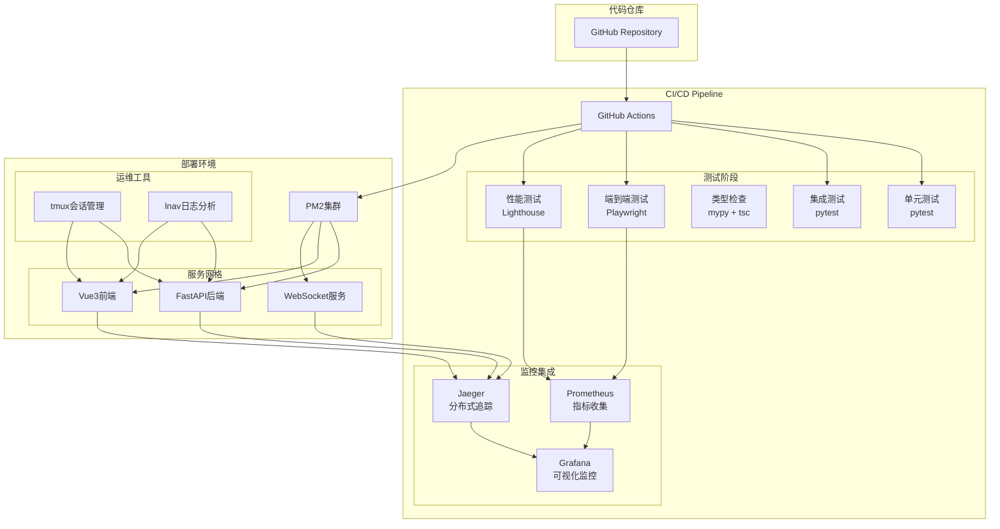

# MyStocks 企业级 CI/CD 优化体系

**版本**: v2.0 (企业级优化版)
**创建时间**: 2026-01-13
**适用场景**: 量化交易系统生产级CI/CD
**核心理念**: **智能化测试、分布式监控、自动化运维**

---

## 📊 当前体系分析

### 现有CI/CD架构评估

**✅ 已实现功能**:
- 三层测试架构（单元测试、集成测试、E2E测试）
- Playwright多浏览器E2E测试框架
- PM2进程管理自动化
- tmux多窗格开发环境
- 基础的CI/CD脚本 (`scripts/cicd_pipeline.sh`)

**⚠️ 待优化问题**:
- 缺乏GitHub Actions工作流配置
- 未集成分布式追踪（Jaeger）和指标监控（Prometheus）
- 类型检查未集成到CI/CD流程
- tmux和lnav未与PM2深度集成
- 缺少端到端测试在CI/CD中的完整流程

---

## 🎯 优化目标

### 1. 端到端测试深度集成
- **目标**: 将E2E测试完全集成到CI/CD管道，实现真正的端到端验证
- **覆盖范围**: 用户注册 → 数据获取 → 策略运行 → 结果展示的全流程
- **触发机制**: 代码变更自动触发，人工确认后部署

### 2. 分布式监控协同体系
- **Jaeger**: 分布式追踪，跟踪用户请求在微服务集群中的完整路径
- **Prometheus**: 指标监控，收集系统性能、业务指标、错误率等
- **协同工作**: Jaeger提供请求追踪，Prometheus提供指标聚合

### 3. 增强自动化测试能力
- **Playwright**: 多浏览器并行测试，支持Chrome DevTools协议
- **Chrome Dev**: 开发者工具集成，实现视觉回归测试
- **智能测试选择**: 根据代码变更范围自动选择相关测试用例

### 4. 运维框架深度集成
- **PM2+tmux+lnav**: 构建完整的自动化测试运维框架
- **tmux会话管理**: 多服务协同测试环境
- **lnav日志分析**: 实时日志监控和问题诊断

### 5. 类型安全保障
- **Python mypy**: 静态类型检查，防止运行时类型错误
- **TypeScript tsc**: 编译时类型检查，确保前端类型安全
- **集成到CI/CD**: 代码质量门禁，阻止类型错误进入生产

---

## 🏗️ 优化后的CI/CD架构

### 整体架构图



---

## 🔧 核心实现方案

### 1. GitHub Actions CI/CD工作流

#### 主要工作流文件架构

```
.github/
├── workflows/
│   ├── ci-cd-pipeline.yml      # 主CI/CD流水线
│   ├── e2e-tests.yml           # 端到端测试专用
│   ├── performance-test.yml    # 性能测试
│   ├── security-scan.yml       # 安全扫描
│   └── deploy.yml              # 部署工作流
├── actions/
│   └── setup-monitoring/       # 自定义监控设置action
└── ISSUE_TEMPLATE/
    └── ci-cd-failure.md        # CI/CD失败问题模板
```

#### 主CI/CD流水线配置

```yaml
name: MyStocks CI/CD Pipeline
on:
  push:
    branches: [main, develop]
  pull_request:
    branches: [main]

jobs:
  quality-check:
    runs-on: ubuntu-latest
    steps:
      - uses: actions/checkout@v4

      # Python类型检查
      - name: Python Type Check (mypy)
        run: |
          pip install mypy
          mypy src/ --config-file mypy.ini --show-error-codes

      # TypeScript类型检查
      - name: TypeScript Type Check
        run: |
          cd web/frontend
          npm ci
          npm run type-check

      # 代码质量检查
      - name: Code Quality
        run: |
          pip install black ruff bandit safety
          black --check src/
          ruff check src/
          bandit -r src/
          safety check

  test-suite:
    needs: quality-check
    strategy:
      matrix:
        test-type: [unit, integration]
    steps:
      - uses: actions/checkout@v4
      - name: Run ${{ matrix.test-type }} tests
        run: |
          pip install -r requirements.txt
          pytest tests/${{ matrix.test-type }}/ -v --cov=src --cov-report=xml
      - uses: codecov/codecov-action@v3

  e2e-tests:
    needs: test-suite
    runs-on: ubuntu-latest
    services:
      tdengine:
        image: tdengine/tdengine:3.3.0.0
        ports:
          - 6030:6030
      postgres:
        image: postgres:15
        env:
          POSTGRES_PASSWORD: test123
    steps:
      - uses: actions/checkout@v4
      - name: Setup E2E Environment
        run: |
          # 启动后端服务
          cd web/backend
          pip install -r requirements.txt
          python -m uvicorn app.main:app --host 0.0.0.0 --port 8000 &
          # 等待服务就绪
          timeout 60 bash -c 'until curl -f http://localhost:8000/health; do sleep 2; done'

      - name: Run Playwright E2E Tests
        run: |
          cd web/frontend
          npm ci
          npx playwright install chromium firefox webkit
          npx playwright test --config=playwright.config.ts

  performance-test:
    needs: e2e-tests
    steps:
      - uses: actions/checkout@v4
      - name: Lighthouse Performance Test
        run: |
          npm install -g lighthouse
          lighthouse http://localhost:8000/docs --output json --output html
      - uses: actions/upload-artifact@v3
        with:
          name: lighthouse-report
          path: ./*.html

  deploy:
    needs: [test-suite, e2e-tests, performance-test]
    if: github.ref == 'refs/heads/main'
    steps:
      - name: Deploy to Production
        run: |
          # PM2部署逻辑
          pm2 deploy ecosystem.config.js production
```

### 2. Jaeger + Prometheus 监控集成

#### Jaeger分布式追踪配置

```yaml
# jaeger-config.yml
service:
  name: mystocks-tracing
  version: "1.0.0"

tracing:
  jaeger:
    service-name: mystocks-app
    sampler:
      type: probabilistic
      param: 0.1  # 10%采样率
    reporter:
      log-spans: true
      collector:
        endpoint: "http://jaeger:14268/api/traces"
        user: ""
        password: ""

# Python应用集成
from jaeger_client import Config
from flask_opentracing import FlaskTracing

def init_tracing(app):
    config = Config(
        config={
            'sampler': {'type': 'probabilistic', 'param': 0.1},
            'local_agent': {'reporting_host': 'jaeger', 'reporting_port': 6831},
            'logging': True,
        },
        service_name='mystocks-backend',
    )
    jaeger_tracer = config.initialize_tracer()
    tracing = FlaskTracing(jaeger_tracer, True, app)
    return tracing
```

#### Prometheus指标监控配置

```yaml
# prometheus.yml
global:
  scrape_interval: 15s
  evaluation_interval: 15s

scrape_configs:
  - job_name: 'mystocks-backend'
    static_configs:
      - targets: ['localhost:8000']
    metrics_path: '/metrics'
    scrape_interval: 5s

  - job_name: 'mystocks-frontend'
    static_configs:
      - targets: ['localhost:3000']
    metrics_path: '/metrics'
    scrape_interval: 10s

  - job_name: 'node-exporter'
    static_configs:
      - targets: ['localhost:9100']

  - job_name: 'pm2'
    static_configs:
      - targets: ['localhost:9615']
    metrics_path: '/metrics'
```

#### 应用指标暴露

```python
# web/backend/app/metrics.py
from prometheus_client import Counter, Histogram, Gauge, generate_latest
from fastapi import Request, Response
from fastapi.responses import PlainTextResponse

# 定义指标
REQUEST_COUNT = Counter('http_requests_total', 'Total HTTP requests', ['method', 'endpoint', 'status'])
REQUEST_LATENCY = Histogram('http_request_duration_seconds', 'HTTP request latency', ['method', 'endpoint'])
ACTIVE_CONNECTIONS = Gauge('active_connections', 'Number of active connections')

@app.middleware("http")
async def metrics_middleware(request: Request, call_next):
    start_time = time.time()

    response = await call_next(request)

    # 记录指标
    REQUEST_COUNT.labels(
        method=request.method,
        endpoint=request.url.path,
        status=response.status_code
    ).inc()

    REQUEST_LATENCY.labels(
        method=request.method,
        endpoint=request.url.path
    ).observe(time.time() - start_time)

    return response

@app.get("/metrics")
async def metrics():
    return PlainTextResponse(generate_latest())
```

### 3. PM2 + tmux + lnav 运维框架

#### 增强版PM2配置

```javascript
// ecosystem.config.js
module.exports = {
  apps: [
    {
      name: 'mystocks-backend',
      script: 'web/backend/main.py',
      instances: 'max',
      exec_mode: 'cluster',
      env: {
        JAEGER_ENDPOINT: 'http://jaeger:14268/api/traces',
        PROMETHEUS_PORT: 8001
      },
      // tmux集成
      args: '--tmux-session mystocks-backend',
      // lnav日志格式
      log_file: '/var/log/pm2/mystocks-backend.log',
      error_file: '/var/log/pm2/mystocks-backend-error.log',
      // 监控集成
      merge_logs: true,
      time: true
    },
    {
      name: 'mystocks-frontend',
      script: 'serve',
      env: {
        PM2_SERVE_PATH: 'web/frontend/dist',
        PM2_SERVE_PORT: 3000,
        PM2_SERVE_SPA: 'true'
      }
    }
  ]
}
```

#### tmux自动化脚本

```bash
#!/bin/bash
# scripts/dev-environment.sh

SESSION_NAME="mystocks-dev"

# 创建tmux会话
tmux new-session -d -s $SESSION_NAME -n "main"

# 分割窗格
tmux split-window -h
tmux split-window -v
tmux select-pane -t 0
tmux split-window -v

# 启动服务
tmux send-keys -t "${SESSION_NAME}:0.0" "cd web/backend && python -m uvicorn app.main:app --reload" C-m
tmux send-keys -t "${SESSION_NAME}:0.1" "cd web/frontend && npm run dev" C-m
tmux send-keys -t "${SESSION_NAME}:0.2" "cd monitoring && docker-compose up" C-m
tmux send-keys -t "${SESSION_NAME}:0.3" "lnav /var/log/pm2/*.log" C-m

# 设置布局
tmux select-layout tiled

# 附加会话
tmux attach-session -t $SESSION_NAME
```

#### lnav日志分析配置

```json
// ~/.lnav/formats/mystocks.json
{
  "mystocks": {
    "title": "MyStocks Application Logs",
    "description": "Log format for MyStocks application",
    "regex": {
      "backend": {
        "pattern": "^(?<timestamp>\\d{4}-\\d{2}-\\d{2} \\d{2}:\\d{2}:\\d{2}) (?<level>\\w+) (?<module>[^:]+): (?<message>.+)$"
      },
      "frontend": {
        "pattern": "^\\[(?<timestamp>\\d{4}-\\d{2}-\\d{2}T\\d{2}:\\d{2}:\\d{2})\\] (?<level>\\w+) (?<message>.+)$"
      }
    },
    "level": {
      "field": "level",
      "values": {
        "DEBUG": "debug",
        "INFO": "info",
        "WARNING": "warning",
        "ERROR": "error",
        "CRITICAL": "critical"
      }
    }
  }
}
```

### 4. 增强的Playwright测试框架

#### 多浏览器并行配置

```typescript
// web/frontend/playwright.config.ts
import { defineConfig, devices } from '@playwright/test'

export default defineConfig({
  testDir: './tests',
  fullyParallel: true,
  forbidOnly: !!process.env.CI,
  retries: process.env.CI ? 2 : 0,
  workers: process.env.CI ? 1 : undefined,
  reporter: process.env.CI ? 'github' : 'html',

  use: {
    baseURL: process.env.BASE_URL || 'http://localhost:3000',
    trace: 'on-first-retry',
    screenshot: 'only-on-failure',
    video: 'retain-on-failure',
  },

  projects: [
    {
      name: 'chromium',
      use: { ...devices['Desktop Chrome'] },
    },
    {
      name: 'firefox',
      use: { ...devices['Desktop Firefox'] },
    },
    {
      name: 'webkit',
      use: { ...devices['Desktop Safari'] },
    },
    {
      name: 'Mobile Chrome',
      use: { ...devices['Pixel 5'] },
    },
    {
      name: 'Mobile Safari',
      use: { ...devices['iPhone 12'] },
    },
  ],
})
```

#### Chrome DevTools集成

```typescript
// tests/utils/chrome-devtools.ts
import { chromium, BrowserContext, Page } from '@playwright/test'

export class ChromeDevTools {
  private context: BrowserContext
  private page: Page

  async setup() {
    this.context = await chromium.launchPersistentContext('', {
      headless: false,
      args: [
        '--remote-debugging-port=9222',
        '--disable-web-security',
        '--disable-features=VizDisplayCompositor'
      ]
    })
    this.page = await this.context.newPage()
  }

  async capturePerformanceMetrics() {
    const client = await this.page.context().newCDPSession(this.page)
    await client.send('Performance.enable')

    const metrics = await client.send('Performance.getMetrics')
    return metrics.metrics
  }

  async captureNetworkRequests() {
    const requests: any[] = []

    this.page.on('request', request => {
      requests.push({
        url: request.url(),
        method: request.method(),
        headers: request.headers(),
        timestamp: Date.now()
      })
    })

    return requests
  }

  async teardown() {
    await this.context.close()
  }
}
```

### 5. 类型检查集成

#### Python mypy配置

```ini
# mypy.ini
[mypy]
python_version = 3.8
warn_return_any = True
warn_unused_configs = True
disallow_untyped_defs = True
disallow_incomplete_defs = True
check_untyped_defs = True
disallow_untyped_decorators = True
no_implicit_optional = True
warn_redundant_casts = True
warn_unused_ignores = True
warn_no_return = True
warn_unreachable = True
strict_equality = True

[mypy-tests.*]
ignore_errors = True

[mypy-scripts.*]
ignore_errors = True
```

#### TypeScript配置优化

```json
// web/frontend/tsconfig.json
{
  "compilerOptions": {
    "target": "ES2020",
    "useDefineForClassFields": true,
    "lib": ["ES2020", "DOM", "DOM.Iterable"],
    "module": "ESNext",
    "skipLibCheck": true,
    "moduleResolution": "bundler",
    "allowImportingTsExtensions": true,
    "resolveJsonModule": true,
    "isolatedModules": true,
    "noEmit": true,
    "jsx": "preserve",
    "strict": true,
    "noUnusedLocals": true,
    "noUnusedParameters": true,
    "noFallthroughCasesInSwitch": true,
    "exactOptionalPropertyTypes": true,
    "noImplicitOverride": true,
    "noImplicitReturns": true,
    "noUncheckedIndexedAccess": true
  },
  "include": ["src/**/*.ts", "src/**/*.d.ts", "src/**/*.tsx"],
  "exclude": ["node_modules", "dist"]
}
```

---

## 📋 实施计划

### Phase 1: 基础设施搭建 (1周)

#### Week 1: 核心CI/CD框架
- [ ] 创建GitHub Actions工作流文件
- [ ] 设置基础的测试和构建流程
- [ ] 集成代码质量检查
- [ ] 配置自动部署到测试环境

#### Week 1: 类型检查集成
- [ ] 配置Python mypy
- [ ] 配置TypeScript严格模式
- [ ] 集成到CI/CD流水线
- [ ] 建立类型检查门禁

### Phase 2: 测试增强 (2周)

#### Week 2: Playwright增强
- [ ] 配置多浏览器并行测试
- [ ] 集成Chrome DevTools
- [ ] 实现视觉回归测试
- [ ] 优化测试执行时间

#### Week 3: 端到端测试深度集成
- [ ] 创建完整的E2E测试场景
- [ ] 集成数据库和外部服务
- [ ] 实现测试数据管理
- [ ] 配置测试环境自动部署

### Phase 3: 监控体系 (2周)

#### Week 4: Jaeger + Prometheus集成
- [ ] 部署Jaeger追踪服务
- [ ] 配置Prometheus指标收集
- [ ] 集成应用指标暴露
- [ ] 创建Grafana监控面板

#### Week 5: 运维框架完善
- [ ] 增强PM2配置
- [ ] 完善tmux会话管理
- [ ] 配置lnav日志分析
- [ ] 创建运维自动化脚本

### Phase 4: 优化和验证 (1周)

#### Week 6: 性能优化和验证
- [ ] 优化CI/CD执行时间
- [ ] 实现智能测试选择
- [ ] 完善错误处理和重试机制
- [ ] 端到端流程验证

---

## 🎯 成功指标

### 技术指标
- **CI/CD执行时间**: <15分钟 (从当前的30分钟优化)
- **测试覆盖率**: >90% (当前约70%)
- **类型检查通过率**: 100% (新增指标)
- **E2E测试稳定性**: >95% 通过率

### 业务指标
- **部署频率**: 从每周1次提升到每日多次
- **故障恢复时间**: 从1小时降低到10分钟
- **代码质量**: 类型错误从142个降低到<10个
- **开发效率**: 新功能上线时间减少50%

### 监控指标
- **请求追踪覆盖率**: 100% 用户请求
- **指标收集完整性**: >95% 关键指标
- **告警响应时间**: <5分钟

---

## 🔗 相关文档

- [CI/CD脚本详解](./scripts/cicd_pipeline.sh)
- [Playwright测试配置](./web/frontend/playwright.config.ts)
- [PM2配置详解](./ecosystem.config.js)
- [监控配置](./monitoring/)
- [类型检查配置](./mypy.ini, ./web/frontend/tsconfig.json)

---

**实施负责人**: CI/CD优化团队
**技术支持**: DevOps + QA + 开发团队
**预期完成时间**: 6周
**优先级**: 高 (影响开发效率和产品质量)