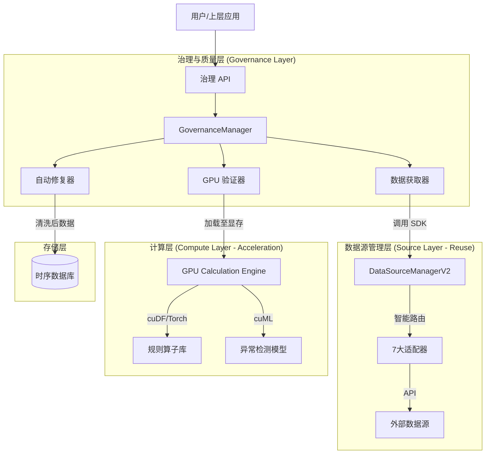

# 数据治理与架构演进路线图 V3.0 (GPU 加速融合版)

> **文档版本**: v3.0
> **创建日期**: 2026-01-07
> **基准**: 集成 DataSource Management V2 & GPU Calculation Engine
> **状态**: 详细架构设计与实施规划

---

## 1. 核心设计理念与架构融合

本路线图旨在解决数据治理中的"效率瓶颈"与"代码冗余"问题，通过架构分层实现能力复用。

### 1.1 现状资产与决策

1.  **数据源管理 (Control Plane)**: `DataSourceManagerV2` (已就绪)
    *   **现状**: 已实现配置管理、健康监控、智能路由、7大源适配器。
    *   **决策**: 治理模块**严禁**直接连接外部 API 或重写适配器，必须通过 `DataSourceManagerV2` SDK 获取原始数据。
2.  **GPU 计算引擎 (Compute Plane)**: 高性能计算基础设施
    *   **现状**: 提供向量化计算环境。
    *   **决策**: 所有数据清洗、规则校验、异常检测逻辑**下沉至 GPU**，利用张量运算替代低效的 CPU 循环。

### 1.2 架构分层 (Layered Architecture)



---

## 2. 详细实施路线图

### Phase 1: 数据源深度集成 (代码复用)

**目标**: 剥离原计划中的“数据获取”职责，通过 API/SDK 调用现有组件，消除重复代码。

#### 1.1 架构调整
*   **Old (v1)**: `DataManager` 内部实现 `fetch_from_tushare`, `fetch_from_wind`。
*   **New (v3)**: `GovernanceEngine` 调用 `DataSourceManagerV2.get_kline(policy='SMART')`。

#### 1.2 核心代码设计 (Integration)

在 `src/governance/core/fetcher_bridge.py` 中实现桥接模式：

```python
# 伪代码：复用现有的 DataSourceManagerV2
from src.core.data_source_manager_v2 import DataSourceManager, RoutePolicy, TimeFrame

class GovernanceDataFetcher:
    """
    治理层的数据获取桥接器
    职责：对接 DataSourceManagerV2，不处理具体协议
    """
    def __init__(self):
        # 复用已有的管理器单例
        self.manager = DataSourceManager()
        
    async def fetch_batch_data(self, symbols: list, start_date: str, end_date: str):
        """
        批量获取数据用于治理检查
        利用 V2 的智能路由功能，自动选择最快/最稳定的源
        """
        results = {}
        for symbol in symbols:
            # 智能路由：自动处理故障转移和负载均衡
            # 治理层不需要关心是用的 Tushare 还是 AKShare，V2 会搞定
            df = await self.manager.get_kline(
                symbol=symbol, 
                start_date=start_date, 
                end_date=end_date, 
                period=TimeFrame.DAILY,
                policy=RoutePolicy.SMART_ROUTING, 
                adjust="qfq"
            )
            
            if df is not None and not df.empty:
                results[symbol] = df
            else:
                # 记录获取失败，供 V2 监控模块使用
                self.manager.report_failure(symbol, "fetch_empty")
                
        return results
```

#### 1.3 交付物
*   [ ] `GovernanceDataFetcher` 类（封装 V2 SDK）。
*   [ ] 移除旧版 `src/adapters/` 下所有重复的 API 客户端代码。
*   [ ] 集成测试：验证治理引擎能否正确处理 V2 返回的统一数据格式 (`StandardKline`)。

---

## Phase 2: GPU 加速的规则校验 (效率革命)

**目标**: 解决 CPU 处理全市场 5000 只股票数年历史数据校验慢的问题。利用 GPU 向量化操作提升 100x 速度。

#### 2.1 规则算子化 (Operator Design)

将原本的 Python `if/else` 逐行逻辑转换为 GPU 张量/矩阵运算。

**场景对比**: 校验 OHLC 逻辑 (High 必须 >= Max(Open, Close))

*   **CPU 方式 (慢)**:
    ```python
    # 逐行遍历，Python 层面循环，极慢
    errors = []
    for index, row in df.iterrows():
        if row['high'] < max(row['open'], row['close']):
            errors.append(index)
    ```

*   **GPU 方式 (快 - cuDF/PyTorch)**:
    ```python
    import cudf

    class GPUValidator:
        def validate_ohlc_logic(self, gpu_df):
            """
            输入: gpu_df (cuDF DataFrame, 显存中)
            输出: 异常行的索引或掩码
            """
            # 向量化计算，一次性处理百万行，无显式循环
            # max_oc 是一个列向量
            max_oc = gpu_df[['open', 'close']].max(axis=1)
            min_oc = gpu_df[['open', 'close']].min(axis=1)
            
            # 生成布尔掩码 (GPU 并行计算)
            invalid_high_mask = gpu_df['high'] < max_oc
            invalid_low_mask  = gpu_df['low'] > min_oc
            
            # 返回所有异常行
            return gpu_df[invalid_high_mask | invalid_low_mask]
    ```

#### 2.2 治理规则集 (GPU 实现计划)

| 规则ID | 规则名称 | GPU 实现逻辑 (Vectorized Logic) | 预期提速 |
|---|---|---|---|
| R001 | 缺失值检查 | `df.isnull().any(axis=1)` | 50x |
| R002 | OHLC逻辑 | `(H < max(O,C)) | (L > min(O,C))` | 100x |
| R003 | 极限涨跌幅 | `abs((close - close.shift(1))/close.shift(1)) > limit` | 80x |
| R004 | 停牌过滤 | `volume == 0` | 100x |
| R005 | 重复检测 | `df.sort_values('time')['time'].diff() == 0` | 20x |

#### 2.3 交付物
*   [ ] `src/governance/engine/gpu_validator.py`: 基于 `cudf` 的验证核心。
*   [ ] `RuleOperator`: GPU 规则算子库。
*   [ ] 性能基准测试：CPU vs GPU 校验 1000万行数据的耗时对比。

---

## Phase 3: 多源交叉验证 (利用 V2 路由能力)

**目标**: 利用 `DataSourceManagerV2` 接入的多个源（如 Tushare, AKShare, TDX），进行数据互相印证。

#### 3.1 交叉验证流程
1.  **主数据获取**: 调用 V2 接口，`policy=PRIORITY_1` (如 Tushare)。
2.  **辅数据获取**: 调用 V2 接口，`policy=PRIORITY_2` (如 AKShare)。
3.  **对齐与计算**: 将两份数据加载至 GPU，按时间戳对齐，进行矩阵减法。

#### 3.2 核心实现逻辑

```python
def gpu_cross_validate(df_primary, df_secondary, tolerance=0.01):
    """
    GPU 加速交叉验证
    """
    # 假设已转为 GPU DataFrame 并按 trade_date 索引对齐
    
    # 向量减法：计算 Close 价格差异
    diff = (df_primary['close'] - df_secondary['close']).abs()
    
    # 瞬间找出差异超过容忍度的行
    # diff > tolerance 会生成一个布尔向量
    anomalies_mask = diff > tolerance
    
    # 计算置信度：差异越小，置信度越高
    confidence = 1.0 - (anomalies_mask.sum() / len(df_primary))
    
    return anomalies_mask, confidence
```

#### 3.3 交付物
*   [ ] `CrossValidationScheduler`: 调度器，负责触发多源获取。
*   [ ] `ConflictResolver`: 冲突解决策略（如：采用加权平均、或信任高权重源）。

---

## Phase 4: 机器学习异常检测 (GPU Training)

**目标**: 识别非显性的数据质量问题（如人为操纵痕迹、非自然的平滑曲线、异常成交量分布），这些很难用固定规则（if/else）发现。

#### 4.1 技术选型
*   **算法**: Isolation Forest (孤立森林) 或 Autoencoder (自编码器)。
*   **库**: **cuML** (RAPIDS AI) —— scikit-learn 的 GPU 加速版。
*   **优势**: 训练速度比 CPU 快 20-50 倍，支持更大规模的数据集。

#### 4.2 训练与推理流水线
1.  **特征工程 (GPU)**:
    *   在 GPU 上直接计算 Technical Indicators (RSI, MACD, Volatility) 作为特征。
2.  **模型训练**:
    ```python
    from cuml.ensemble import IsolationForest as cuIF
    
    def train_anomaly_model(gpu_features_df):
        # 直接传入显存数据进行训练
        model = cuIF(n_estimators=100, contamination=0.01)
        model.fit(gpu_features_df)
        return model
    ```
3.  **在线拦截**:
    *   新数据入库前，先通过模型打分，Anomaly Score 过高则标记并告警。

#### 4.3 交付物
*   [ ] `src/ml/anomaly_detector.py`: 基于 cuML 的实现。
*   [ ] 离线训练脚本：每周使用最新全量数据重训模型。
*   [ ] 模型注册表：管理不同市场（A股/港股）的异常检测模型。

---

## Phase 5: 告警闭环与监控

**目标**: 治理结果必须反馈给 `DataSourceManagerV2`，实现系统的自我愈合。

#### 5.1 闭环反馈机制
*   **输入**: 治理引擎发现 Tushare 返回的数据连续出现 `0` 值或异常。
*   **反馈**: 调用 `DataSourceManagerV2.report_health_status(source_id='tushare', status='UNSTABLE')`。
*   **结果**: V2 的智能路由模块自动将该源降权，后续请求自动切换到备用源。

#### 5.2 可视化监控
*   集成到现有的 Grafana 面板中：
    *   **Data Quality Score**: 全市场数据质量评分。
    *   **Throughput**: 清洗速率 (Rows/sec)。
    *   **Anomaly Rate**: 异常数据占比。

---

## 3. 总体实施进度表 (8周)

| 阶段 | 模块 | 关键技术点 | 复用/集成点 | 预计工期 |
|---|---|---|---|---|
| **Phase 1** | **V2 集成** | Adapter Pattern, SDK | **DataSourceManagerV2** | 1周 |
| **Phase 2** | **GPU 规则引擎** | **cuDF**, Vectorization | **GPU Engine** | 2周 |
| **Phase 3** | **交叉验证** | Multi-source fetch | DataSourceV2 Routing | 1.5周 |
| **Phase 4** | **ML 异常检测** | **cuML**, Isolation Forest | GPU Engine | 2周 |
| **Phase 5** | **闭环监控** | Feedback Loop | V2 Health Monitor | 1.5周 |

---

## 4. 总结：v3.0 的改进与优势

1.  **深度复用，拒绝冗余**: 彻底移除了重复的 API 请求代码，治理层只关注“质量”，获取层全权委托给 V2。
2.  **计算下沉，效率质变**: 放弃 CPU 串行清洗，利用 GPU 引擎实现海量数据的毫秒级清洗，支撑高频/全市场级别的数据治理。
3.  **技术细节详实**: 恢复了关键的类设计和伪代码，明确了如何将 V2 和 GPU 引擎结合，为开发提供了清晰的蓝图。
