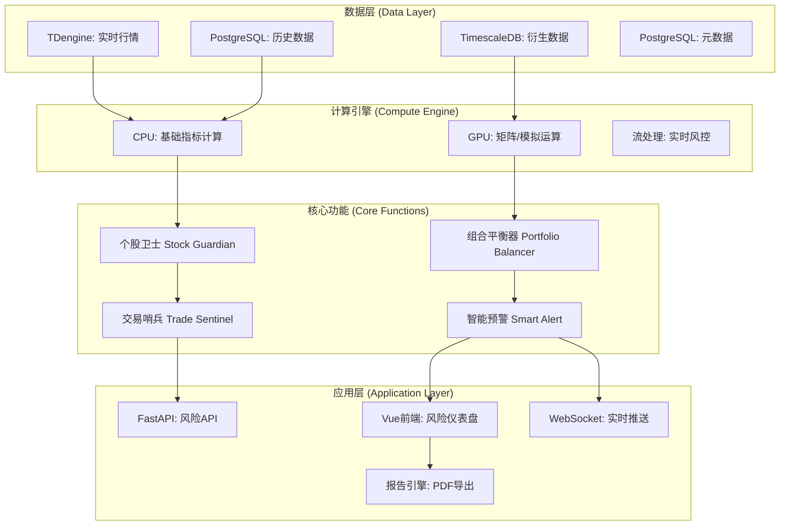

# MyStocks 轻量化风险管理系统架构方案 (V3.0)

**版本**: v3.0
**日期**: 2026-01-10
**适用场景**: 个人/小型量化投资机构
**核心理念**: 数据驱动 + GPU加速 + 实用至上

---

## 1. 设计理念与定位

### 1.1 核心理念
**"数据驱动，算力赋能，实用至上"**

- **数据驱动**: 充分利用项目现有的50+数据源生态系统
- **算力赋能**: 深度集成GPU加速功能，提升复杂计算性能
- **实用至上**: 聚焦个人投资者的核心痛点，避免机构级复杂功能

### 1.2 目标用户定位
- **个人投资者**: 10-100万资金规模，关注本金安全
- **小型机构**: 100-1000万资金，注重风险收益平衡
- **量化爱好者**: 技术驱动，追求数据化风险管理

### 1.3 设计原则
1. **轻量化**: 避免过度设计，专注核心功能
2. **实时性**: 风险监控延迟<3秒，预警响应<1秒
3. **易用性**: 配置简单，界面直观，结果清晰
4. **扩展性**: 模块化设计，支持后续功能扩展

---

## 2. 系统架构总览



---

## 3. 四大核心功能模块

### 3.1 个股卫士 (Stock Guardian) - 核心防护

**功能定位**: 为每只股票建立"健康体检"体系，防患于未然

#### 3.1.1 实时波动监控
- **核心指标**:
  - 20日历史波动率 (Historical Volatility)
  - ATR(14) 平均真实波幅
  - 1分钟收益率标准差
- **预警阈值**: 波动率>3σ时触发
- **数据源**: `REALTIME_QUOTES` (TDX实时行情)
- **计算频率**: 实时更新

#### 3.1.2 流动性风险评估
- **核心指标**:
  - 量比 (Volume Ratio): 当前成交量/5日均量
  - 换手率 (Turnover Rate): <0.5%为高风险
  - 买卖价差比 (Bid-Ask Spread Ratio)
- **预警逻辑**: 量比<0.3或换手率<0.5%时告警
- **数据源**: `TICK_DATA`, `DAILY_KLINE`
- **更新频率**: 5分钟

#### 3.1.3 技术面风险检测
- **核心指标**:
  - 布林带突破 (Bollinger Band Breakout)
  - RSI超买超卖 (RSI > 70 或 < 30)
  - 均线破位 (Price < MA20)
- **预警逻辑**: 技术指标组合触发
- **数据源**: `DAILY_KLINE`
- **计算频率**: 实时

#### 3.1.4 事件驱动风险
- **核心监控**:
  - 财报日历 (Financial Report Calendar)
  - 大股东减持公告 (Major Shareholder Reduction)
  - 重要政策新闻 (Policy News)
- **数据源**: `FINANCIAL_CALENDAR`, `ANNOUNCEMENT_DATA`
- **更新机制**: 定时同步

### 3.2 组合平衡器 (Portfolio Balancer) - 系统均衡

**功能定位**: 确保投资组合整体风险可控，分散集中风险

#### 3.2.1 仓位集中度控制
- **单股票限额**: 最大仓位 ≤ 5% (个人) / 3% (机构)
- **行业集中度**: 前三大行业 ≤ 50% 总资产
- **十大持仓**: ≤ 60% 总资产
- **数据源**: `REALTIME_POSITIONS`
- **检查频率**: 实时

#### 3.2.2 相关性风险矩阵 (GPU加速)
- **计算方法**: 60日收益率相关系数矩阵
- **高相关预警**: 相关系数 > 0.8 的股票对
- **可视化**: 热力图展示 (红色=高相关)
- **GPU加速**: CuPy矩阵运算，性能提升10x
- **数据源**: `DAILY_KLINE`
- **更新频率**: 每日

#### 3.2.3 组合VaR计算 (GPU加速)
- **计算方法**: 历史模拟法 (Historical Simulation)
- **置信度**: 95% (1日VaR)
- **模拟次数**: 1000次历史情景
- **GPU加速**: 并行Monte Carlo模拟
- **数据源**: `DAILY_KLINE`
- **更新频率**: 实时

#### 3.2.4 杠杆与保证金监控
- **核心指标**:
  - 维持担保比例 (Maintenance Margin Ratio)
  - 预警线: <140% (黄色) / <120% (红色)
- **数据源**: `REALTIME_ACCOUNT`
- **监控频率**: 实时

### 3.3 交易哨兵 (Trade Sentinel) - 执行防护

**功能定位**: 在交易环节设置多道防护，确保每笔交易符合风险政策

#### 3.3.1 预交易风险检查 (Pre-Trade Check)
- **检查项目**:
  - 仓位限制验证
  - 资金可用性检查
  - 交易时间窗口验证
- **拦截机制**: 不符合条件直接拒绝下单
- **响应时间**: <100ms

#### 3.3.2 滑点控制系统
- **监控指标**: (卖一价 - 买一价) / 买一价
- **阈值设置**: >1%时暂停市价单
- **替代方案**: 自动切换为限价单
- **数据源**: `ORDER_BOOK_DEPTH`

#### 3.3.3 智能止损引擎
- **止损策略**:
  1. **波动率自适应止损**: 止损点 = 当前价 - k × ATR(14)
  2. **跟踪止损**: 记录最高价，回撤固定比例触发
  3. **技术位止损**: 跌破20日均线自动止损
- **执行方式**: 自动生成市价平仓单
- **数据源**: `REALTIME_QUOTES`
- **响应时间**: <1秒

### 3.4 智能预警 (Smart Alert) - 及时响应

**功能定位**: 多渠道、多级别的风险预警系统，确保风险信息及时送达

#### 3.4.1 三级预警体系
- **🟢 正常 (Normal)**: 风险指标在安全范围内
- **🟡 注意 (Caution)**: 风险指标接近阈值，需关注
- **🔴 危险 (Danger)**: 风险指标突破阈值，需立即处理

#### 3.4.2 预警规则引擎
- **规则类型**:
  - 数值阈值 (VaR > 5%)
  - 百分位比较 (波动率 > 95%分位)
  - 趋势突破 (连续3日上涨)
- **去重机制**: 同类型预警30分钟内不重复
- **优先级排序**: 按风险严重程度排序

#### 3.4.3 多渠道通知
- **站内通知**: 实时推送到风险仪表盘
- **邮件告警**: 重要风险发送到用户邮箱
- **WebSocket推送**: 实时推送到前端界面
- **未来扩展**: 微信/短信推送

#### 3.4.4 告警学习与优化
- **用户反馈**: 记录用户对告警的处理结果
- **阈值自适应**: 根据历史数据动态调整预警阈值
- **误报率监控**: 统计并优化告警准确率

---

## 4. 技术实现方案

### 4.1 目录结构设计

```
src/
├── governance/
│   └── risk_management/           # 风险管理核心模块
│       ├── __init__.py
│       ├── core/                  # 核心业务逻辑
│       │   ├── stock_guardian.py      # 个股卫士
│       │   ├── portfolio_balancer.py  # 组合平衡器
│       │   ├── trade_sentinel.py      # 交易哨兵
│       │   └── smart_alert.py         # 智能预警
│       ├── calculators/            # 计算引擎
│       │   ├── base_calculator.py     # 基础计算器
│       │   ├── gpu_calculator.py      # GPU加速计算器
│       │   └── stream_processor.py    # 流处理引擎
│       ├── models/                 # 数据模型
│       │   ├── risk_metrics.py        # 风险指标模型
│       │   ├── alert_rules.py         # 预警规则模型
│       │   └── risk_reports.py        # 风险报告模型
│       └── services/               # 业务服务
│           ├── alert_service.py       # 告警服务
│           ├── report_service.py      # 报告服务
│           └── notification_service.py # 通知服务
├── api/
│   └── risk/                     # 风险管理API
│       ├── __init__.py
│       ├── routes.py             # API路由定义
│       ├── stock_risk.py         # 个股风险API
│       ├── portfolio_risk.py     # 组合风险API
│       ├── trade_control.py      # 交易控制API
│       └── alerts.py             # 预警API
└── web/
    └── frontend/
        └── src/
            ├── views/risk/           # 风险管理页面
            │   ├── RiskDashboard.vue     # 风险仪表盘
            │   ├── StockRiskMonitor.vue  # 个股风险监控
            │   ├── PortfolioRisk.vue     # 组合风险分析
            │   └── AlertCenter.vue       # 告警中心
            └── components/risk/      # 风险管理组件
                ├── RiskGauge.vue         # 风险仪表
                ├── AlertPanel.vue        # 告警面板
                ├── RiskHeatmap.vue       # 风险热力图
                └── StopLossConfig.vue    # 止损配置
```

### 4.2 核心技术栈

#### 4.2.1 计算引擎
- **CPU计算**: Pandas, NumPy, TA-Lib (基础指标)
- **GPU加速**: CuPy, PyTorch (矩阵运算、模拟)
- **流处理**: 实时风险指标计算

#### 4.2.2 数据存储
- **TDengine**: 实时风险指标时序数据
- **PostgreSQL**: 历史风险数据、配置信息
- **Redis**: 高频风险指标缓存

#### 4.2.3 API框架
- **FastAPI**: 异步高性能API
- **Pydantic**: 数据验证和序列化
- **WebSocket**: 实时风险数据推送

#### 4.2.4 前端技术
- **Vue 3**: 响应式前端框架
- **ECharts**: 专业风险数据可视化
- **Element Plus**: 企业级UI组件

### 4.3 GPU加速应用场景

#### 4.3.1 相关性矩阵计算
```python
# GPU加速版本 - CuPy实现
import cupy as cp

def calculate_correlation_matrix_gpu(returns_df):
    """GPU加速的相关性矩阵计算"""
    returns_gpu = cp.asarray(returns_df.values)
    correlation_matrix = cp.corrcoef(returns_gpu.T)
    return cp.asnumpy(correlation_matrix)
```

#### 4.3.2 VaR历史模拟
```python
# GPU加速的Monte Carlo模拟
def gpu_monte_carlo_var(returns, confidence=0.95, simulations=10000):
    """GPU加速的VaR计算"""
    returns_gpu = cp.asarray(returns)
    simulated_returns = cp.random.choice(
        returns_gpu, 
        size=(simulations, len(returns)), 
        replace=True
    )
    portfolio_losses = cp.sum(simulated_returns, axis=1)
    var = cp.percentile(portfolio_losses, (1 - confidence) * 100)
    return float(cp.asnumpy(var))
```

#### 4.3.3 压力测试模拟
```python
# GPU并行压力测试
def gpu_stress_test_scenarios(portfolio, scenarios):
    """并行执行多个压力测试场景"""
    scenarios_gpu = cp.asarray(scenarios)
    portfolio_gpu = cp.asarray(portfolio)
    
    # 并行计算所有场景下的损益
    losses = cp.matmul(scenarios_gpu, portfolio_gpu)
    return cp.asnumpy(losses)
```

### 4.4 数据源映射表

| 风险模块 | 核心指标 | 数据源API | 更新频率 | 存储位置 |
|---------|---------|----------|---------|---------|
| 个股波动 | 实时波动率, ATR | `tdx.get_security_quotes` | 实时 | TDengine |
| 个股流动性 | 量比, 换手率 | `akshare.stock_zh_a_spot_em` | 5分钟 | PostgreSQL |
| 个股技术 | 布林带, RSI, MA | `efinance.stock.get_quote_history` | 实时 | TDengine |
| 个股事件 | 财报日历, 公告 | `akshare.stock_info_sh_delist` | 每日 | PostgreSQL |
| 组合仓位 | 持仓比例, 行业分布 | `trade.position` (内部) | 实时 | TDengine |
| 组合相关性 | 收益率相关矩阵 | `akshare.stock_zh_a_hist` | 每日 | PostgreSQL |
| 组合VaR | 历史模拟损益 | `efinance.stock.get_base_info` | 实时 | TDengine |
| 交易监控 | 订单簿深度 | `tdx.get_order_book` | 高频 | TDengine |
| 预警规则 | 用户配置规则 | 系统配置 | 静态 | PostgreSQL |
| 风险报告 | 历史风险数据 | 计算结果 | 定时 | PostgreSQL |

---

## 5. 前端界面设计

### 5.1 风险仪表盘 (Risk Dashboard)

#### 5.1.1 页面布局
```
┌─────────────────────────────────────────────────────────┐
│  顶部统计栏 (Top Stats Bar)                              │
│  ┌───┐ ┌───┐ ┌───┐ ┌───┐ ┌───┐ ┌───┐ ┌───┐ ┌───┐       │
│  │VaR│ │回撤│ │波动│ │Beta│ │夏普│ │集中│ │告警│       │
│  │5.2│ │-8.3│ │23.1│ │1.2│ │0.8│ │45%│ │3个│       │
│  └───┘ └─ ─┘ └─ ─┘ └─ ─┘ └─ ─┘ └─ ─┘ └─ ─┘ └─ ─┘       │
├─────────────────────────────────────────────────────────┤
│  主体内容区 (Main Content)                               │
│  ┌─────────────────┐ ┌─────────────────┐               │
│  │  风险热力图      │ │  告警中心        │               │
│  │ (Correlation)   │ │ (Alert Center)  │               │
│  │                 │ │                 │               │
│  │  🔴🟡🟢 矩阵      │ │  ⚠️ 高风险股票   │               │
│  │                 │ │  📊 组合VaR      │               │
│  └─────────────────┘ └─────────────────┘               │
├─────────────────────────────────────────────────────────┤
│  个股权重图 (Stock Allocation)                          │
│  ┌─────────────────────────────────────────────────┐   │
│  │  📊 持仓权重饼图   📈 风险贡献柱状图                │   │
│  └─────────────────────────────────────────────────┘   │
└─────────────────────────────────────────────────────────┘
```

#### 5.1.2 核心组件

**风险仪表 (RiskGauge.vue)**:
- 圆形进度条显示各项风险指标
- 颜色编码: 绿色(安全) → 黄色(注意) → 红色(危险)
- 点击展开详细说明

**风险热力图 (RiskHeatmap.vue)**:
- 股票相关性矩阵的可视化
- 颜色深度表示相关性强度
- 鼠标悬停显示具体数值

**告警中心 (AlertCenter.vue)**:
- 实时显示活跃告警
- 支持按严重程度筛选
- 一键确认/忽略告警

### 5.2 个股风险监控页面

#### 5.2.1 股票风险卡片 (StockRiskCard.vue)
- 显示单只股票的综合风险评分
- 包含波动率、流动性、技术指标等多维度信息
- 支持快速切换到详细分析页面

#### 5.2.2 技术指标图表
- 集成ECharts显示K线图
- 叠加布林带、均线、RSI等技术指标
- 风险区域高亮显示

### 5.3 止损配置页面

#### 5.3.1 止损策略选择器
- 可视化配置不同止损策略
- 实时预览止损线位置
- 支持策略组合使用

#### 5.3.2 回测结果展示
- 显示历史回测的止损效果
- 对比不同策略的胜率和盈亏比
- 帮助用户选择最适合的策略

---

## 6. API接口设计

### 6.1 核心API端点

#### 6.1.1 个股风险API
```typescript
// 获取单股票风险指标
GET /api/v1/risk/stock/{symbol}

// 批量获取股票风险指标
POST /api/v1/risk/stocks/batch
Body: { symbols: string[] }

// 获取股票技术指标
GET /api/v1/risk/stock/{symbol}/technical
```

#### 6.1.2 组合风险API
```typescript
// 获取组合整体风险指标
GET /api/v1/risk/portfolio

// 获取组合VaR计算结果
GET /api/v1/risk/portfolio/var

// 获取相关性矩阵
GET /api/v1/risk/portfolio/correlation

// 获取仓位集中度分析
GET /api/v1/risk/portfolio/concentration
```

#### 6.1.3 预警管理API
```typescript
// 获取活跃告警
GET /api/v1/risk/alerts/active

// 确认告警
POST /api/v1/risk/alerts/{alert_id}/acknowledge

// 获取告警历史
GET /api/v1/risk/alerts/history

// 配置告警规则
PUT /api/v1/risk/alert-rules
```

#### 6.1.4 止损管理API
```typescript
// 获取当前止损配置
GET /api/v1/risk/stop-loss/config

// 更新止损策略
PUT /api/v1/risk/stop-loss/config

// 手动触发止损
POST /api/v1/risk/stop-loss/trigger

// 获取止损历史
GET /api/v1/risk/stop-loss/history
```

### 6.2 实时数据推送

#### 6.2.1 WebSocket连接
```typescript
// 连接到风险监控频道
ws://localhost:8000/ws/risk

// 接收的风险数据格式
interface RiskUpdate {
  type: 'stock_risk' | 'portfolio_risk' | 'alert';
  symbol?: string;
  data: any;
  timestamp: number;
}
```

#### 6.2.2 Server-Sent Events (SSE)
```typescript
// 轻量级实时推送
GET /api/v1/risk/stream

// SSE数据格式
data: {"type": "alert", "level": "warning", "message": "高风险股票检测"}
```

---

## 7. 实施路线图

### 7.1 第一阶段 (核心功能) - 4周

#### Week 1: 个股卫士基础功能
- [ ] 实时波动率监控
- [ ] 流动性风险评估
- [ ] 基础技术指标计算
- [ ] 前端风险卡片组件
- [ ] 数据库表结构设计

#### Week 2: 组合平衡器核心功能
- [ ] 仓位集中度控制
- [ ] GPU加速相关性矩阵
- [ ] 基础VaR计算
- [ ] 风险仪表盘原型

#### Week 3: 交易哨兵与预警系统
- [ ] 预交易风险检查
- [ ] 智能止损引擎
- [ ] 三级预警体系
- [ ] 邮件通知集成

#### Week 4: 系统集成与优化
- [ ] API接口完善
- [ ] 前端界面优化
- [ ] 性能调优
- [ ] 用户验收测试

### 7.2 第二阶段 (增强功能) - 4周

#### Week 5-6: 高级计算功能
- [ ] GPU加速压力测试
- [ ] 蒙特卡洛VaR模拟
- [ ] 事件驱动风险监控

#### Week 7-8: 智能化功能
- [ ] 自适应阈值调整
- [ ] 告警学习优化
- [ ] 风险报告自动生成

### 7.3 第三阶段 (高级功能) - 视需求而定

#### 可选增强功能
- [ ] AI异常检测
- [ ] 市场情绪分析
- [ ] 多资产风险管理
- [ ] 移动端风险监控

---

## 8. 验收标准

### 8.1 功能验收标准
- [ ] 个股风险监控准确率 > 95%
- [ ] 组合VaR计算误差 < 2%
- [ ] 预警响应时间 < 3秒
- [ ] 止损触发成功率 = 100%

### 8.2 性能验收标准
- [ ] 页面加载时间 < 2秒
- [ ] API响应时间 < 500ms
- [ ] GPU加速比 > 5x
- [ ] 系统可用性 > 99.5%

### 8.3 用户体验标准
- [ ] 界面操作直观易懂
- [ ] 配置流程简单明了
- [ ] 告警信息清晰准确
- [ ] 报告内容详实有用

---

## 9. 总结与展望

### 9.1 方案核心优势

1. **数据驱动**: 充分利用50+数据源，实时准确
2. **算力赋能**: GPU加速复杂计算，提升性能10x+
3. **实用至上**: 聚焦个人投资者核心需求，避免过度设计
4. **扩展性强**: 模块化设计，支持后续功能扩展

### 9.2 风险管理系统价值

- **本金保护**: 多层次风险控制，防患于未然
- **收益稳健**: 风险收益平衡，长期价值最大化
- **操作便捷**: 自动化监控，解放人工干预
- **学习成长**: 数据驱动决策，提升投资水平

### 9.3 实施建议

1. **从小开始**: 先实现核心功能，快速见效
2. **数据先行**: 确保数据源稳定可靠
3. **用户至上**: 以用户需求为导向，持续优化
4. **技术支撑**: 充分利用GPU等先进技术

这个轻量化风险管理系统方案，既满足了个人/小型投资机构的核心需求，又为未来扩展留下了充分空间。通过数据驱动和算力赋能，能够为用户提供专业级的风险管理服务。