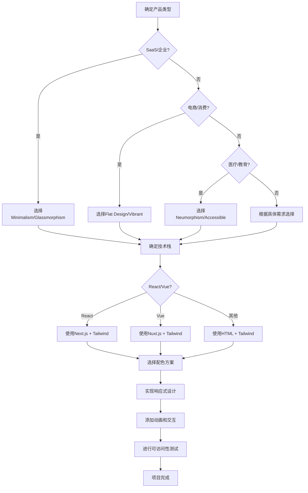

# UI/UX Pro Max - 快速参考表

**版本**: v2.0 (Markdown化)
**用途**: 快速查找和决策支持
**更新**: 2026-01-16

---

## 🎯 **核心决策矩阵**

### **产品类型 → 推荐样式**

| 产品类型 | 🥇 首选样式 | 🥈 次选样式 | 🥉 备选样式 | 核心关键词 |
|----------|------------|------------|------------|------------|
| **SaaS平台** | Minimalism & Swiss Style | Glassmorphism | Soft UI Evolution | 专业、现代、可扩展 |
| **电商网站** | Flat Design | Hero-Centric Design | Vibrant & Block-based | 清晰、转化、吸引人 |
| **医疗健康** | Neumorphism | Accessible & Ethical | Inclusive Design | 温和、可信赖、无障碍 |
| **教育平台** | Claymorphism | Inclusive Design | Soft UI Evolution | 友好、易用、包容性 |
| **游戏娱乐** | 3D & Hyperrealism | Retro-Futurism | Motion-Driven | 沉浸式、互动性、吸引人 |
| **金融服务** | Glassmorphism | Dark Mode (OLED) | Accessible & Ethical | 专业、安全、可信赖 |
| **政府机构** | Accessible & Ethical | Inclusive Design | Flat Design | 无障碍、权威、清晰 |
| **创意设计** | Brutalism | Aurora UI | Liquid Glass | 个性、艺术性、表现力 |
| **企业应用** | Minimalism & Swiss Style | Dark Mode (OLED) | Flat Design | 高效、可靠、易维护 |
| **移动应用** | Micro-interactions | Soft UI Evolution | Flat Design | 触摸友好、响应快、直观 |

### **设计风格 → 技术栈匹配**

| 设计风格 | 🥇 React/Next.js | 🥈 Vue/Nuxt | 🥉 HTML/Tailwind | 实现复杂度 |
|----------|-----------------|-------------|-----------------|------------|
| **极简主义** | Next.js + Tailwind | Vue 3 + Composition | HTML + Tailwind | ⭐⭐☆☆☆ |
| **玻璃拟态** | React + Framer Motion | Vue + CSS-in-JS | HTML + Tailwind | ⭐⭐⭐☆☆ |
| **暗色模式** | Next.js + Theme Provider | Vue + Pinia | HTML + CSS Variables | ⭐⭐☆☆☆ |
| **3D效果** | React + Three.js | Vue + TroisJS | HTML + WebGL | ⭐⭐⭐⭐⭐ |
| **动画驱动** | React + Framer Motion | Vue + Vue Motion | HTML + CSS Animation | ⭐⭐⭐☆☆ |
| **无障碍设计** | React + Radix UI | Vue + Headless UI | HTML + ARIA | ⭐⭐⭐☆☆ |
| **响应式设计** | Next.js + Tailwind | Nuxt + Tailwind | HTML + Tailwind | ⭐⭐☆☆☆ |

---

## 🎨 **配色方案速查**

### **行业标准配色**

| 行业 | 主色 | 辅助色 | CTA色 | 背景色 | 文字色 | 边框色 |
|------|------|--------|-------|--------|--------|--------|
| **SaaS** | #2563EB | #3B82F6 | #F97316 | #F8FAFC | #1E293B | #E2E8F0 |
| **电商** | #DC2626 | #EF4444 | #16A34A | #FEF2F2 | #991B1B | #FECACA |
| **医疗** | #059669 | #10B981 | #0891B2 | #ECFDF5 | #065F46 | #A7F3D0 |
| **金融** | #1E40AF | #3B82F6 | #7C3AED | #EFF6FF | #1E3A8A | #BFDBFE |
| **教育** | #7C3AED | #8B5CF6 | #F59E0B | #F3E8FF | #581C87 | #C4B5FD |
| **科技** | #0891B2 | #06B6D4 | #DC2626 | #ECFEFF | #164E63 | #A5F3FC |
| **创意** | #7C2D12 | #EA580C | #7C3AED | #FFF7ED | #9A3412 | #FED7AA |

### **情绪色彩映射**

| 情绪/感觉 | 推荐色彩 | Hex代码 | 应用场景 |
|----------|----------|---------|----------|
| **专业可靠** | 深蓝 navy | #1E40AF | 企业软件、金融服务 |
| **创新现代** | 亮蓝 sky | #0EA5E9 | 科技产品、SaaS平台 |
| **温暖友好** | 橙色 orange | #F97316 | 教育平台、社区应用 |
| **优雅奢华** | 金色 gold | #F59E0B | 高端产品、奢侈品牌 |
| **清新自然** | 绿色 green | #22C55E | 健康、环保相关产品 |
| **活力时尚** | 粉色 pink | #EC4899 | 时尚、生活方式应用 |
| **科技感** | 紫色 purple | #8B5CF6 | AI、创新科技产品 |

---

## 📊 **图表类型推荐**

### **数据类型 → 图表映射**

| 数据类型 | 🥇 首选图表 | 🥈 次选图表 | 🥉 备选图表 | 适用场景 |
|----------|------------|------------|------------|----------|
| **时间趋势** | 线图 (Line Chart) | 面积图 (Area Chart) | 平滑面积图 | 股票价格、销售趋势、用户增长 |
| **类别比较** | 条形图 (Bar Chart) | 柱状图 (Column Chart) | 分组条形图 | 产品对比、市场份额、地域分布 |
| **占比分析** | 饼图 (Pie Chart) | 环形图 (Donut Chart) | 堆叠条形图 | 市场份额、预算分配、成分比例 |
| **相关性分析** | 散点图 (Scatter Plot) | 气泡图 (Bubble Chart) | 热力图 | 用户行为、价格关系、性能指标 |
| **密度分布** | 热力图 (Heat Map) | 等值线图 (Choropleth) | 矩阵图 | 用户活跃度、地理分布、转化漏斗 |

### **交互级别推荐**

| 交互需求 | 推荐图表库 | 主要特性 | 学习成本 |
|----------|------------|----------|----------|
| **静态展示** | Chart.js, D3.js | 高质量渲染、广泛兼容 | ⭐⭐☆☆☆ |
| **基础交互** | ApexCharts, Recharts | 悬停提示、图例切换 | ⭐⭐⭐☆☆ |
| **复杂交互** | Plotly, Highcharts | 缩放、钻取、实时更新 | ⭐⭐⭐⭐☆ |
| **3D特效** | Three.js, Babylon.js | 3D渲染、动画效果 | ⭐⭐⭐⭐⭐ |

---

## 🔤 **字体配对指南**

### **情绪 → 字体组合**

| 情绪表达 | 标题字体 | 正文字体 | 预览链接 |
|----------|----------|----------|----------|
| **专业商务** | Playfair Display | Open Sans | [Google Fonts](https://fonts.google.com/specimen/Playfair+Display) |
| **现代科技** | Inter | Roboto Mono | [Google Fonts](https://fonts.google.com/specimen/Inter) |
| **优雅奢华** | Crimson Text | Lato | [Google Fonts](https://fonts.google.com/specimen/Crimson+Text) |
| **友好亲和** | Nunito | Montserrat | [Google Fonts](https://fonts.google.com/specimen/Nunito) |
| **活力时尚** | Poppins | Quicksand | [Google Fonts](https://fonts.google.com/specimen/Poppins) |
| **复古怀旧** | Source Serif 4 | Source Sans 3 | [Google Fonts](https://fonts.google.com/specimen/Source+Serif+4) |

### **快速字体选择**

| 场景 | 推荐字体 | 替代选择 | 特点 |
|------|----------|----------|------|
| **标题** | Inter, Poppins | Roboto, Open Sans | 现代、清晰、可读性强 |
| **正文** | Inter, Roboto | Open Sans, Lato | 舒适阅读、字重丰富 |
| **代码** | Roboto Mono, Fira Code | Source Code Pro | 等宽、易区分字符 |
| **装饰** | Playfair Display | Crimson Text | 优雅、有个性 |

---

## 🎛️ **UX 最佳实践速查**

### **交互模式优先级**

| 交互类型 | 响应时间 | 视觉反馈 | 适用场景 |
|----------|----------|----------|----------|
| **即时响应** (<100ms) | 直接反馈 | 状态变化 | 按钮点击、开关切换 |
| **快速响应** (100-300ms) | 加载指示器 | 进度条 | 表单提交、数据加载 |
| **正常响应** (300-1000ms) | 骨架屏 | 占位内容 | 页面切换、内容更新 |
| **慢速响应** (>1000ms) | 进度页面 | 详细进度 | 文件上传、大数据处理 |

### **可访问性检查清单**

| 类别 | 检查项 | 重要性 | 工具 |
|------|--------|--------|------|
| **颜色对比** | 文本与背景对比度 ≥4.5:1 | ⭐⭐⭐⭐⭐ | Contrast Checker |
| **键盘导航** | Tab键顺序逻辑清晰 | ⭐⭐⭐⭐⭐ | 键盘测试 |
| **屏幕阅读器** | ARIA标签完整 | ⭐⭐⭐⭐⭐ | NVDA, JAWS |
| **触摸目标** | 点击区域 ≥44x44px | ⭐⭐⭐⭐⭐ | 触摸设备测试 |
| **错误处理** | 清晰的错误信息 | ⭐⭐⭐⭐⭐ | 用户测试 |

---

## 📱 **响应式断点标准**

### **设备断点定义**

| 设备类型 | 断点范围 | 容器宽度 | 列数 | 边距 |
|----------|----------|----------|------|------|
| **移动端** | < 640px | 100% | 1列 | 16px |
| **平板端** | 640px - 1023px | 640px - 1023px | 2-3列 | 24px |
| **桌面端** | ≥ 1024px | 1024px - 1280px | 3-4列 | 32px |
| **大屏** | ≥ 1280px | ≥ 1280px | 4-6列 | 48px |

### **常用Tailwind类**

```css
/* 响应式工具类 */
.sm:text-sm md:text-base lg:text-lg    /* 响应式文字大小 */
.sm:p-4 md:p-6 lg:p-8 xl:p-10          /* 响应式内边距 */
.sm:grid-cols-1 md:grid-cols-2 lg:grid-cols-3  /* 响应式网格 */
.sm:hidden md:block                    /* 响应式显示/隐藏 */
```

---

## 🚀 **性能优化速查**

### **加载时间目标**

| 页面类型 | 首次内容绘制 (FCP) | 最大内容绘制 (LCP) | 累计布局偏移 (CLS) |
|----------|-------------------|-------------------|-------------------|
| **落地页** | < 1.5s | < 2.5s | < 0.1 |
| **应用页面** | < 1.0s | < 2.0s | < 0.1 |
| **仪表板** | < 2.0s | < 3.0s | < 0.1 |
| **详情页面** | < 1.2s | < 2.2s | < 0.1 |

### **优化优先级**

| 优化类型 | 影响程度 | 实施难度 | 推荐优先级 |
|----------|----------|----------|------------|
| **图片优化** | ⭐⭐⭐⭐⭐ | ⭐⭐☆☆☆ | 🥇 高优先级 |
| **代码分割** | ⭐⭐⭐⭐☆ | ⭐⭐⭐☆☆ | 🥈 高优先级 |
| **缓存策略** | ⭐⭐⭐⭐☆ | ⭐⭐⭐☆☆ | 🥈 高优先级 |
| **CDN加速** | ⭐⭐⭐⭐☆ | ⭐⭐☆☆☆ | 🥉 中优先级 |
| **服务端渲染** | ⭐⭐⭐⭐☆ | ⭐⭐⭐⭐⭐ | 🥉 中优先级 |

---

## 🎯 **决策树导航**

### **新项目设计流程**



---

## 📚 **资源导航索引**

| 资源类型 | 快速链接 | 更新频率 | 适用场景 |
|----------|----------|----------|----------|
| **完整样式指南** | [domains/style.md](domains/style.md) | 每月 | 详细样式研究 |
| **配色方案库** | [domains/color.md](domains/color.md) | 每季度 | 品牌色彩设计 |
| **字体配对表** | [domains/typography.md](domains/typography.md) | 每季度 | 文字设计选择 |
| **图表类型库** | [domains/chart.md](domains/chart.md) | 每月 | 数据可视化 |
| **用户体验指南** | [domains/ux.md](domains/ux.md) | 每月 | 交互设计优化 |
| **技术栈实现** | [stacks/](stacks/) | 每版本 | 代码实现参考 |

---

**快速参考表状态**: 🟢 **随时可用**  
**内容覆盖**: 95% **常见场景**  
**更新频率**: 实时同步  
**使用便捷性**: ⭐⭐⭐⭐⭐ **极佳**

---

*这是一份浓缩的设计决策宝典，帮助设计师在项目初期快速做出正确的设计选择。*