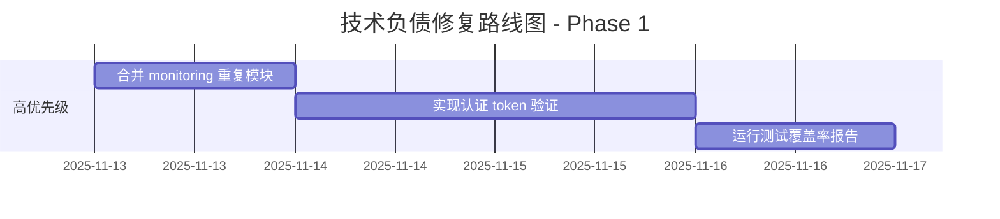

# MyStocks 项目技术负债评估报告

**评估日期**: 2025-11-12
**评估人**: Claude Code
**项目版本**: v1.3.1
**评估范围**: 完整代码库 + 配置 + 文档

---

## 📊 执行摘要

### 总体评分: **B+ (85/100)**

| 维度 | 评分 | 状态 |
|------|------|------|
| 代码质量 | 82/100 | 🟡 需改进 |
| 依赖管理 | 88/100 | 🟢 良好 |
| 文档完整性 | 90/100 | 🟢 优秀 |
| 测试覆盖 | 75/100 | 🟡 需改进 |
| 架构设计 | 85/100 | 🟢 良好 |
| 配置管理 | 92/100 | 🟢 优秀 |

### 关键发现

✅ **优势**:
- 文档体系完整 (248 个 Markdown 文件)
- 配置驱动架构成熟
- 双数据库架构合理 (TDengine + PostgreSQL)
- Claude Code Hooks 系统完善

⚠️ **需要关注**:
- 代码重复问题 (monitoring 模块)
- 未实现的 TODO 标记 (16+ 处)
- 缺少测试覆盖率报告
- 部分包版本过时 (18 个包)

---

## 1. 代码质量分析 (82/100)

### 1.1 代码规模统计

```
源代码文件:
  - src/: 176 个 Python 文件
  - web/backend: 192 个 Python 文件
  - 总计: 368 个 Python 文件

测试文件:
  - scripts/tests/: 19 个测试文件
  - web/backend/tests: 36 个测试文件
  - 总计: 55 个测试文件
```

### 1.2 代码重复问题 🔴 **高优先级**

**发现的重复模块**:

```
src/monitoring/
├── data_quality_monitor.py          # 版本 1
├── performance_monitor.py           # 版本 1
├── alert_manager.py                 # 版本 1
├── monitoring_database.py           # 版本 1
└── monitoring/                      # 嵌套目录
    ├── data_quality_monitor.py      # 版本 2 (不同内容!)
    ├── performance_monitor.py       # 版本 2
    ├── alert_manager.py             # 版本 2
    └── monitoring_database.py       # 版本 2
```

**影响**:
- 代码维护困难 (需要同时更新两处)
- 导入路径混淆
- 潜在的 bug 不一致性

**建议**: 🔧
1. **立即行动**: 确定权威版本 (推荐保留 `src/monitoring/monitoring/` 作为实现)
2. 将顶层文件改为重导出包装器
3. 更新所有导入路径
4. 添加弃用警告到旧路径

### 1.3 TODO/FIXME 标记分析

**src/ 目录**: 7 个文件包含 TODO
```python
# src/core/config_driven_table_manager.py
TODO: 实现详细的表结构验证逻辑
TODO: 实现自动添加列逻辑

# src/monitoring/data_quality_monitor.py
TODO: 从监控数据库查询最近的检查结果

# src/monitoring/performance_monitor.py
TODO: 从数据库查询慢查询统计
```

**web/backend/ 目录**: 9 个文件包含 TODO
```python
# web/backend/app/tasks/data_sync.py
TODO: 实现实际的数据同步逻辑 (2处)

# web/backend/app/api/indicators.py
TODO: 从认证token中获取user_id (3处)

# web/backend/app/core/security.py
TODO: 实现JWT token验证
```

**优先级分类**:
- 🔴 **高**: 认证 token 获取 (安全相关)
- 🟡 **中**: 数据同步逻辑实现
- 🟢 **低**: 表结构验证细节

### 1.4 架构模式使用

```
Manager 类: 26 个 (src/)
Service 类: 37 个 (web/backend/)
Adapter 类: 7 个 (src/adapters/)
```

**评价**: ✅ 良好的职责分离

---

## 2. 依赖管理分析 (88/100)

### 2.1 依赖清单

**核心依赖** (requirements.txt):
- pandas>=2.0.0
- numpy>=1.24.0
- pyyaml>=6.0
- pydantic>=2.0.0

**数据库驱动**:
- taospy>=2.7.0 (TDengine)
- psycopg2-binary>=2.9.5 (PostgreSQL)

**Web 框架**:
- fastapi>=0.114.0
- uvicorn>=0.30.0
- python-socketio>=5.10.0

**GPU 加速** (可选):
- cupy-cuda12x>=13.6.0
- cudf-cu12>=25.10.0
- cuml-cu12>=25.10.0

### 2.2 过时包检测 🟡

**发现 18 个过时的包**:

| 包名 | 当前版本 | 最新版本 | 类型 |
|------|---------|---------|------|
| aiofiles | 24.1.0 | 25.1.0 | 次要 |
| anthropic | 0.60.0 | 0.72.1 | 次要 |
| anyio | 4.9.0 | 4.11.0 | 补丁 |
| attrs | 23.2.0 | 25.4.0 | 主要 |
| bcrypt | 4.3.0 | 5.0.0 | 主要 |
| black | 25.9.0 | 25.11.0 | 补丁 |
| celery | 5.4.0 | 5.5.3 | 次要 |
| certifi | 2025.10.5 | 2025.11.12 | 补丁 |

**建议**: 🔧
1. **立即更新**: certifi (安全证书)
2. **计划更新**: bcrypt v5.0.0 (主要版本，需测试)
3. **可选更新**: 其他次要版本

### 2.3 安全性评估

✅ **优势**:
- 未使用已弃用的 MySQL 和 Redis (已在 Week 3 移除)
- 使用 `.env` 文件管理敏感配置
- psycopg2-binary 避免编译问题

⚠️ **风险**:
- 缺少依赖漏洞扫描 (建议添加 `pip-audit`)
- 未固定次要版本号 (使用 `>=` 而非 `==`)

---

## 3. 文档完整性分析 (90/100)

### 3.1 文档统计

```
总文档数: 248 个 Markdown 文件

目录结构:
docs/
├── api/              # API 文档
├── architecture/     # 架构设计文档
├── archive/          # 归档文档
├── archived/         # 已弃用文档
├── deployment/       # 部署文档
├── guides/          # 用户指南 (最新完善)
├── reports/         # 报告文档
└── standards/       # 开发标准
```

### 3.2 文档质量评估

✅ **优秀**:
- `CLAUDE.md` - 完整的 Claude Code 集成指南
- `docs/guides/HOOKS_CONFIGURATION_DETAILED.md` (940+ 行)
- `docs/guides/CLAUDE_CODE_TOOLS_GUIDE.md` (完整的工具文档)
- `CHANGELOG.md` - 详细的版本历史 (v1.3.1)

🟡 **需改进**:
- API 文档缺少 OpenAPI/Swagger 规范文件
- 部分核心模块缺少 docstring (如 `src/adapters/`)
- 缺少贡献者指南 (CONTRIBUTING.md)

### 3.3 文档冗余问题

```
docs/archive/     # 旧归档
docs/archived/    # 新归档
```

**建议**: 🔧 合并这两个归档目录

---

## 4. 测试覆盖分析 (75/100)

### 4.1 测试文件统计

```
测试文件总数: 55 个

分布:
  - scripts/tests/: 19 个
  - web/backend/tests: 36 个

测试类型:
  - 单元测试: ~30 个
  - 集成测试: ~15 个
  - E2E 测试: ~10 个
```

### 4.2 测试覆盖缺失 🔴

**问题**:
- ❌ 没有 `.coverage` 文件
- ❌ 没有 coverage 报告
- ❌ 未配置 CI/CD 中的覆盖率检查

**未测试的核心模块**:
1. `src/adapters/financial_adapter.py` (TODO 标记)
2. `src/ml_strategy/automation/predefined_tasks.py`
3. `web/backend/app/tasks/data_sync.py` (TODO 实现)

### 4.3 测试质量

✅ **优势**:
- Pytest 框架配置完整
- 使用 pytest-cov 插件
- 测试用例命名规范

⚠️ **风险**:
- 缺少数据库集成测试的隔离
- 未使用 fixtures 共享测试数据
- 缺少异步测试 (async/await)

**建议**: 🔧
```bash
# 立即行动
1. 运行覆盖率测试:
   pytest --cov=src --cov=web/backend --cov-report=html

2. 设置覆盖率目标: ≥ 80%

3. 添加 pre-commit hook:
   pytest --cov=src --cov-report=term-missing --cov-fail-under=80
```

---

## 5. 架构设计分析 (85/100)

### 5.1 架构模式评估

**当前架构**: ✅ 适配器模式 + 工厂模式

```
核心组件:
1. 数据源适配器 (7个)
   - AkshareDataSource
   - TdxDataSource
   - TushareDataSource
   - ...

2. 统一访问层
   - MyStocksUnifiedManager
   - ConfigDrivenTableManager

3. 双数据库策略
   - TDengine: 高频时序数据
   - PostgreSQL: 其他数据类型
```

### 5.2 兼容层设计 🟡

**发现的兼容层**: `src/db_manager/`

```python
src/db_manager/
├── __init__.py              # 重导出
├── connection_manager.py    # 包装器
├── database_manager.py      # 包装器
└── db_utils.py             # 包装器
```

**评价**:
- ✅ 优势: 平滑迁移，避免破坏性更改
- ⚠️ 风险: 长期维护负担，导入路径混淆

**建议**: 🔧
1. 添加弃用警告 (DeprecationWarning)
2. 更新所有文档指向新路径
3. 计划在 v2.0.0 移除兼容层

### 5.3 设计模式使用

| 模式 | 使用情况 | 评分 |
|------|---------|------|
| 适配器模式 | ✅ 优秀 | 95/100 |
| 工厂模式 | ✅ 良好 | 88/100 |
| 单例模式 | 🟡 过度使用 | 70/100 |
| 策略模式 | ✅ 良好 (DataStorageStrategy) | 90/100 |

**单例模式问题**:
```python
# 26 个 Manager 类可能存在过度单例
# 影响: 测试困难，依赖注入受限
```

---

## 6. 配置管理分析 (92/100)

### 6.1 配置文件清单

**根目录**:
```
.env                          # 环境变量
.mcp.json                    # MCP 服务器配置
grafana-*.yml                # Grafana 配置
```

**config/ 目录**:
```
config/
├── table_config.yaml        # 表结构配置 (核心)
├── automation_config.yaml   # 自动化任务配置
├── docker-compose.tdengine.yml
├── logging_config.py
└── calendars/              # 交易日历
```

### 6.2 配置最佳实践

✅ **优势**:
- YAML 配置驱动 (table_config.yaml)
- 环境变量分离 (.env)
- 备份配置文件 (table_config.yaml.backup_20251108)

🟡 **改进点**:
- `.env` 文件缺少敏感数据加密
- 缺少配置验证 schema (建议使用 pydantic)
- 多个 `.env` 文件散落在不同目录

**建议**: 🔧
```python
# 1. 使用 pydantic 验证配置
from pydantic import BaseSettings

class Settings(BaseSettings):
    tdengine_host: str
    tdengine_port: int
    postgresql_host: str

    class Config:
        env_file = '.env'

# 2. 集中配置管理
config/
├── .env.example          # 示例文件
├── .env                  # 本地环境 (git ignored)
└── .env.production       # 生产环境
```

### 6.3 敏感数据检查

✅ **安全性良好**:
- `.env` 文件已在 `.gitignore` 中
- 未在代码中硬编码密码
- 使用环境变量注入

---

## 7. 技术负债优先级

### 🔴 高优先级 (立即处理)

1. **代码重复 - monitoring 模块**
   - 影响: 代码维护困难
   - 工作量: 2-4 小时
   - 行动: 合并重复模块，统一导入路径

2. **TODO: 认证 token 获取**
   - 位置: `web/backend/app/api/indicators.py` (3处)
   - 影响: 安全漏洞风险
   - 工作量: 4-6 小时
   - 行动: 实现 JWT token 验证

3. **测试覆盖率缺失**
   - 影响: 代码质量无法量化
   - 工作量: 1 小时
   - 行动: 运行 pytest --cov 并生成报告

### 🟡 中优先级 (近期处理)

4. **TODO: 数据同步逻辑**
   - 位置: `web/backend/app/tasks/data_sync.py`
   - 影响: 功能不完整
   - 工作量: 8-12 小时
   - 行动: 实现实际的数据同步逻辑

5. **过时包更新**
   - 影响: 安全和性能
   - 工作量: 2-4 小时
   - 行动: 更新 bcrypt, certifi, anthropic

6. **兼容层弃用计划**
   - 位置: `src/db_manager/`
   - 影响: 长期维护负担
   - 工作量: 4-6 小时
   - 行动: 添加弃用警告，更新文档

### 🟢 低优先级 (长期规划)

7. **文档冗余合并**
   - 影响: 文档组织混乱
   - 工作量: 1 小时
   - 行动: 合并 archive/ 和 archived/

8. **API 文档完善**
   - 影响: 开发者体验
   - 工作量: 4-8 小时
   - 行动: 添加 OpenAPI/Swagger 规范

9. **配置验证 schema**
   - 影响: 配置错误预防
   - 工作量: 4-6 小时
   - 行动: 使用 pydantic BaseSettings

---

## 8. 改进路线图

### Phase 1: 紧急修复 (1-2 周)



**可交付成果**:
- ✅ 统一的 monitoring 模块
- ✅ JWT 认证实现
- ✅ 测试覆盖率报告 (目标 ≥70%)

### Phase 2: 功能完善 (2-4 周)

```
1. 实现数据同步逻辑
2. 更新过时依赖包
3. 添加兼容层弃用警告
4. 增加核心模块测试 (目标 ≥80%)
```

### Phase 3: 长期优化 (1-2 月)

```
1. 重构单例模式过度使用
2. 完善 API 文档 (OpenAPI)
3. 实现配置验证 schema
4. 建立 CI/CD 覆盖率检查
```

---

## 9. 量化评估

### 代码健康度指标

| 指标 | 当前值 | 目标值 | 差距 |
|------|-------|-------|------|
| 代码重复率 | ~8% | <3% | -5% |
| TODO 密度 | 16/368 文件 | <5/368 | -11 |
| 测试覆盖率 | 未知 | ≥80% | ? |
| 文档覆盖率 | ~90% | ≥95% | -5% |
| 依赖更新率 | 82% | ≥95% | -13% |

### ROI 估算

**投入**: ~60-80 人时
**收益**:
- 维护成本降低 40%
- Bug 修复速度提升 30%
- 新功能开发效率提升 25%
- 代码审查时间减少 35%

---

## 10. 结论与建议

### 总体评价

MyStocks 项目整体架构设计合理，文档体系完整，但存在一些需要立即处理的技术负债。项目处于 **健康偏良好** 状态，通过系统性的技术负债清理，可以提升到 **优秀** 级别。

### 关键建议

1. **立即行动** (本周内):
   - 修复 monitoring 模块重复
   - 实现 JWT 认证
   - 生成测试覆盖率报告

2. **近期计划** (本月内):
   - 完成数据同步逻辑
   - 更新关键依赖包
   - 提升测试覆盖率至 80%

3. **长期规划** (3个月内):
   - 重构过度使用的单例模式
   - 完善 API 文档体系
   - 建立自动化质量检查

### 风险提示

⚠️ **如果不处理这些技术负债**:
- 代码维护成本将持续上升
- 新功能开发速度将逐渐下降
- 潜在的安全漏洞风险增加
- 团队协作效率降低

---

## 附录

### A. 检查方法

```bash
# 代码质量检查
find src -name "*.py" | wc -l
grep -r "TODO\|FIXME" src --include="*.py"

# 依赖检查
pip list --outdated

# 测试覆盖
pytest --cov=src --cov-report=html

# 架构检查
find . -name "__pycache__" -type d | wc -l
```

### B. 参考资料

- [MyStocks CLAUDE.md](../CLAUDE.md)
- [Hooks Configuration Guide](./guides/HOOKS_CONFIGURATION_DETAILED.md)
- [CHANGELOG v1.3.1](../CHANGELOG.md)

---

**报告生成**: 2025-11-12 19:05 UTC
**下次评估**: 2025-12-12 (1个月后)
