# API-Web Component Alignment - Technical Design

## 📐 Architecture Overview

This design implements a type-safe, adapter-based frontend-backend integration following the Schema First principle and Smart/Dumb component separation.

## 🏛️ System Architecture

```mermaid
graph TB
    subgraph "Backend (FastAPI)"
        A[Pydantic Schemas<br/>SSOT] --> B[API Endpoints<br/>Unified Response]
        B --> C[Middleware<br/>CSRF/CORS/Error]
        C --> D[Business Logic<br/>Services]
    end

    subgraph "Frontend (Vue 3)"
        E[Auto-generated<br/>TypeScript Types] --> F[API Services<br/>Axios + Interceptors]
        F --> G[Adapters<br/>DTO → ViewModel]
        G --> H[Smart Components<br/>Views/Containers]
        H --> I[Dumb Components<br/>UI Parts]
    end

    subgraph "Real-time"
        J[SSE Endpoints] --> K[SSE Service]
        K --> H
    end

    B -.->|HTTP/REST| F
    J -.->|Server-Sent Events| K
```



## 🔧 Component Design

### 1. Unified Response Format

All API responses will follow this structure:

```python
# web/backend/app/core/responses.py
from typing import Generic, TypeVar, Optional
from pydantic import BaseModel, Field
from datetime import datetime
import uuid

T = TypeVar('T')

class APIResponse(BaseModel, Generic[T]):
    """Standard API response format"""
    success: bool = True
    code: int = 0
    message: str = "操作成功"
    data: Optional[T] = None
    request_id: str = Field(default_factory=lambda: str(uuid.uuid4()))
    timestamp: datetime = Field(default_factory=datetime.now)

    class Config:
        json_encoders = {
            datetime: lambda v: v.isoformat()
        }

class ErrorResponse(BaseModel):
    """Error response format"""
    success: bool = False
    code: int
    message: str
    details: Optional[dict] = None
    request_id: str
    timestamp: datetime
```

### 2. Frontend Request Infrastructure

```typescript
// web/frontend/src/utils/request.ts
import axios, { AxiosInstance, AxiosRequestConfig, AxiosResponse } from 'axios'
import { ElMessage } from 'element-plus'

// Type definitions
export interface APIResponse<T = any> {
  success: boolean
  code: number
  message: string
  data?: T
  request_id: string
  timestamp: string
}

export interface ErrorResponse extends APIResponse {
  success: false
  details?: any
}

// Axios instance configuration
const instance: AxiosInstance = axios.create({
  baseURL: import.meta.env.VITE_API_BASE_URL || 'http://localhost:8000',
  timeout: 10000,
  headers: {
    'Content-Type': 'application/json'
  }
})

// Request interceptor - CSRF token injection
instance.interceptors.request.use(async (config) => {
  if (['POST', 'PUT', 'DELETE', 'PATCH'].includes(config.method?.toUpperCase() || '')) {
    const token = await getCsrfToken()
    config.headers['X-CSRF-Token'] = token
  }
  return config
})

// Response interceptor - Unified response handling
instance.interceptors.response.use(
  (response: AxiosResponse<APIResponse>) => {
    if (response.data.success) {
      return response.data.data
    } else {
      throw new Error(response.data.message || 'Request failed')
    }
  },
  (error) => {
    handleAPIError(error)
    return Promise.reject(error)
  }
)

// Error handling
function handleAPIError(error: any) {
  if (error.response) {
    const { status, data } = error.response
    switch (status) {
      case 401:
        ElMessage.error('请先登录')
        // Redirect to login
        break
      case 403:
        ElMessage.error('权限不足')
        break
      case 422:
        ElMessage.error(data.message || '请求参数错误')
        break
      default:
        ElMessage.error(data?.message || '服务器错误')
    }
  } else if (error.request) {
    ElMessage.error('网络连接失败')
  } else {
    ElMessage.error(error.message || '未知错误')
  }
}

// CSRF token management
async function getCsrfToken(): Promise<string> {
  const cached = sessionStorage.getItem('csrf-token')
  if (cached) return cached

  const response = await axios.get('/api/auth/csrf')
  const token = response.data.token
  sessionStorage.setItem('csrf-token', token)
  return token
}

export default instance
```

### 3. Adapter Pattern Implementation

```typescript
// web/frontend/src/utils/adapters.ts
import type {
  MarketOverviewResponse,
  FundFlowItem,
  KLineData,
  StrategyListItem
} from '@/api/types'

// ViewModel interfaces (what UI components expect)
export interface MarketOverviewVM {
  indices: IndexItemVM[]
  sectors: SectorItemVM[]
  volume: string
  timestamp: number
}

export interface IndexItemVM {
  name: string
  current: number
  change: number
  changePercent: number
  trend: 'up' | 'down' | 'flat'
}

export interface SectorItemVM {
  name: string
  changePercent: number
  stockCount: number
  leaderStock: string
}

export class DataAdapter {
  // Market Data Adapters
  static toMarketOverview(data: MarketOverviewResponse): MarketOverviewVM {
    return {
      indices: data.market_index.map(item => ({
        name: item.name,
        current: item.current,
        change: item.change,
        changePercent: item.change_percent,
        trend: item.change > 0 ? 'up' : item.change < 0 ? 'down' : 'flat'
      })),
      sectors: data.hot_sectors.map(item => ({
        name: item.sector_name,
        changePercent: item.change_percent,
        stockCount: item.stock_count,
        leaderStock: item.leader_stock
      })),
      volume: this.formatVolume(data.trading_volume),
      timestamp: Date.now()
    }
  }

  static toFundFlowChart(data: FundFlowItem[]): ChartDataPoint[] {
    return data.map(item => ({
      date: item.trade_date,
      mainInflow: this.convertToWan(item.main_net_inflow),
      mainOutflow: this.convertToWan(item.main_net_outflow),
      timestamp: new Date(item.trade_date).getTime()
    }))
  }

  static toKLineData(data: KLineData[]): KLineChartData {
    return {
      categoryData: data.map(item => item.date),
      values: data.map(item => [
        item.open,
        item.close,
        item.low,
        item.high
      ]),
      volumes: data.map(item => item.volume)
    }
  }

  // Strategy Adapters
  static toStrategyList(data: StrategyListItem[]): StrategyListItemVM[] {
    return data.map(item => ({
      id: item.strategy_id,
      name: item.strategy_name,
      status: item.status as 'running' | 'stopped' | 'paused',
      totalReturn: this.formatPercent(item.total_return),
      sharpeRatio: item.sharpe_ratio.toFixed(2),
      maxDrawdown: this.formatPercent(item.max_drawdown),
      lastUpdate: new Date(item.last_update).toLocaleString()
    }))
  }

  // Utility methods
  private static formatVolume(volume: number): string {
    if (volume >= 100000000) {
      return `${(volume / 100000000).toFixed(2)}亿`
    } else if (volume >= 10000) {
      return `${(volume / 10000).toFixed(2)}万`
    }
    return volume.toString()
  }

  private static convertToWan(value: number): number {
    return Math.round(value / 10000 * 100) / 100
  }

  private static formatPercent(value: number): string {
    return `${(value * 100).toFixed(2)}%`
  }
}
```

### 4. Smart Component Template

```vue
<!-- web/frontend/src/views/Market.vue -->
<template>
  <div class="market-container">
    <!-- Loading state -->
    <el-skeleton v-if="loading" :rows="5" animated />

    <!-- Main content -->
    <div v-else>
      <!-- Market Overview Component -->
      <MarketOverviewComponent
        :data="marketOverviewData"
        :loading="overviewLoading"
        @refresh="fetchMarketOverview"
      />

      <!-- Fund Flow Panel -->
      <FundFlowPanel
        :data="fundFlowData"
        :date-range="dateRange"
        @date-change="handleDateChange"
      />

      <!-- K-Line Chart -->
      <KLineChart
        :data="klineData"
        :symbol="selectedStock"
        :interval="chartInterval"
        @symbol-change="handleStockChange"
        @interval-change="handleIntervalChange"
      />
    </div>
  </div>
</template>

<script setup lang="ts">
import { ref, onMounted, watch } from 'vue'
import { useMarketStore } from '@/stores/market'
import { DataAdapter } from '@/utils/adapters'
import type { MarketOverviewVM, FundFlowItemVM } from '@/utils/adapters'

// Smart component - manages business logic
const marketStore = useMarketStore()

// State management
const loading = ref(false)
const overviewLoading = ref(false)
const selectedStock = ref('000001.SZ')
const dateRange = ref<[Date, Date]>([
  new Date(Date.now() - 30 * 24 * 60 * 60 * 1000),
  new Date()
])
const chartInterval = ref('1d')

// Data refs (ViewModel format)
const marketOverviewData = ref<MarketOverviewVM | null>(null)
const fundFlowData = ref<FundFlowItemVM[]>([])
const klineData = ref<any>(null)

// API calls (through store)
async function fetchMarketOverview() {
  overviewLoading.value = true
  try {
    const rawData = await marketStore.getMarketOverview()
    marketOverviewData.value = DataAdapter.toMarketOverview(rawData)
  } catch (error) {
    console.error('Failed to fetch market overview:', error)
  } finally {
    overviewLoading.value = false
  }
}

async function fetchFundFlow() {
  try {
    const rawData = await marketStore.getFundFlow({
      start_date: dateRange.value[0],
      end_date: dateRange.value[1]
    })
    fundFlowData.value = DataAdapter.toFundFlowChart(rawData)
  } catch (error) {
    console.error('Failed to fetch fund flow:', error)
  }
}

async function fetchKLineData() {
  try {
    const rawData = await marketStore.getKLineData({
      symbol: selectedStock.value,
      interval: chartInterval.value
    })
    klineData.value = DataAdapter.toKLineData(rawData)
  } catch (error) {
    console.error('Failed to fetch K-line data:', error)
  }
}

// Event handlers
function handleDateChange(range: [Date, Date]) {
  dateRange.value = range
  fetchFundFlow()
}

function handleStockChange(symbol: string) {
  selectedStock.value = symbol
  fetchKLineData()
}

function handleIntervalChange(interval: string) {
  chartInterval.value = interval
  fetchKLineData()
}

// Lifecycle
onMounted(() => {
  fetchMarketOverview()
  fetchFundFlow()
  fetchKLineData()
})

// Watch for real-time updates
watch(
  () => marketStore.lastUpdateTime,
  () => {
    if (marketStore.realTimeEnabled) {
      fetchMarketOverview()
    }
  }
)
</script>

<style scoped>
.market-container {
  padding: 20px;
  background: #f5f5f5;
}
</style>
```

### 5. Type Generation Pipeline

```python
# scripts/generate_frontend_types.py
"""
Generate TypeScript types from Pydantic models
"""
import os
import json
from pathlib import Path
from typing import Dict, List
import subprocess

def generate_types():
    """Generate TypeScript types from backend Pydantic models"""

    # 1. Extract Pydantic models
    models_path = Path('web/backend/app/schemas')
    models = extract_pydantic_models(models_path)

    # 2. Convert to TypeScript interfaces
    ts_types = convert_to_typescript(models)

    # 3. Write to frontend
    output_path = Path('web/frontend/src/api/types.ts')
    write_typescript_file(output_path, ts_types)

    # 4. Format the file
    subprocess.run(['npx', 'prettier', '--write', str(output_path)])

    print(f"✅ TypeScript types generated: {output_path}")

def extract_pydantic_models(schemas_path: Path) -> Dict:
    """Extract Pydantic model definitions"""
    models = {}
    for py_file in schemas_path.glob('*.py'):
        # Parse Python file and extract Pydantic models
        # Implementation detail...
        pass
    return models

def convert_to_typescript(models: Dict) -> str:
    """Convert Python models to TypeScript interfaces"""
    ts_content = "// Auto-generated TypeScript types\n\n"

    for model_name, model_def in models.items():
        ts_content += f"export interface {model_name} {{\n"
        for field_name, field_info in model_def.fields.items():
            ts_type = python_to_typescript_type(field_info.type_)
            ts_content += f"  {to_camel_case(field_name)}: {ts_type};\n"
        ts_content += "}\n\n"

    return ts_content

def python_to_typescript_type(python_type: str) -> str:
    """Convert Python type to TypeScript type"""
    type_mapping = {
        'str': 'string',
        'int': 'number',
        'float': 'number',
        'bool': 'boolean',
        'List': 'Array',
        'Dict': 'Record',
        'Optional': '| null',
        'Union': '|',
        'datetime': 'string',
        'date': 'string'
    }

    # Apply type mappings
    result = python_type
    for py_type, ts_type in type_mapping.items():
        result = result.replace(py_type, ts_type)

    return result

if __name__ == '__main__':
    generate_types()
```

## 🔐 Security Implementation

### CSRF Protection

```python
# web/backend/app/middleware/csrf.py
from fastapi import FastAPI, Request, HTTPException
from fastapi.security import CSRFProtect
from fastapi.responses import JSONResponse
import secrets

csrf = CSRFProtect(secret_key=os.getenv('CSRF_SECRET_KEY'))

def setup_csrf(app: FastAPI):
    """Setup CSRF protection"""

    @app.get("/api/auth/csrf")
    async def get_csrf_token():
        """Generate and return CSRF token"""
        token = secrets.token_urlsafe(32)
        # Store token in session or database
        return {"token": token}

    # Verify CSRF token on state-changing requests
    @app.middleware("http")
    async def verify_csrf_token(request: Request, call_next):
        if request.method in ["POST", "PUT", "DELETE", "PATCH"]:
            # Skip for public endpoints
            if request.url.path.startswith("/api/public/"):
                return await call_next(request)

            csrf_token = request.headers.get("X-CSRF-Token")
            if not csrf_token:
                raise HTTPException(status_code=403, detail="CSRF token missing")

            # Verify token against stored value
            if not verify_stored_token(csrf_token):
                raise HTTPException(status_code=403, detail="Invalid CSRF token")

        return await call_next(request)
```

## 📊 Performance Optimization

### Smart Caching Strategy

```typescript
// web/frontend/src/utils/cache-manager.ts
export class CacheManager<T = any> {
  private cache = new Map<string, CacheEntry<T>>()
  private maxSize: number
  private defaultTTL: number

  constructor(options: CacheManagerOptions) {
    this.maxSize = options.maxSize || 100
    this.defaultTTL = options.defaultTTL || 5 * 60 * 1000 // 5 minutes
  }

  set(key: string, data: T, ttl?: number): void {
    // LRU eviction if cache is full
    if (this.cache.size >= this.maxSize) {
      const firstKey = this.cache.keys().next().value
      this.cache.delete(firstKey)
    }

    this.cache.set(key, {
      data,
      timestamp: Date.now(),
      ttl: ttl || this.defaultTTL
    })
  }

  get(key: string): T | null {
    const entry = this.cache.get(key)
    if (!entry) return null

    // Check if entry has expired
    if (Date.now() - entry.timestamp > entry.ttl) {
      this.cache.delete(key)
      return null
    }

    // Move to end (LRU)
    this.cache.delete(key)
    this.cache.set(key, entry)

    return entry.data
  }

  // Cache decorator for API calls
  async cachedFetch<T>(
    key: string,
    fetcher: () => Promise<T>,
    ttl?: number
  ): Promise<T> {
    // Try cache first
    const cached = this.get<T>(key)
    if (cached) return cached

    // Fetch fresh data
    const data = await fetcher()
    this.set(key, data, ttl)
    return data
  }
}

// Global cache instance
export const cacheManager = new CacheManager({
  maxSize: 100,
  defaultTTL: 5 * 60 * 1000 // 5 minutes
})

// Usage example
export async function fetchMarketOverviewWithCache(): Promise<MarketOverviewVM> {
  return cacheManager.cachedFetch(
    'market-overview',
    () => marketStore.getMarketOverview(),
    60 * 1000 // 1 minute cache
  )
}
```

## 🔄 Real-time Updates (SSE)

```typescript
// web/frontend/src/services/sse-service.ts
export class SSEService {
  private connections: Map<string, EventSource> = new Map()

  connect(endpoint: string, handlers: SSEHandlers): () => void {
    const url = `${import.meta.env.VITE_API_BASE_URL}${endpoint}`
    const eventSource = new EventSource(url)

    eventSource.onopen = () => {
      console.log(`SSE connected: ${endpoint}`)
      handlers.onOpen?.()
    }

    eventSource.onmessage = (event) => {
      try {
        const data = JSON.parse(event.data)
        handlers.onMessage?.(data)
      } catch (error) {
        console.error('SSE message parse error:', error)
      }
    }

    eventSource.onerror = (error) => {
      console.error(`SSE error: ${endpoint}`, error)
      handlers.onError?.(error)
    }

    this.connections.set(endpoint, eventSource)

    // Return disconnect function
    return () => {
      eventSource.close()
      this.connections.delete(endpoint)
    }
  }

  disconnect(endpoint?: string) {
    if (endpoint) {
      const eventSource = this.connections.get(endpoint)
      if (eventSource) {
        eventSource.close()
        this.connections.delete(endpoint)
      }
    } else {
      // Disconnect all
      this.connections.forEach(eventSource => eventSource.close())
      this.connections.clear()
    }
  }
}

// Usage in component
const sseService = new SSEService()

onMounted(() => {
  const disconnect = sseService.connect('/api/v1/sse/market-data', {
    onMessage: (data) => {
      // Update real-time data
      if (data.type === 'market_overview') {
        marketOverviewData.value = DataAdapter.toMarketOverview(data.payload)
      }
    },
    onError: (error) => {
      ElMessage.warning('实时连接断开，正在重连...')
    }
  })

  onUnmounted(() => {
    disconnect()
  })
})
```

## 📋 Implementation Checklist

### Backend Tasks
- [ ] Implement unified response wrapper for all endpoints
- [ ] Add CSRF middleware
- [ ] Ensure all endpoints have proper Pydantic models
- [ ] Implement SSE endpoints for real-time updates
- [ ] Add API versioning support

### Frontend Tasks
- [ ] Set up Axios instance with interceptors
- [ ] Create adapter layer for data transformation
- [ ] Generate TypeScript types from Pydantic models
- [ ] Implement caching strategy
- [ ] Refactor components to use smart/dumb pattern
- [ ] Integrate SSE for real-time updates

### Testing Tasks
- [ ] Write unit tests for adapters
- [ ] Write integration tests for API endpoints
- [ ] Write E2E tests for critical user flows
- [ ] Performance testing for cache strategy
- [ ] Security testing for CSRF protection

### Documentation Tasks
- [ ] Update API documentation
- [ ] Create frontend integration guide
- [ ] Document adapter patterns
- [ ] Create troubleshooting guide